# RStudio and R notebooks

While all of the code functions from the command line, we recommend using RStudio for these course materials.

**Launch RStudio.**

## RStudio

RStudio is a convenient integrated development environment (IDE) for R. It provides a number of features that improve the experience of learning to the basics of R.

Your RStudio window should look something like this:


### The console

On the left hand side is the *console*. This is a command-line interface for R. Type a command, press enter to run it, and the result appears below.


For now, ignore the `[1]` at the beginning of the line. We will come back to it in a later section.

In R, the prompt is a `>` character. At the beginning of the line, it indicates that R is ready for your next command.

In these materials, code appears in gray boxes, like this:


``` r
1 + 1
```

Whenever you see one of these boxes, run the code yourself.

What happens if you press enter before you meant to?


``` r
1 + 
```


If you press enter before finishing a command, the next line will begin with a `+` character. This lets you know that R is expecting more input.

### The workspace browser

In the upper right panel is the *workspace (or environment) browser*. This window shows the objects present in the environment. Currently there are none.

Objects are data stored in memory. The following code adds an object to the workspace.


``` r
a <- 1 + 1
```

**Run the code in the gray box above.**


Unlike the first time we ran `1 + 1`, nothing is printed to the console.


Instead, a new value appears in the workspace browser.

Why? The `<-` is a special pair of characters called the *assignment operator* that stores the result of the addition in the *object* referred to on the left-hand side of the "arrow." If no object with the name exists, one is created.


R evaluates the object and returns its value, 2. Objects retain their values until removed or reassigned.

The `<-` character pair is one of two assignment operators in R. In most situations, it is equivalent to the `=` character, but there are some exceptions, which we will address when they come up. This documentation follows the R convention of using `<-` in most cases.

### Help documentation

The lower right pane contains the file browser, plot viewer, and help documentation, which we will be using frequently.

## R notebooks

**Create a new R notebook using the menu bar at the top: File \> New File \> R Notebook.**

A fourth pane will open up containing a template R notebook. It should look something like this:


R notebooks are a special type of *markdown* document. They combine executable code, its output, and text. Markdown syntax is used to encode formatting like headings, bold or italic fonts, bullet points, links, and more. Using an R notebook keeps code, figures, and written commentary together, making it easy to generate a report with a single click.

Within a notebook, code is organized into chunks, which separates the text R will evaluate from any notes or images included in the notebook.

New chunks are added by clicking the *Insert Chunk* button on the toolbar or by pressing *Ctrl+Alt+I* on Windows, or *Cmd+Option+I* on Mac.

Code chunks are executed by clicking the *Run* button within the chunk or by placing your cursor inside it and pressing *Ctrl+Shift+Enter* on Windows, or *Cmd+Shift+Enter* on Mac. You can run a single line of code by placing your cursor anywhere on the line and pressing *Ctrl+Enter* on Windows, or *Cmd+Enter* on Mac.

**Create and run a new chunk with the following code:**


``` r
2 + 2
b <- 3 + 3
```

What happened? Where did the output for each line of code go?

**Set up a folder for the course, and save your notebook.**

Create a folder to contain all of the files for this course. 

Directories (folders) and the files they contain should be named without spaces or special characters. Using only alphanumeric characters, dots, dashes, and underscores ensures that most programming languages will be able to understand the name of your file without any problems. *If you use special characters like dollar signs, slashes, quotation marks, spaces, or parentheses, this is not always the case.*

Save your R notebook to your new folder.

# Importing and exporting data

For the remainder of this course, we will be working with a single data set to answer a number of simple biological questions about the effects of maternal cigarette use during pregnancy. This data is a table of parental and newborn birth weights adapted from a data set provided by [Mathematics and Statistics Help at the University of Sheffield](https://www.sheffield.ac.uk/mash/statistics/datasets). It has been slightly modified to allow us to demonstrate a few more functions, but the data is largely unchanged.

**Begin by setting up a working directory for this course.**

We're going to do all the work for this course in the directory we created in the last section. To make things easier, we'll set R's working directory to the directory where we saved our notebook. To do this, select the "Session" menu in the toolbar, then navigate to "Set Working Directory," and click on "Choose Directory." Choose the directory in which you saved your notebook.

When you do so, you should see that a line of code ran in your console:


``` r
setwd("/Users/hannah/Desktop/intro_R/")
```

This is the GUI at work! When you clicked on a directory in the file browser, R was actually running the code displayed in your console. In the future, you can set your working directory that way instead.

**Download the data.**


``` r
download.file("https://raw.githubusercontent.com/ucdavis-bioinformatics-training/2022_February_Introduction_to_R_for_Bioinformatics/main/birthweight.csv", "birthweight.csv")
```

## Import data using read.csv()

Manual data entry is time-consuming and leads to errors. R has a number of functions for reading data in a variety of formats. Let's use the `read.csv()` function to read in a spreadsheet containing data from an experiment.


``` r
birthweight <- read.csv("birthweight.csv")
```

CSV stands for "comma separated value," and the CSV file is simply a text file where each row in the file represents a row in the data table, and the columns are separated by commas. The contents of the CSV file are now stored in the variable "birthweight."

## Export data using write.csv()

In the course of our analysis, we will add metrics to this data set. When we're finished, we will want to be able to save our analyses. To write the contents of the birthweight object to a new CSV, we can use the `write.csv()` function.


``` r
write.csv(birthweight, file = "new_birthweight.csv")
```

The similar `read.delim()` and `write.delim()` can be used to read and write tab-delimited files, where columns are separated by tab characters rather than commas.

# Data frames

## Structure of a data frame

What is the birthweight object? In the environment browser, you should see that it is "42 obs. of 18 variables." It's probably a data table with 42 rows and 18 columns. We can verify this using the `class()` and `dim()` functions.


``` r
class(birthweight)
```

```
## [1] "data.frame"
```

``` r
dim(birthweight)
```

```
## [1] 42 18
```

**A note on formatting:** In this documentation lines beginning with `##` are the output of the R code shown. Running `dim(birthweight)` asked R what the dimensions of the birthweight object are; the answer is 42 (rows) x 21 (columns). The "[1]" is not part of the output. It is an index added by R to help you keep track of the values when an operation outputs a large number of values. We will see other examples later that will hopefully make this more clear. For now, we can safely ignore that "[1]".

A data frame organizes data into rows and columns. The object must be "rectangular," with all rows having the same number of fields, and all values in a column must be of the same type.

Each column of a data frame is a *vector*. A vector is an ordered collection of values of the same type.

Let's take a look at the contents.


``` r
birthweight
```

<div style="border: 1px solid #ddd; padding: 0px; overflow-y: scroll; height:500px; overflow-x: scroll; width:100%; "><table class="table table-striped" style="margin-left: auto; margin-right: auto;">
<caption>The birthweight data set.</caption>
 <thead>
  <tr>
   <th style="text-align:right;position: sticky; top:0; background-color: #FFFFFF;"> ID </th>
   <th style="text-align:left;position: sticky; top:0; background-color: #FFFFFF;"> birth.date </th>
   <th style="text-align:left;position: sticky; top:0; background-color: #FFFFFF;"> location </th>
   <th style="text-align:right;position: sticky; top:0; background-color: #FFFFFF;"> length </th>
   <th style="text-align:right;position: sticky; top:0; background-color: #FFFFFF;"> birthweight </th>
   <th style="text-align:right;position: sticky; top:0; background-color: #FFFFFF;"> head.circumference </th>
   <th style="text-align:right;position: sticky; top:0; background-color: #FFFFFF;"> weeks.gestation </th>
   <th style="text-align:left;position: sticky; top:0; background-color: #FFFFFF;"> smoker </th>
   <th style="text-align:right;position: sticky; top:0; background-color: #FFFFFF;"> maternal.age </th>
   <th style="text-align:right;position: sticky; top:0; background-color: #FFFFFF;"> maternal.cigarettes </th>
   <th style="text-align:right;position: sticky; top:0; background-color: #FFFFFF;"> maternal.height </th>
   <th style="text-align:right;position: sticky; top:0; background-color: #FFFFFF;"> maternal.prepregnant.weight </th>
   <th style="text-align:right;position: sticky; top:0; background-color: #FFFFFF;"> paternal.age </th>
   <th style="text-align:right;position: sticky; top:0; background-color: #FFFFFF;"> paternal.education </th>
   <th style="text-align:right;position: sticky; top:0; background-color: #FFFFFF;"> paternal.cigarettes </th>
   <th style="text-align:right;position: sticky; top:0; background-color: #FFFFFF;"> paternal.height </th>
   <th style="text-align:right;position: sticky; top:0; background-color: #FFFFFF;"> low.birthweight </th>
   <th style="text-align:left;position: sticky; top:0; background-color: #FFFFFF;"> geriatric.pregnancy </th>
  </tr>
 </thead>
<tbody>
  <tr>
   <td style="text-align:right;"> 1107 </td>
   <td style="text-align:left;"> 1/25/1967 </td>
   <td style="text-align:left;"> General </td>
   <td style="text-align:right;"> 52 </td>
   <td style="text-align:right;"> 3.23 </td>
   <td style="text-align:right;"> 36 </td>
   <td style="text-align:right;"> 38 </td>
   <td style="text-align:left;"> no </td>
   <td style="text-align:right;"> 31 </td>
   <td style="text-align:right;"> 0 </td>
   <td style="text-align:right;"> 164 </td>
   <td style="text-align:right;"> 57 </td>
   <td style="text-align:right;"> NA </td>
   <td style="text-align:right;"> NA </td>
   <td style="text-align:right;"> NA </td>
   <td style="text-align:right;"> NA </td>
   <td style="text-align:right;"> 0 </td>
   <td style="text-align:left;"> FALSE </td>
  </tr>
  <tr>
   <td style="text-align:right;"> 697 </td>
   <td style="text-align:left;"> 2/6/1967 </td>
   <td style="text-align:left;"> Silver Hill </td>
   <td style="text-align:right;"> 48 </td>
   <td style="text-align:right;"> 3.03 </td>
   <td style="text-align:right;"> 35 </td>
   <td style="text-align:right;"> 39 </td>
   <td style="text-align:left;"> no </td>
   <td style="text-align:right;"> 27 </td>
   <td style="text-align:right;"> 0 </td>
   <td style="text-align:right;"> 162 </td>
   <td style="text-align:right;"> 62 </td>
   <td style="text-align:right;"> 27 </td>
   <td style="text-align:right;"> 14 </td>
   <td style="text-align:right;"> 0 </td>
   <td style="text-align:right;"> 178 </td>
   <td style="text-align:right;"> 0 </td>
   <td style="text-align:left;"> FALSE </td>
  </tr>
  <tr>
   <td style="text-align:right;"> 1683 </td>
   <td style="text-align:left;"> 2/14/1967 </td>
   <td style="text-align:left;"> Silver Hill </td>
   <td style="text-align:right;"> 53 </td>
   <td style="text-align:right;"> 3.35 </td>
   <td style="text-align:right;"> 33 </td>
   <td style="text-align:right;"> 41 </td>
   <td style="text-align:left;"> no </td>
   <td style="text-align:right;"> 27 </td>
   <td style="text-align:right;"> 0 </td>
   <td style="text-align:right;"> 164 </td>
   <td style="text-align:right;"> 62 </td>
   <td style="text-align:right;"> 37 </td>
   <td style="text-align:right;"> 14 </td>
   <td style="text-align:right;"> 0 </td>
   <td style="text-align:right;"> 170 </td>
   <td style="text-align:right;"> 0 </td>
   <td style="text-align:left;"> FALSE </td>
  </tr>
  <tr>
   <td style="text-align:right;"> 27 </td>
   <td style="text-align:left;"> 3/9/1967 </td>
   <td style="text-align:left;"> Silver Hill </td>
   <td style="text-align:right;"> 53 </td>
   <td style="text-align:right;"> 3.55 </td>
   <td style="text-align:right;"> 37 </td>
   <td style="text-align:right;"> 41 </td>
   <td style="text-align:left;"> yes </td>
   <td style="text-align:right;"> 37 </td>
   <td style="text-align:right;"> 25 </td>
   <td style="text-align:right;"> 161 </td>
   <td style="text-align:right;"> 66 </td>
   <td style="text-align:right;"> 46 </td>
   <td style="text-align:right;"> NA </td>
   <td style="text-align:right;"> 0 </td>
   <td style="text-align:right;"> 175 </td>
   <td style="text-align:right;"> 0 </td>
   <td style="text-align:left;"> TRUE </td>
  </tr>
  <tr>
   <td style="text-align:right;"> 1522 </td>
   <td style="text-align:left;"> 3/13/1967 </td>
   <td style="text-align:left;"> Memorial </td>
   <td style="text-align:right;"> 50 </td>
   <td style="text-align:right;"> 2.74 </td>
   <td style="text-align:right;"> 33 </td>
   <td style="text-align:right;"> 39 </td>
   <td style="text-align:left;"> yes </td>
   <td style="text-align:right;"> 21 </td>
   <td style="text-align:right;"> 17 </td>
   <td style="text-align:right;"> 156 </td>
   <td style="text-align:right;"> 53 </td>
   <td style="text-align:right;"> 24 </td>
   <td style="text-align:right;"> 12 </td>
   <td style="text-align:right;"> 7 </td>
   <td style="text-align:right;"> 179 </td>
   <td style="text-align:right;"> 0 </td>
   <td style="text-align:left;"> FALSE </td>
  </tr>
  <tr>
   <td style="text-align:right;"> 569 </td>
   <td style="text-align:left;"> 3/23/1967 </td>
   <td style="text-align:left;"> Memorial </td>
   <td style="text-align:right;"> 50 </td>
   <td style="text-align:right;"> 2.51 </td>
   <td style="text-align:right;"> 35 </td>
   <td style="text-align:right;"> 39 </td>
   <td style="text-align:left;"> yes </td>
   <td style="text-align:right;"> 22 </td>
   <td style="text-align:right;"> 7 </td>
   <td style="text-align:right;"> 159 </td>
   <td style="text-align:right;"> 52 </td>
   <td style="text-align:right;"> 23 </td>
   <td style="text-align:right;"> 14 </td>
   <td style="text-align:right;"> 25 </td>
   <td style="text-align:right;"> NA </td>
   <td style="text-align:right;"> 1 </td>
   <td style="text-align:left;"> FALSE </td>
  </tr>
  <tr>
   <td style="text-align:right;"> 365 </td>
   <td style="text-align:left;"> 4/23/1967 </td>
   <td style="text-align:left;"> Memorial </td>
   <td style="text-align:right;"> 52 </td>
   <td style="text-align:right;"> 3.53 </td>
   <td style="text-align:right;"> 37 </td>
   <td style="text-align:right;"> 40 </td>
   <td style="text-align:left;"> yes </td>
   <td style="text-align:right;"> 26 </td>
   <td style="text-align:right;"> 25 </td>
   <td style="text-align:right;"> 170 </td>
   <td style="text-align:right;"> 62 </td>
   <td style="text-align:right;"> 30 </td>
   <td style="text-align:right;"> 10 </td>
   <td style="text-align:right;"> 25 </td>
   <td style="text-align:right;"> 181 </td>
   <td style="text-align:right;"> 0 </td>
   <td style="text-align:left;"> FALSE </td>
  </tr>
  <tr>
   <td style="text-align:right;"> 808 </td>
   <td style="text-align:left;"> 5/5/1967 </td>
   <td style="text-align:left;"> Silver Hill </td>
   <td style="text-align:right;"> 48 </td>
   <td style="text-align:right;"> 2.92 </td>
   <td style="text-align:right;"> 33 </td>
   <td style="text-align:right;"> 34 </td>
   <td style="text-align:left;"> no </td>
   <td style="text-align:right;"> 26 </td>
   <td style="text-align:right;"> 0 </td>
   <td style="text-align:right;"> 167 </td>
   <td style="text-align:right;"> 64 </td>
   <td style="text-align:right;"> 25 </td>
   <td style="text-align:right;"> 12 </td>
   <td style="text-align:right;"> 25 </td>
   <td style="text-align:right;"> 175 </td>
   <td style="text-align:right;"> 0 </td>
   <td style="text-align:left;"> FALSE </td>
  </tr>
  <tr>
   <td style="text-align:right;"> 1369 </td>
   <td style="text-align:left;"> 6/4/1967 </td>
   <td style="text-align:left;"> Silver Hill </td>
   <td style="text-align:right;"> 49 </td>
   <td style="text-align:right;"> 3.18 </td>
   <td style="text-align:right;"> 34 </td>
   <td style="text-align:right;"> 38 </td>
   <td style="text-align:left;"> yes </td>
   <td style="text-align:right;"> 31 </td>
   <td style="text-align:right;"> 25 </td>
   <td style="text-align:right;"> 162 </td>
   <td style="text-align:right;"> 57 </td>
   <td style="text-align:right;"> 32 </td>
   <td style="text-align:right;"> 16 </td>
   <td style="text-align:right;"> 50 </td>
   <td style="text-align:right;"> 194 </td>
   <td style="text-align:right;"> 0 </td>
   <td style="text-align:left;"> FALSE </td>
  </tr>
  <tr>
   <td style="text-align:right;"> 1023 </td>
   <td style="text-align:left;"> 6/7/1967 </td>
   <td style="text-align:left;"> Memorial </td>
   <td style="text-align:right;"> 52 </td>
   <td style="text-align:right;"> 3.00 </td>
   <td style="text-align:right;"> 35 </td>
   <td style="text-align:right;"> 38 </td>
   <td style="text-align:left;"> yes </td>
   <td style="text-align:right;"> 30 </td>
   <td style="text-align:right;"> 12 </td>
   <td style="text-align:right;"> 165 </td>
   <td style="text-align:right;"> 64 </td>
   <td style="text-align:right;"> 38 </td>
   <td style="text-align:right;"> 14 </td>
   <td style="text-align:right;"> 50 </td>
   <td style="text-align:right;"> 180 </td>
   <td style="text-align:right;"> 0 </td>
   <td style="text-align:left;"> FALSE </td>
  </tr>
  <tr>
   <td style="text-align:right;"> 822 </td>
   <td style="text-align:left;"> 6/14/1967 </td>
   <td style="text-align:left;"> Memorial </td>
   <td style="text-align:right;"> 50 </td>
   <td style="text-align:right;"> 3.42 </td>
   <td style="text-align:right;"> 35 </td>
   <td style="text-align:right;"> 38 </td>
   <td style="text-align:left;"> no </td>
   <td style="text-align:right;"> 20 </td>
   <td style="text-align:right;"> 0 </td>
   <td style="text-align:right;"> 157 </td>
   <td style="text-align:right;"> 48 </td>
   <td style="text-align:right;"> 22 </td>
   <td style="text-align:right;"> 14 </td>
   <td style="text-align:right;"> 0 </td>
   <td style="text-align:right;"> 179 </td>
   <td style="text-align:right;"> 0 </td>
   <td style="text-align:left;"> FALSE </td>
  </tr>
  <tr>
   <td style="text-align:right;"> 1272 </td>
   <td style="text-align:left;"> 6/20/1967 </td>
   <td style="text-align:left;"> Memorial </td>
   <td style="text-align:right;"> 53 </td>
   <td style="text-align:right;"> 2.75 </td>
   <td style="text-align:right;"> 32 </td>
   <td style="text-align:right;"> 40 </td>
   <td style="text-align:left;"> yes </td>
   <td style="text-align:right;"> 37 </td>
   <td style="text-align:right;"> 50 </td>
   <td style="text-align:right;"> 168 </td>
   <td style="text-align:right;"> 61 </td>
   <td style="text-align:right;"> 31 </td>
   <td style="text-align:right;"> 16 </td>
   <td style="text-align:right;"> 0 </td>
   <td style="text-align:right;"> 173 </td>
   <td style="text-align:right;"> 0 </td>
   <td style="text-align:left;"> TRUE </td>
  </tr>
  <tr>
   <td style="text-align:right;"> 1262 </td>
   <td style="text-align:left;"> 6/25/1967 </td>
   <td style="text-align:left;"> Silver Hill </td>
   <td style="text-align:right;"> 53 </td>
   <td style="text-align:right;"> 3.19 </td>
   <td style="text-align:right;"> 34 </td>
   <td style="text-align:right;"> 41 </td>
   <td style="text-align:left;"> yes </td>
   <td style="text-align:right;"> 27 </td>
   <td style="text-align:right;"> 35 </td>
   <td style="text-align:right;"> 163 </td>
   <td style="text-align:right;"> 51 </td>
   <td style="text-align:right;"> 31 </td>
   <td style="text-align:right;"> 16 </td>
   <td style="text-align:right;"> 25 </td>
   <td style="text-align:right;"> 185 </td>
   <td style="text-align:right;"> 0 </td>
   <td style="text-align:left;"> FALSE </td>
  </tr>
  <tr>
   <td style="text-align:right;"> 575 </td>
   <td style="text-align:left;"> 7/12/1967 </td>
   <td style="text-align:left;"> Memorial </td>
   <td style="text-align:right;"> 50 </td>
   <td style="text-align:right;"> 2.78 </td>
   <td style="text-align:right;"> 30 </td>
   <td style="text-align:right;"> 37 </td>
   <td style="text-align:left;"> yes </td>
   <td style="text-align:right;"> 19 </td>
   <td style="text-align:right;"> 7 </td>
   <td style="text-align:right;"> 165 </td>
   <td style="text-align:right;"> 60 </td>
   <td style="text-align:right;"> 20 </td>
   <td style="text-align:right;"> 14 </td>
   <td style="text-align:right;"> 0 </td>
   <td style="text-align:right;"> 183 </td>
   <td style="text-align:right;"> 0 </td>
   <td style="text-align:left;"> FALSE </td>
  </tr>
  <tr>
   <td style="text-align:right;"> 1016 </td>
   <td style="text-align:left;"> 7/13/1967 </td>
   <td style="text-align:left;"> Silver Hill </td>
   <td style="text-align:right;"> 53 </td>
   <td style="text-align:right;"> 4.32 </td>
   <td style="text-align:right;"> 36 </td>
   <td style="text-align:right;"> 40 </td>
   <td style="text-align:left;"> no </td>
   <td style="text-align:right;"> 19 </td>
   <td style="text-align:right;"> 0 </td>
   <td style="text-align:right;"> 171 </td>
   <td style="text-align:right;"> 62 </td>
   <td style="text-align:right;"> 19 </td>
   <td style="text-align:right;"> 12 </td>
   <td style="text-align:right;"> 0 </td>
   <td style="text-align:right;"> 183 </td>
   <td style="text-align:right;"> 0 </td>
   <td style="text-align:left;"> FALSE </td>
  </tr>
  <tr>
   <td style="text-align:right;"> 792 </td>
   <td style="text-align:left;"> 9/7/1967 </td>
   <td style="text-align:left;"> Memorial </td>
   <td style="text-align:right;"> 53 </td>
   <td style="text-align:right;"> 3.64 </td>
   <td style="text-align:right;"> 38 </td>
   <td style="text-align:right;"> 40 </td>
   <td style="text-align:left;"> yes </td>
   <td style="text-align:right;"> 20 </td>
   <td style="text-align:right;"> 2 </td>
   <td style="text-align:right;"> 170 </td>
   <td style="text-align:right;"> 59 </td>
   <td style="text-align:right;"> 24 </td>
   <td style="text-align:right;"> 12 </td>
   <td style="text-align:right;"> 12 </td>
   <td style="text-align:right;"> 185 </td>
   <td style="text-align:right;"> 0 </td>
   <td style="text-align:left;"> FALSE </td>
  </tr>
  <tr>
   <td style="text-align:right;"> 820 </td>
   <td style="text-align:left;"> 10/7/1967 </td>
   <td style="text-align:left;"> General </td>
   <td style="text-align:right;"> 52 </td>
   <td style="text-align:right;"> 3.77 </td>
   <td style="text-align:right;"> 34 </td>
   <td style="text-align:right;"> 40 </td>
   <td style="text-align:left;"> no </td>
   <td style="text-align:right;"> 24 </td>
   <td style="text-align:right;"> 0 </td>
   <td style="text-align:right;"> 157 </td>
   <td style="text-align:right;"> 50 </td>
   <td style="text-align:right;"> 31 </td>
   <td style="text-align:right;"> 16 </td>
   <td style="text-align:right;"> 0 </td>
   <td style="text-align:right;"> 173 </td>
   <td style="text-align:right;"> 0 </td>
   <td style="text-align:left;"> FALSE </td>
  </tr>
  <tr>
   <td style="text-align:right;"> 752 </td>
   <td style="text-align:left;"> 10/19/1967 </td>
   <td style="text-align:left;"> General </td>
   <td style="text-align:right;"> 49 </td>
   <td style="text-align:right;"> 3.32 </td>
   <td style="text-align:right;"> 36 </td>
   <td style="text-align:right;"> 40 </td>
   <td style="text-align:left;"> yes </td>
   <td style="text-align:right;"> 27 </td>
   <td style="text-align:right;"> 12 </td>
   <td style="text-align:right;"> 152 </td>
   <td style="text-align:right;"> 48 </td>
   <td style="text-align:right;"> 37 </td>
   <td style="text-align:right;"> 12 </td>
   <td style="text-align:right;"> 25 </td>
   <td style="text-align:right;"> 170 </td>
   <td style="text-align:right;"> 0 </td>
   <td style="text-align:left;"> FALSE </td>
  </tr>
  <tr>
   <td style="text-align:right;"> 619 </td>
   <td style="text-align:left;"> 11/1/1967 </td>
   <td style="text-align:left;"> Memorial </td>
   <td style="text-align:right;"> 52 </td>
   <td style="text-align:right;"> 3.41 </td>
   <td style="text-align:right;"> 33 </td>
   <td style="text-align:right;"> 39 </td>
   <td style="text-align:left;"> yes </td>
   <td style="text-align:right;"> 23 </td>
   <td style="text-align:right;"> 25 </td>
   <td style="text-align:right;"> 181 </td>
   <td style="text-align:right;"> 69 </td>
   <td style="text-align:right;"> 23 </td>
   <td style="text-align:right;"> 16 </td>
   <td style="text-align:right;"> 2 </td>
   <td style="text-align:right;"> 181 </td>
   <td style="text-align:right;"> 0 </td>
   <td style="text-align:left;"> FALSE </td>
  </tr>
  <tr>
   <td style="text-align:right;"> 1764 </td>
   <td style="text-align:left;"> 12/7/1967 </td>
   <td style="text-align:left;"> Silver Hill </td>
   <td style="text-align:right;"> 58 </td>
   <td style="text-align:right;"> 4.57 </td>
   <td style="text-align:right;"> 39 </td>
   <td style="text-align:right;"> 41 </td>
   <td style="text-align:left;"> yes </td>
   <td style="text-align:right;"> 32 </td>
   <td style="text-align:right;"> 12 </td>
   <td style="text-align:right;"> 173 </td>
   <td style="text-align:right;"> 70 </td>
   <td style="text-align:right;"> 38 </td>
   <td style="text-align:right;"> 14 </td>
   <td style="text-align:right;"> 25 </td>
   <td style="text-align:right;"> 180 </td>
   <td style="text-align:right;"> 0 </td>
   <td style="text-align:left;"> FALSE </td>
  </tr>
  <tr>
   <td style="text-align:right;"> 1081 </td>
   <td style="text-align:left;"> 12/14/1967 </td>
   <td style="text-align:left;"> Silver Hill </td>
   <td style="text-align:right;"> 54 </td>
   <td style="text-align:right;"> 3.63 </td>
   <td style="text-align:right;"> 38 </td>
   <td style="text-align:right;"> 38 </td>
   <td style="text-align:left;"> no </td>
   <td style="text-align:right;"> 18 </td>
   <td style="text-align:right;"> 0 </td>
   <td style="text-align:right;"> 172 </td>
   <td style="text-align:right;"> 50 </td>
   <td style="text-align:right;"> 20 </td>
   <td style="text-align:right;"> 12 </td>
   <td style="text-align:right;"> 7 </td>
   <td style="text-align:right;"> 172 </td>
   <td style="text-align:right;"> 0 </td>
   <td style="text-align:left;"> FALSE </td>
  </tr>
  <tr>
   <td style="text-align:right;"> 516 </td>
   <td style="text-align:left;"> 1/8/1968 </td>
   <td style="text-align:left;"> Silver Hill </td>
   <td style="text-align:right;"> 47 </td>
   <td style="text-align:right;"> 2.66 </td>
   <td style="text-align:right;"> 33 </td>
   <td style="text-align:right;"> 35 </td>
   <td style="text-align:left;"> yes </td>
   <td style="text-align:right;"> 20 </td>
   <td style="text-align:right;"> 35 </td>
   <td style="text-align:right;"> 170 </td>
   <td style="text-align:right;"> 57 </td>
   <td style="text-align:right;"> 23 </td>
   <td style="text-align:right;"> 12 </td>
   <td style="text-align:right;"> 50 </td>
   <td style="text-align:right;"> 186 </td>
   <td style="text-align:right;"> 1 </td>
   <td style="text-align:left;"> FALSE </td>
  </tr>
  <tr>
   <td style="text-align:right;"> 272 </td>
   <td style="text-align:left;"> 1/10/1968 </td>
   <td style="text-align:left;"> Memorial </td>
   <td style="text-align:right;"> 52 </td>
   <td style="text-align:right;"> 3.86 </td>
   <td style="text-align:right;"> 36 </td>
   <td style="text-align:right;"> 39 </td>
   <td style="text-align:left;"> yes </td>
   <td style="text-align:right;"> 30 </td>
   <td style="text-align:right;"> 25 </td>
   <td style="text-align:right;"> 170 </td>
   <td style="text-align:right;"> 78 </td>
   <td style="text-align:right;"> 40 </td>
   <td style="text-align:right;"> 16 </td>
   <td style="text-align:right;"> 50 </td>
   <td style="text-align:right;"> 178 </td>
   <td style="text-align:right;"> 0 </td>
   <td style="text-align:left;"> FALSE </td>
  </tr>
  <tr>
   <td style="text-align:right;"> 321 </td>
   <td style="text-align:left;"> 1/21/1968 </td>
   <td style="text-align:left;"> Silver Hill </td>
   <td style="text-align:right;"> 48 </td>
   <td style="text-align:right;"> 3.11 </td>
   <td style="text-align:right;"> 33 </td>
   <td style="text-align:right;"> 37 </td>
   <td style="text-align:left;"> no </td>
   <td style="text-align:right;"> 28 </td>
   <td style="text-align:right;"> 0 </td>
   <td style="text-align:right;"> 158 </td>
   <td style="text-align:right;"> 54 </td>
   <td style="text-align:right;"> 39 </td>
   <td style="text-align:right;"> 10 </td>
   <td style="text-align:right;"> 0 </td>
   <td style="text-align:right;"> 171 </td>
   <td style="text-align:right;"> 0 </td>
   <td style="text-align:left;"> FALSE </td>
  </tr>
  <tr>
   <td style="text-align:right;"> 1636 </td>
   <td style="text-align:left;"> 2/2/1968 </td>
   <td style="text-align:left;"> Silver Hill </td>
   <td style="text-align:right;"> 51 </td>
   <td style="text-align:right;"> 3.93 </td>
   <td style="text-align:right;"> 38 </td>
   <td style="text-align:right;"> 38 </td>
   <td style="text-align:left;"> no </td>
   <td style="text-align:right;"> 29 </td>
   <td style="text-align:right;"> 0 </td>
   <td style="text-align:right;"> 165 </td>
   <td style="text-align:right;"> 61 </td>
   <td style="text-align:right;"> NA </td>
   <td style="text-align:right;"> NA </td>
   <td style="text-align:right;"> NA </td>
   <td style="text-align:right;"> NA </td>
   <td style="text-align:right;"> 0 </td>
   <td style="text-align:left;"> FALSE </td>
  </tr>
  <tr>
   <td style="text-align:right;"> 1360 </td>
   <td style="text-align:left;"> 2/16/1968 </td>
   <td style="text-align:left;"> General </td>
   <td style="text-align:right;"> 56 </td>
   <td style="text-align:right;"> 4.55 </td>
   <td style="text-align:right;"> 34 </td>
   <td style="text-align:right;"> 44 </td>
   <td style="text-align:left;"> no </td>
   <td style="text-align:right;"> 20 </td>
   <td style="text-align:right;"> 0 </td>
   <td style="text-align:right;"> 162 </td>
   <td style="text-align:right;"> 57 </td>
   <td style="text-align:right;"> 23 </td>
   <td style="text-align:right;"> 10 </td>
   <td style="text-align:right;"> 35 </td>
   <td style="text-align:right;"> 179 </td>
   <td style="text-align:right;"> 0 </td>
   <td style="text-align:left;"> FALSE </td>
  </tr>
  <tr>
   <td style="text-align:right;"> 1388 </td>
   <td style="text-align:left;"> 2/22/1968 </td>
   <td style="text-align:left;"> Memorial </td>
   <td style="text-align:right;"> 51 </td>
   <td style="text-align:right;"> 3.14 </td>
   <td style="text-align:right;"> 33 </td>
   <td style="text-align:right;"> 41 </td>
   <td style="text-align:left;"> yes </td>
   <td style="text-align:right;"> 22 </td>
   <td style="text-align:right;"> 7 </td>
   <td style="text-align:right;"> 160 </td>
   <td style="text-align:right;"> 53 </td>
   <td style="text-align:right;"> 24 </td>
   <td style="text-align:right;"> 16 </td>
   <td style="text-align:right;"> 12 </td>
   <td style="text-align:right;"> 176 </td>
   <td style="text-align:right;"> 0 </td>
   <td style="text-align:left;"> FALSE </td>
  </tr>
  <tr>
   <td style="text-align:right;"> 1363 </td>
   <td style="text-align:left;"> 4/2/1968 </td>
   <td style="text-align:left;"> General </td>
   <td style="text-align:right;"> 48 </td>
   <td style="text-align:right;"> 2.37 </td>
   <td style="text-align:right;"> 30 </td>
   <td style="text-align:right;"> 37 </td>
   <td style="text-align:left;"> yes </td>
   <td style="text-align:right;"> 20 </td>
   <td style="text-align:right;"> 7 </td>
   <td style="text-align:right;"> 163 </td>
   <td style="text-align:right;"> 47 </td>
   <td style="text-align:right;"> 20 </td>
   <td style="text-align:right;"> 10 </td>
   <td style="text-align:right;"> 35 </td>
   <td style="text-align:right;"> 185 </td>
   <td style="text-align:right;"> 1 </td>
   <td style="text-align:left;"> FALSE </td>
  </tr>
  <tr>
   <td style="text-align:right;"> 1058 </td>
   <td style="text-align:left;"> 4/24/1968 </td>
   <td style="text-align:left;"> Silver Hill </td>
   <td style="text-align:right;"> 53 </td>
   <td style="text-align:right;"> 3.15 </td>
   <td style="text-align:right;"> 34 </td>
   <td style="text-align:right;"> 40 </td>
   <td style="text-align:left;"> no </td>
   <td style="text-align:right;"> 29 </td>
   <td style="text-align:right;"> 0 </td>
   <td style="text-align:right;"> 167 </td>
   <td style="text-align:right;"> 60 </td>
   <td style="text-align:right;"> 30 </td>
   <td style="text-align:right;"> 16 </td>
   <td style="text-align:right;"> NA </td>
   <td style="text-align:right;"> 182 </td>
   <td style="text-align:right;"> 0 </td>
   <td style="text-align:left;"> FALSE </td>
  </tr>
  <tr>
   <td style="text-align:right;"> 755 </td>
   <td style="text-align:left;"> 4/25/1968 </td>
   <td style="text-align:left;"> Memorial </td>
   <td style="text-align:right;"> 53 </td>
   <td style="text-align:right;"> 3.20 </td>
   <td style="text-align:right;"> 33 </td>
   <td style="text-align:right;"> 41 </td>
   <td style="text-align:left;"> no </td>
   <td style="text-align:right;"> 21 </td>
   <td style="text-align:right;"> 0 </td>
   <td style="text-align:right;"> 155 </td>
   <td style="text-align:right;"> 55 </td>
   <td style="text-align:right;"> 25 </td>
   <td style="text-align:right;"> 14 </td>
   <td style="text-align:right;"> 25 </td>
   <td style="text-align:right;"> 183 </td>
   <td style="text-align:right;"> 0 </td>
   <td style="text-align:left;"> FALSE </td>
  </tr>
  <tr>
   <td style="text-align:right;"> 462 </td>
   <td style="text-align:left;"> 6/19/1968 </td>
   <td style="text-align:left;"> Silver Hill </td>
   <td style="text-align:right;"> 58 </td>
   <td style="text-align:right;"> 4.10 </td>
   <td style="text-align:right;"> 39 </td>
   <td style="text-align:right;"> 41 </td>
   <td style="text-align:left;"> no </td>
   <td style="text-align:right;"> 35 </td>
   <td style="text-align:right;"> 0 </td>
   <td style="text-align:right;"> 172 </td>
   <td style="text-align:right;"> 58 </td>
   <td style="text-align:right;"> 31 </td>
   <td style="text-align:right;"> 16 </td>
   <td style="text-align:right;"> 25 </td>
   <td style="text-align:right;"> 185 </td>
   <td style="text-align:right;"> 0 </td>
   <td style="text-align:left;"> TRUE </td>
  </tr>
  <tr>
   <td style="text-align:right;"> 300 </td>
   <td style="text-align:left;"> 7/18/1968 </td>
   <td style="text-align:left;"> Silver Hill </td>
   <td style="text-align:right;"> 46 </td>
   <td style="text-align:right;"> 2.05 </td>
   <td style="text-align:right;"> 32 </td>
   <td style="text-align:right;"> 35 </td>
   <td style="text-align:left;"> yes </td>
   <td style="text-align:right;"> 41 </td>
   <td style="text-align:right;"> 7 </td>
   <td style="text-align:right;"> 166 </td>
   <td style="text-align:right;"> 57 </td>
   <td style="text-align:right;"> 37 </td>
   <td style="text-align:right;"> 14 </td>
   <td style="text-align:right;"> 25 </td>
   <td style="text-align:right;"> 173 </td>
   <td style="text-align:right;"> 1 </td>
   <td style="text-align:left;"> TRUE </td>
  </tr>
  <tr>
   <td style="text-align:right;"> 1088 </td>
   <td style="text-align:left;"> 7/24/1968 </td>
   <td style="text-align:left;"> General </td>
   <td style="text-align:right;"> 51 </td>
   <td style="text-align:right;"> 3.27 </td>
   <td style="text-align:right;"> 36 </td>
   <td style="text-align:right;"> 40 </td>
   <td style="text-align:left;"> no </td>
   <td style="text-align:right;"> 24 </td>
   <td style="text-align:right;"> 0 </td>
   <td style="text-align:right;"> 168 </td>
   <td style="text-align:right;"> 53 </td>
   <td style="text-align:right;"> 29 </td>
   <td style="text-align:right;"> 16 </td>
   <td style="text-align:right;"> 0 </td>
   <td style="text-align:right;"> 181 </td>
   <td style="text-align:right;"> 0 </td>
   <td style="text-align:left;"> FALSE </td>
  </tr>
  <tr>
   <td style="text-align:right;"> 57 </td>
   <td style="text-align:left;"> 8/12/1968 </td>
   <td style="text-align:left;"> Memorial </td>
   <td style="text-align:right;"> 51 </td>
   <td style="text-align:right;"> 3.32 </td>
   <td style="text-align:right;"> 38 </td>
   <td style="text-align:right;"> 39 </td>
   <td style="text-align:left;"> yes </td>
   <td style="text-align:right;"> 23 </td>
   <td style="text-align:right;"> 17 </td>
   <td style="text-align:right;"> 157 </td>
   <td style="text-align:right;"> 48 </td>
   <td style="text-align:right;"> NA </td>
   <td style="text-align:right;"> NA </td>
   <td style="text-align:right;"> NA </td>
   <td style="text-align:right;"> NA </td>
   <td style="text-align:right;"> 0 </td>
   <td style="text-align:left;"> FALSE </td>
  </tr>
  <tr>
   <td style="text-align:right;"> 553 </td>
   <td style="text-align:left;"> 8/17/1968 </td>
   <td style="text-align:left;"> Silver Hill </td>
   <td style="text-align:right;"> 54 </td>
   <td style="text-align:right;"> 3.94 </td>
   <td style="text-align:right;"> 37 </td>
   <td style="text-align:right;"> 42 </td>
   <td style="text-align:left;"> no </td>
   <td style="text-align:right;"> 24 </td>
   <td style="text-align:right;"> 0 </td>
   <td style="text-align:right;"> 175 </td>
   <td style="text-align:right;"> 66 </td>
   <td style="text-align:right;"> 30 </td>
   <td style="text-align:right;"> 12 </td>
   <td style="text-align:right;"> 0 </td>
   <td style="text-align:right;"> 184 </td>
   <td style="text-align:right;"> 0 </td>
   <td style="text-align:left;"> FALSE </td>
  </tr>
  <tr>
   <td style="text-align:right;"> 1191 </td>
   <td style="text-align:left;"> 9/7/1968 </td>
   <td style="text-align:left;"> General </td>
   <td style="text-align:right;"> 53 </td>
   <td style="text-align:right;"> 3.65 </td>
   <td style="text-align:right;"> 33 </td>
   <td style="text-align:right;"> 42 </td>
   <td style="text-align:left;"> no </td>
   <td style="text-align:right;"> 21 </td>
   <td style="text-align:right;"> 0 </td>
   <td style="text-align:right;"> 165 </td>
   <td style="text-align:right;"> 61 </td>
   <td style="text-align:right;"> 21 </td>
   <td style="text-align:right;"> 10 </td>
   <td style="text-align:right;"> 25 </td>
   <td style="text-align:right;"> 185 </td>
   <td style="text-align:right;"> 0 </td>
   <td style="text-align:left;"> FALSE </td>
  </tr>
  <tr>
   <td style="text-align:right;"> 431 </td>
   <td style="text-align:left;"> 9/16/1968 </td>
   <td style="text-align:left;"> Silver Hill </td>
   <td style="text-align:right;"> 48 </td>
   <td style="text-align:right;"> 1.92 </td>
   <td style="text-align:right;"> 30 </td>
   <td style="text-align:right;"> 33 </td>
   <td style="text-align:left;"> yes </td>
   <td style="text-align:right;"> 20 </td>
   <td style="text-align:right;"> 7 </td>
   <td style="text-align:right;"> 161 </td>
   <td style="text-align:right;"> 50 </td>
   <td style="text-align:right;"> 20 </td>
   <td style="text-align:right;"> 10 </td>
   <td style="text-align:right;"> 35 </td>
   <td style="text-align:right;"> 180 </td>
   <td style="text-align:right;"> 1 </td>
   <td style="text-align:left;"> FALSE </td>
  </tr>
  <tr>
   <td style="text-align:right;"> 1313 </td>
   <td style="text-align:left;"> 9/27/1968 </td>
   <td style="text-align:left;"> Silver Hill </td>
   <td style="text-align:right;"> 43 </td>
   <td style="text-align:right;"> 2.65 </td>
   <td style="text-align:right;"> 32 </td>
   <td style="text-align:right;"> 33 </td>
   <td style="text-align:left;"> no </td>
   <td style="text-align:right;"> 24 </td>
   <td style="text-align:right;"> 0 </td>
   <td style="text-align:right;"> 149 </td>
   <td style="text-align:right;"> 45 </td>
   <td style="text-align:right;"> 26 </td>
   <td style="text-align:right;"> 16 </td>
   <td style="text-align:right;"> 0 </td>
   <td style="text-align:right;"> 169 </td>
   <td style="text-align:right;"> 1 </td>
   <td style="text-align:left;"> FALSE </td>
  </tr>
  <tr>
   <td style="text-align:right;"> 1600 </td>
   <td style="text-align:left;"> 10/9/1968 </td>
   <td style="text-align:left;"> General </td>
   <td style="text-align:right;"> 53 </td>
   <td style="text-align:right;"> 2.90 </td>
   <td style="text-align:right;"> 34 </td>
   <td style="text-align:right;"> 39 </td>
   <td style="text-align:left;"> no </td>
   <td style="text-align:right;"> 19 </td>
   <td style="text-align:right;"> 0 </td>
   <td style="text-align:right;"> 165 </td>
   <td style="text-align:right;"> 57 </td>
   <td style="text-align:right;"> NA </td>
   <td style="text-align:right;"> NA </td>
   <td style="text-align:right;"> NA </td>
   <td style="text-align:right;"> NA </td>
   <td style="text-align:right;"> 0 </td>
   <td style="text-align:left;"> FALSE </td>
  </tr>
  <tr>
   <td style="text-align:right;"> 532 </td>
   <td style="text-align:left;"> 10/25/1968 </td>
   <td style="text-align:left;"> General </td>
   <td style="text-align:right;"> 53 </td>
   <td style="text-align:right;"> 3.59 </td>
   <td style="text-align:right;"> 34 </td>
   <td style="text-align:right;"> 40 </td>
   <td style="text-align:left;"> yes </td>
   <td style="text-align:right;"> 31 </td>
   <td style="text-align:right;"> 12 </td>
   <td style="text-align:right;"> 163 </td>
   <td style="text-align:right;"> 49 </td>
   <td style="text-align:right;"> 41 </td>
   <td style="text-align:right;"> 12 </td>
   <td style="text-align:right;"> 50 </td>
   <td style="text-align:right;"> 191 </td>
   <td style="text-align:right;"> 0 </td>
   <td style="text-align:left;"> FALSE </td>
  </tr>
  <tr>
   <td style="text-align:right;"> 223 </td>
   <td style="text-align:left;"> 12/11/1968 </td>
   <td style="text-align:left;"> General </td>
   <td style="text-align:right;"> 50 </td>
   <td style="text-align:right;"> 3.87 </td>
   <td style="text-align:right;"> 33 </td>
   <td style="text-align:right;"> 45 </td>
   <td style="text-align:left;"> yes </td>
   <td style="text-align:right;"> 28 </td>
   <td style="text-align:right;"> 25 </td>
   <td style="text-align:right;"> 163 </td>
   <td style="text-align:right;"> 54 </td>
   <td style="text-align:right;"> 30 </td>
   <td style="text-align:right;"> 16 </td>
   <td style="text-align:right;"> 0 </td>
   <td style="text-align:right;"> 183 </td>
   <td style="text-align:right;"> 0 </td>
   <td style="text-align:left;"> FALSE </td>
  </tr>
  <tr>
   <td style="text-align:right;"> 1187 </td>
   <td style="text-align:left;"> 12/19/1968 </td>
   <td style="text-align:left;"> Silver Hill </td>
   <td style="text-align:right;"> 53 </td>
   <td style="text-align:right;"> 4.07 </td>
   <td style="text-align:right;"> 38 </td>
   <td style="text-align:right;"> 44 </td>
   <td style="text-align:left;"> no </td>
   <td style="text-align:right;"> 20 </td>
   <td style="text-align:right;"> 0 </td>
   <td style="text-align:right;"> 174 </td>
   <td style="text-align:right;"> 68 </td>
   <td style="text-align:right;"> 26 </td>
   <td style="text-align:right;"> 14 </td>
   <td style="text-align:right;"> 25 </td>
   <td style="text-align:right;"> 189 </td>
   <td style="text-align:right;"> 0 </td>
   <td style="text-align:left;"> FALSE </td>
  </tr>
</tbody>
</table></div>

The data frame format should look familiar. It's a lot like a spreadsheet.

Generally, we don't want to operate on the entire data frame. For example, to calculate the mean birth weight, we don't need the information in the "paternal.education" column.

There are three ways to have R subset the data frame: `$`, `[[`, and `[`.

## Selecting a single column using the \$ and \[\[ operators

The simplest way to get all the values in the "birthweight" column is with the `$` operator.


``` r
birthweight$birthweight
```

```
##  [1] 3.23 3.03 3.35 3.55 2.74 2.51 3.53 2.92 3.18 3.00 3.42 2.75 3.19 2.78 4.32
## [16] 3.64 3.77 3.32 3.41 4.57 3.63 2.66 3.86 3.11 3.93 4.55 3.14 2.37 3.15 3.20
## [31] 4.10 2.05 3.27 3.32 3.94 3.65 1.92 2.65 2.90 3.59 3.87 4.07
```

Notice that there are now three numbers inside brackets: one at the beginning of each line of output. These are the indices (locations) of the following number within the output vector. They give us a general idea of the length of the vector, and allow us to determine the value of a particular observation at a glance. For example, we can answer the question "what was the birth weight of the 34th baby?"

Once the vector of birth weights has been extracted from the rest of the data frame, it can be used to calculate a mean.


``` r
mean(birthweight$birthweight)
```

```
## [1] 3.312857
```

This `$` operator is a shortcut for the `[[` sub-setting operator, which requires typing six characters (two pairs of square brackets and a pair of quotation marks) rather than just one (the dollar sign). They function in the same way, returning the value of the element named.


``` r
birthweight[["birthweight"]]
```

```
##  [1] 3.23 3.03 3.35 3.55 2.74 2.51 3.53 2.92 3.18 3.00 3.42 2.75 3.19 2.78 4.32
## [16] 3.64 3.77 3.32 3.41 4.57 3.63 2.66 3.86 3.11 3.93 4.55 3.14 2.37 3.15 3.20
## [31] 4.10 2.05 3.27 3.32 3.94 3.65 1.92 2.65 2.90 3.59 3.87 4.07
```

``` r
mean(birthweight[["birthweight"]])
```

```
## [1] 3.312857
```

One difference to note is that while `[[` works with the index, or column number, `$` does not.


``` r
# which column contains the birth weight?
# lines beginning with a '#' are comments, and are not executed by R
colnames(birthweight)
```

```
##  [1] "ID"                          "birth.date"                 
##  [3] "location"                    "length"                     
##  [5] "birthweight"                 "head.circumference"         
##  [7] "weeks.gestation"             "smoker"                     
##  [9] "maternal.age"                "maternal.cigarettes"        
## [11] "maternal.height"             "maternal.prepregnant.weight"
## [13] "paternal.age"                "paternal.education"         
## [15] "paternal.cigarettes"         "paternal.height"            
## [17] "low.birthweight"             "geriatric.pregnancy"
```

``` r
birthweight[[5]]
```

```
##  [1] 3.23 3.03 3.35 3.55 2.74 2.51 3.53 2.92 3.18 3.00 3.42 2.75 3.19 2.78 4.32
## [16] 3.64 3.77 3.32 3.41 4.57 3.63 2.66 3.86 3.11 3.93 4.55 3.14 2.37 3.15 3.20
## [31] 4.10 2.05 3.27 3.32 3.94 3.65 1.92 2.65 2.90 3.59 3.87 4.07
```

``` r
mean(birthweight[[5]])
```

```
## [1] 3.312857
```


``` r
# the $ operator can't take an index
birthweight$5
```

## Selecting a subset of the data frame using the \[ operator

Unlike `$` and `[[`, which return the value(s) contained in the specified element, `[` returns an object of the same type it is used to subset. Using `[` to retrieve the fifth column will return a data frame with 42 rows and 1 column. This may not seem like a big difference, but it can be an important distinction in some cases.


``` r
birthweight[5]
```

<div style="border: 1px solid #ddd; padding: 0px; overflow-y: scroll; height:500px; "><table class="table table-striped" style="margin-left: auto; margin-right: auto;">
<caption>Results of birthweight[5].</caption>
 <thead>
  <tr>
   <th style="text-align:right;position: sticky; top:0; background-color: #FFFFFF;"> birthweight </th>
  </tr>
 </thead>
<tbody>
  <tr>
   <td style="text-align:right;"> 3.23 </td>
  </tr>
  <tr>
   <td style="text-align:right;"> 3.03 </td>
  </tr>
  <tr>
   <td style="text-align:right;"> 3.35 </td>
  </tr>
  <tr>
   <td style="text-align:right;"> 3.55 </td>
  </tr>
  <tr>
   <td style="text-align:right;"> 2.74 </td>
  </tr>
  <tr>
   <td style="text-align:right;"> 2.51 </td>
  </tr>
  <tr>
   <td style="text-align:right;"> 3.53 </td>
  </tr>
  <tr>
   <td style="text-align:right;"> 2.92 </td>
  </tr>
  <tr>
   <td style="text-align:right;"> 3.18 </td>
  </tr>
  <tr>
   <td style="text-align:right;"> 3.00 </td>
  </tr>
  <tr>
   <td style="text-align:right;"> 3.42 </td>
  </tr>
  <tr>
   <td style="text-align:right;"> 2.75 </td>
  </tr>
  <tr>
   <td style="text-align:right;"> 3.19 </td>
  </tr>
  <tr>
   <td style="text-align:right;"> 2.78 </td>
  </tr>
  <tr>
   <td style="text-align:right;"> 4.32 </td>
  </tr>
  <tr>
   <td style="text-align:right;"> 3.64 </td>
  </tr>
  <tr>
   <td style="text-align:right;"> 3.77 </td>
  </tr>
  <tr>
   <td style="text-align:right;"> 3.32 </td>
  </tr>
  <tr>
   <td style="text-align:right;"> 3.41 </td>
  </tr>
  <tr>
   <td style="text-align:right;"> 4.57 </td>
  </tr>
  <tr>
   <td style="text-align:right;"> 3.63 </td>
  </tr>
  <tr>
   <td style="text-align:right;"> 2.66 </td>
  </tr>
  <tr>
   <td style="text-align:right;"> 3.86 </td>
  </tr>
  <tr>
   <td style="text-align:right;"> 3.11 </td>
  </tr>
  <tr>
   <td style="text-align:right;"> 3.93 </td>
  </tr>
  <tr>
   <td style="text-align:right;"> 4.55 </td>
  </tr>
  <tr>
   <td style="text-align:right;"> 3.14 </td>
  </tr>
  <tr>
   <td style="text-align:right;"> 2.37 </td>
  </tr>
  <tr>
   <td style="text-align:right;"> 3.15 </td>
  </tr>
  <tr>
   <td style="text-align:right;"> 3.20 </td>
  </tr>
  <tr>
   <td style="text-align:right;"> 4.10 </td>
  </tr>
  <tr>
   <td style="text-align:right;"> 2.05 </td>
  </tr>
  <tr>
   <td style="text-align:right;"> 3.27 </td>
  </tr>
  <tr>
   <td style="text-align:right;"> 3.32 </td>
  </tr>
  <tr>
   <td style="text-align:right;"> 3.94 </td>
  </tr>
  <tr>
   <td style="text-align:right;"> 3.65 </td>
  </tr>
  <tr>
   <td style="text-align:right;"> 1.92 </td>
  </tr>
  <tr>
   <td style="text-align:right;"> 2.65 </td>
  </tr>
  <tr>
   <td style="text-align:right;"> 2.90 </td>
  </tr>
  <tr>
   <td style="text-align:right;"> 3.59 </td>
  </tr>
  <tr>
   <td style="text-align:right;"> 3.87 </td>
  </tr>
  <tr>
   <td style="text-align:right;"> 4.07 </td>
  </tr>
</tbody>
</table></div>

Because the `[` operator returns a new data frame, it can be used to specify multiple rows and / or columns.


``` r
birthweight[c(1,5)]
```

<div style="border: 1px solid #ddd; padding: 0px; overflow-y: scroll; height:500px; "><table class="table table-striped" style="margin-left: auto; margin-right: auto;">
<caption>Results of birthweight[c(1,5)].</caption>
 <thead>
  <tr>
   <th style="text-align:right;position: sticky; top:0; background-color: #FFFFFF;"> ID </th>
   <th style="text-align:right;position: sticky; top:0; background-color: #FFFFFF;"> birthweight </th>
  </tr>
 </thead>
<tbody>
  <tr>
   <td style="text-align:right;"> 1107 </td>
   <td style="text-align:right;"> 3.23 </td>
  </tr>
  <tr>
   <td style="text-align:right;"> 697 </td>
   <td style="text-align:right;"> 3.03 </td>
  </tr>
  <tr>
   <td style="text-align:right;"> 1683 </td>
   <td style="text-align:right;"> 3.35 </td>
  </tr>
  <tr>
   <td style="text-align:right;"> 27 </td>
   <td style="text-align:right;"> 3.55 </td>
  </tr>
  <tr>
   <td style="text-align:right;"> 1522 </td>
   <td style="text-align:right;"> 2.74 </td>
  </tr>
  <tr>
   <td style="text-align:right;"> 569 </td>
   <td style="text-align:right;"> 2.51 </td>
  </tr>
  <tr>
   <td style="text-align:right;"> 365 </td>
   <td style="text-align:right;"> 3.53 </td>
  </tr>
  <tr>
   <td style="text-align:right;"> 808 </td>
   <td style="text-align:right;"> 2.92 </td>
  </tr>
  <tr>
   <td style="text-align:right;"> 1369 </td>
   <td style="text-align:right;"> 3.18 </td>
  </tr>
  <tr>
   <td style="text-align:right;"> 1023 </td>
   <td style="text-align:right;"> 3.00 </td>
  </tr>
  <tr>
   <td style="text-align:right;"> 822 </td>
   <td style="text-align:right;"> 3.42 </td>
  </tr>
  <tr>
   <td style="text-align:right;"> 1272 </td>
   <td style="text-align:right;"> 2.75 </td>
  </tr>
  <tr>
   <td style="text-align:right;"> 1262 </td>
   <td style="text-align:right;"> 3.19 </td>
  </tr>
  <tr>
   <td style="text-align:right;"> 575 </td>
   <td style="text-align:right;"> 2.78 </td>
  </tr>
  <tr>
   <td style="text-align:right;"> 1016 </td>
   <td style="text-align:right;"> 4.32 </td>
  </tr>
  <tr>
   <td style="text-align:right;"> 792 </td>
   <td style="text-align:right;"> 3.64 </td>
  </tr>
  <tr>
   <td style="text-align:right;"> 820 </td>
   <td style="text-align:right;"> 3.77 </td>
  </tr>
  <tr>
   <td style="text-align:right;"> 752 </td>
   <td style="text-align:right;"> 3.32 </td>
  </tr>
  <tr>
   <td style="text-align:right;"> 619 </td>
   <td style="text-align:right;"> 3.41 </td>
  </tr>
  <tr>
   <td style="text-align:right;"> 1764 </td>
   <td style="text-align:right;"> 4.57 </td>
  </tr>
  <tr>
   <td style="text-align:right;"> 1081 </td>
   <td style="text-align:right;"> 3.63 </td>
  </tr>
  <tr>
   <td style="text-align:right;"> 516 </td>
   <td style="text-align:right;"> 2.66 </td>
  </tr>
  <tr>
   <td style="text-align:right;"> 272 </td>
   <td style="text-align:right;"> 3.86 </td>
  </tr>
  <tr>
   <td style="text-align:right;"> 321 </td>
   <td style="text-align:right;"> 3.11 </td>
  </tr>
  <tr>
   <td style="text-align:right;"> 1636 </td>
   <td style="text-align:right;"> 3.93 </td>
  </tr>
  <tr>
   <td style="text-align:right;"> 1360 </td>
   <td style="text-align:right;"> 4.55 </td>
  </tr>
  <tr>
   <td style="text-align:right;"> 1388 </td>
   <td style="text-align:right;"> 3.14 </td>
  </tr>
  <tr>
   <td style="text-align:right;"> 1363 </td>
   <td style="text-align:right;"> 2.37 </td>
  </tr>
  <tr>
   <td style="text-align:right;"> 1058 </td>
   <td style="text-align:right;"> 3.15 </td>
  </tr>
  <tr>
   <td style="text-align:right;"> 755 </td>
   <td style="text-align:right;"> 3.20 </td>
  </tr>
  <tr>
   <td style="text-align:right;"> 462 </td>
   <td style="text-align:right;"> 4.10 </td>
  </tr>
  <tr>
   <td style="text-align:right;"> 300 </td>
   <td style="text-align:right;"> 2.05 </td>
  </tr>
  <tr>
   <td style="text-align:right;"> 1088 </td>
   <td style="text-align:right;"> 3.27 </td>
  </tr>
  <tr>
   <td style="text-align:right;"> 57 </td>
   <td style="text-align:right;"> 3.32 </td>
  </tr>
  <tr>
   <td style="text-align:right;"> 553 </td>
   <td style="text-align:right;"> 3.94 </td>
  </tr>
  <tr>
   <td style="text-align:right;"> 1191 </td>
   <td style="text-align:right;"> 3.65 </td>
  </tr>
  <tr>
   <td style="text-align:right;"> 431 </td>
   <td style="text-align:right;"> 1.92 </td>
  </tr>
  <tr>
   <td style="text-align:right;"> 1313 </td>
   <td style="text-align:right;"> 2.65 </td>
  </tr>
  <tr>
   <td style="text-align:right;"> 1600 </td>
   <td style="text-align:right;"> 2.90 </td>
  </tr>
  <tr>
   <td style="text-align:right;"> 532 </td>
   <td style="text-align:right;"> 3.59 </td>
  </tr>
  <tr>
   <td style="text-align:right;"> 223 </td>
   <td style="text-align:right;"> 3.87 </td>
  </tr>
  <tr>
   <td style="text-align:right;"> 1187 </td>
   <td style="text-align:right;"> 4.07 </td>
  </tr>
</tbody>
</table></div>
The `c()` function creates a vector. This allows R to treat indices 1 and 5 as a single argument. This is critical, because `birthweight[1,5]` does not produce the same effect at all.


``` r
birthweight[1, 5]
```

```
## [1] 3.23
```

What happened?

When there are two arguments provided to `[`, R interprets these as the index on the first (row) and second (column) dimension of the object. The value returned is the content of the first row, fifth column: the birth weight of individual 1107.

The default behavior of `[` is to return the entire object. The first argument acts as a sort of filter on the first dimension, the second argument as a filter on the second dimension, and so on. Leaving the space before the comma blank will return all rows (no filter applied), while leaving the space following the comma blank will return all columns. **Be sure to try variations on the example code below to see what happens.**


``` r
birthweight[c(2,7,29), c(1,5)]
```

<table class="table table-striped" style="margin-left: auto; margin-right: auto;">
<caption>Results of birthweight[c(2,7,29), c(1,5)].</caption>
 <thead>
  <tr>
   <th style="text-align:left;">  </th>
   <th style="text-align:right;"> ID </th>
   <th style="text-align:right;"> birthweight </th>
  </tr>
 </thead>
<tbody>
  <tr>
   <td style="text-align:left;"> 2 </td>
   <td style="text-align:right;"> 697 </td>
   <td style="text-align:right;"> 3.03 </td>
  </tr>
  <tr>
   <td style="text-align:left;"> 7 </td>
   <td style="text-align:right;"> 365 </td>
   <td style="text-align:right;"> 3.53 </td>
  </tr>
  <tr>
   <td style="text-align:left;"> 29 </td>
   <td style="text-align:right;"> 1058 </td>
   <td style="text-align:right;"> 3.15 </td>
  </tr>
</tbody>
</table>

Using a minus sign before an index or group of indices will exclude the specified rows / columns.


``` r
colnames(birthweight)
```

```
##  [1] "ID"                          "birth.date"                 
##  [3] "location"                    "length"                     
##  [5] "birthweight"                 "head.circumference"         
##  [7] "weeks.gestation"             "smoker"                     
##  [9] "maternal.age"                "maternal.cigarettes"        
## [11] "maternal.height"             "maternal.prepregnant.weight"
## [13] "paternal.age"                "paternal.education"         
## [15] "paternal.cigarettes"         "paternal.height"            
## [17] "low.birthweight"             "geriatric.pregnancy"
```

``` r
# exclude paternal data (columns 13-16)
birthweight[c(1,3,5:13), -c(13:16)]
```
<div style="border: 1px solid #ddd; padding: 0px; overflow-y: scroll; height:500px; overflow-x: scroll; width:100%; "><table class="table table-striped" style="margin-left: auto; margin-right: auto;">
<caption>Results of birthweight[c(1,3,5:13), -c(13:16)].</caption>
 <thead>
  <tr>
   <th style="text-align:left;position: sticky; top:0; background-color: #FFFFFF;">  </th>
   <th style="text-align:right;position: sticky; top:0; background-color: #FFFFFF;"> ID </th>
   <th style="text-align:left;position: sticky; top:0; background-color: #FFFFFF;"> birth.date </th>
   <th style="text-align:left;position: sticky; top:0; background-color: #FFFFFF;"> location </th>
   <th style="text-align:right;position: sticky; top:0; background-color: #FFFFFF;"> length </th>
   <th style="text-align:right;position: sticky; top:0; background-color: #FFFFFF;"> birthweight </th>
   <th style="text-align:right;position: sticky; top:0; background-color: #FFFFFF;"> head.circumference </th>
   <th style="text-align:right;position: sticky; top:0; background-color: #FFFFFF;"> weeks.gestation </th>
   <th style="text-align:left;position: sticky; top:0; background-color: #FFFFFF;"> smoker </th>
   <th style="text-align:right;position: sticky; top:0; background-color: #FFFFFF;"> maternal.age </th>
   <th style="text-align:right;position: sticky; top:0; background-color: #FFFFFF;"> maternal.cigarettes </th>
   <th style="text-align:right;position: sticky; top:0; background-color: #FFFFFF;"> maternal.height </th>
   <th style="text-align:right;position: sticky; top:0; background-color: #FFFFFF;"> maternal.prepregnant.weight </th>
   <th style="text-align:right;position: sticky; top:0; background-color: #FFFFFF;"> low.birthweight </th>
   <th style="text-align:left;position: sticky; top:0; background-color: #FFFFFF;"> geriatric.pregnancy </th>
  </tr>
 </thead>
<tbody>
  <tr>
   <td style="text-align:left;"> 1 </td>
   <td style="text-align:right;"> 1107 </td>
   <td style="text-align:left;"> 1/25/1967 </td>
   <td style="text-align:left;"> General </td>
   <td style="text-align:right;"> 52 </td>
   <td style="text-align:right;"> 3.23 </td>
   <td style="text-align:right;"> 36 </td>
   <td style="text-align:right;"> 38 </td>
   <td style="text-align:left;"> no </td>
   <td style="text-align:right;"> 31 </td>
   <td style="text-align:right;"> 0 </td>
   <td style="text-align:right;"> 164 </td>
   <td style="text-align:right;"> 57 </td>
   <td style="text-align:right;"> 0 </td>
   <td style="text-align:left;"> FALSE </td>
  </tr>
  <tr>
   <td style="text-align:left;"> 3 </td>
   <td style="text-align:right;"> 1683 </td>
   <td style="text-align:left;"> 2/14/1967 </td>
   <td style="text-align:left;"> Silver Hill </td>
   <td style="text-align:right;"> 53 </td>
   <td style="text-align:right;"> 3.35 </td>
   <td style="text-align:right;"> 33 </td>
   <td style="text-align:right;"> 41 </td>
   <td style="text-align:left;"> no </td>
   <td style="text-align:right;"> 27 </td>
   <td style="text-align:right;"> 0 </td>
   <td style="text-align:right;"> 164 </td>
   <td style="text-align:right;"> 62 </td>
   <td style="text-align:right;"> 0 </td>
   <td style="text-align:left;"> FALSE </td>
  </tr>
  <tr>
   <td style="text-align:left;"> 5 </td>
   <td style="text-align:right;"> 1522 </td>
   <td style="text-align:left;"> 3/13/1967 </td>
   <td style="text-align:left;"> Memorial </td>
   <td style="text-align:right;"> 50 </td>
   <td style="text-align:right;"> 2.74 </td>
   <td style="text-align:right;"> 33 </td>
   <td style="text-align:right;"> 39 </td>
   <td style="text-align:left;"> yes </td>
   <td style="text-align:right;"> 21 </td>
   <td style="text-align:right;"> 17 </td>
   <td style="text-align:right;"> 156 </td>
   <td style="text-align:right;"> 53 </td>
   <td style="text-align:right;"> 0 </td>
   <td style="text-align:left;"> FALSE </td>
  </tr>
  <tr>
   <td style="text-align:left;"> 6 </td>
   <td style="text-align:right;"> 569 </td>
   <td style="text-align:left;"> 3/23/1967 </td>
   <td style="text-align:left;"> Memorial </td>
   <td style="text-align:right;"> 50 </td>
   <td style="text-align:right;"> 2.51 </td>
   <td style="text-align:right;"> 35 </td>
   <td style="text-align:right;"> 39 </td>
   <td style="text-align:left;"> yes </td>
   <td style="text-align:right;"> 22 </td>
   <td style="text-align:right;"> 7 </td>
   <td style="text-align:right;"> 159 </td>
   <td style="text-align:right;"> 52 </td>
   <td style="text-align:right;"> 1 </td>
   <td style="text-align:left;"> FALSE </td>
  </tr>
  <tr>
   <td style="text-align:left;"> 7 </td>
   <td style="text-align:right;"> 365 </td>
   <td style="text-align:left;"> 4/23/1967 </td>
   <td style="text-align:left;"> Memorial </td>
   <td style="text-align:right;"> 52 </td>
   <td style="text-align:right;"> 3.53 </td>
   <td style="text-align:right;"> 37 </td>
   <td style="text-align:right;"> 40 </td>
   <td style="text-align:left;"> yes </td>
   <td style="text-align:right;"> 26 </td>
   <td style="text-align:right;"> 25 </td>
   <td style="text-align:right;"> 170 </td>
   <td style="text-align:right;"> 62 </td>
   <td style="text-align:right;"> 0 </td>
   <td style="text-align:left;"> FALSE </td>
  </tr>
  <tr>
   <td style="text-align:left;"> 8 </td>
   <td style="text-align:right;"> 808 </td>
   <td style="text-align:left;"> 5/5/1967 </td>
   <td style="text-align:left;"> Silver Hill </td>
   <td style="text-align:right;"> 48 </td>
   <td style="text-align:right;"> 2.92 </td>
   <td style="text-align:right;"> 33 </td>
   <td style="text-align:right;"> 34 </td>
   <td style="text-align:left;"> no </td>
   <td style="text-align:right;"> 26 </td>
   <td style="text-align:right;"> 0 </td>
   <td style="text-align:right;"> 167 </td>
   <td style="text-align:right;"> 64 </td>
   <td style="text-align:right;"> 0 </td>
   <td style="text-align:left;"> FALSE </td>
  </tr>
  <tr>
   <td style="text-align:left;"> 9 </td>
   <td style="text-align:right;"> 1369 </td>
   <td style="text-align:left;"> 6/4/1967 </td>
   <td style="text-align:left;"> Silver Hill </td>
   <td style="text-align:right;"> 49 </td>
   <td style="text-align:right;"> 3.18 </td>
   <td style="text-align:right;"> 34 </td>
   <td style="text-align:right;"> 38 </td>
   <td style="text-align:left;"> yes </td>
   <td style="text-align:right;"> 31 </td>
   <td style="text-align:right;"> 25 </td>
   <td style="text-align:right;"> 162 </td>
   <td style="text-align:right;"> 57 </td>
   <td style="text-align:right;"> 0 </td>
   <td style="text-align:left;"> FALSE </td>
  </tr>
  <tr>
   <td style="text-align:left;"> 10 </td>
   <td style="text-align:right;"> 1023 </td>
   <td style="text-align:left;"> 6/7/1967 </td>
   <td style="text-align:left;"> Memorial </td>
   <td style="text-align:right;"> 52 </td>
   <td style="text-align:right;"> 3.00 </td>
   <td style="text-align:right;"> 35 </td>
   <td style="text-align:right;"> 38 </td>
   <td style="text-align:left;"> yes </td>
   <td style="text-align:right;"> 30 </td>
   <td style="text-align:right;"> 12 </td>
   <td style="text-align:right;"> 165 </td>
   <td style="text-align:right;"> 64 </td>
   <td style="text-align:right;"> 0 </td>
   <td style="text-align:left;"> FALSE </td>
  </tr>
  <tr>
   <td style="text-align:left;"> 11 </td>
   <td style="text-align:right;"> 822 </td>
   <td style="text-align:left;"> 6/14/1967 </td>
   <td style="text-align:left;"> Memorial </td>
   <td style="text-align:right;"> 50 </td>
   <td style="text-align:right;"> 3.42 </td>
   <td style="text-align:right;"> 35 </td>
   <td style="text-align:right;"> 38 </td>
   <td style="text-align:left;"> no </td>
   <td style="text-align:right;"> 20 </td>
   <td style="text-align:right;"> 0 </td>
   <td style="text-align:right;"> 157 </td>
   <td style="text-align:right;"> 48 </td>
   <td style="text-align:right;"> 0 </td>
   <td style="text-align:left;"> FALSE </td>
  </tr>
  <tr>
   <td style="text-align:left;"> 12 </td>
   <td style="text-align:right;"> 1272 </td>
   <td style="text-align:left;"> 6/20/1967 </td>
   <td style="text-align:left;"> Memorial </td>
   <td style="text-align:right;"> 53 </td>
   <td style="text-align:right;"> 2.75 </td>
   <td style="text-align:right;"> 32 </td>
   <td style="text-align:right;"> 40 </td>
   <td style="text-align:left;"> yes </td>
   <td style="text-align:right;"> 37 </td>
   <td style="text-align:right;"> 50 </td>
   <td style="text-align:right;"> 168 </td>
   <td style="text-align:right;"> 61 </td>
   <td style="text-align:right;"> 0 </td>
   <td style="text-align:left;"> TRUE </td>
  </tr>
  <tr>
   <td style="text-align:left;"> 13 </td>
   <td style="text-align:right;"> 1262 </td>
   <td style="text-align:left;"> 6/25/1967 </td>
   <td style="text-align:left;"> Silver Hill </td>
   <td style="text-align:right;"> 53 </td>
   <td style="text-align:right;"> 3.19 </td>
   <td style="text-align:right;"> 34 </td>
   <td style="text-align:right;"> 41 </td>
   <td style="text-align:left;"> yes </td>
   <td style="text-align:right;"> 27 </td>
   <td style="text-align:right;"> 35 </td>
   <td style="text-align:right;"> 163 </td>
   <td style="text-align:right;"> 51 </td>
   <td style="text-align:right;"> 0 </td>
   <td style="text-align:left;"> FALSE </td>
  </tr>
</tbody>
</table></div>

R will also accept row or column names in quotations as a way to subset the data frame.


``` r
birthweight[c("maternal.cigarettes", "birthweight")]
```
<div style="border: 1px solid #ddd; padding: 0px; overflow-y: scroll; height:500px; "><table class="table table-striped" style="margin-left: auto; margin-right: auto;">
<caption>Results of birthweight[c("maternal.cigarettes", "birthweight")].</caption>
 <thead>
  <tr>
   <th style="text-align:right;position: sticky; top:0; background-color: #FFFFFF;"> maternal.cigarettes </th>
   <th style="text-align:right;position: sticky; top:0; background-color: #FFFFFF;"> birthweight </th>
  </tr>
 </thead>
<tbody>
  <tr>
   <td style="text-align:right;"> 0 </td>
   <td style="text-align:right;"> 3.23 </td>
  </tr>
  <tr>
   <td style="text-align:right;"> 0 </td>
   <td style="text-align:right;"> 3.03 </td>
  </tr>
  <tr>
   <td style="text-align:right;"> 0 </td>
   <td style="text-align:right;"> 3.35 </td>
  </tr>
  <tr>
   <td style="text-align:right;"> 25 </td>
   <td style="text-align:right;"> 3.55 </td>
  </tr>
  <tr>
   <td style="text-align:right;"> 17 </td>
   <td style="text-align:right;"> 2.74 </td>
  </tr>
  <tr>
   <td style="text-align:right;"> 7 </td>
   <td style="text-align:right;"> 2.51 </td>
  </tr>
  <tr>
   <td style="text-align:right;"> 25 </td>
   <td style="text-align:right;"> 3.53 </td>
  </tr>
  <tr>
   <td style="text-align:right;"> 0 </td>
   <td style="text-align:right;"> 2.92 </td>
  </tr>
  <tr>
   <td style="text-align:right;"> 25 </td>
   <td style="text-align:right;"> 3.18 </td>
  </tr>
  <tr>
   <td style="text-align:right;"> 12 </td>
   <td style="text-align:right;"> 3.00 </td>
  </tr>
  <tr>
   <td style="text-align:right;"> 0 </td>
   <td style="text-align:right;"> 3.42 </td>
  </tr>
  <tr>
   <td style="text-align:right;"> 50 </td>
   <td style="text-align:right;"> 2.75 </td>
  </tr>
  <tr>
   <td style="text-align:right;"> 35 </td>
   <td style="text-align:right;"> 3.19 </td>
  </tr>
  <tr>
   <td style="text-align:right;"> 7 </td>
   <td style="text-align:right;"> 2.78 </td>
  </tr>
  <tr>
   <td style="text-align:right;"> 0 </td>
   <td style="text-align:right;"> 4.32 </td>
  </tr>
  <tr>
   <td style="text-align:right;"> 2 </td>
   <td style="text-align:right;"> 3.64 </td>
  </tr>
  <tr>
   <td style="text-align:right;"> 0 </td>
   <td style="text-align:right;"> 3.77 </td>
  </tr>
  <tr>
   <td style="text-align:right;"> 12 </td>
   <td style="text-align:right;"> 3.32 </td>
  </tr>
  <tr>
   <td style="text-align:right;"> 25 </td>
   <td style="text-align:right;"> 3.41 </td>
  </tr>
  <tr>
   <td style="text-align:right;"> 12 </td>
   <td style="text-align:right;"> 4.57 </td>
  </tr>
  <tr>
   <td style="text-align:right;"> 0 </td>
   <td style="text-align:right;"> 3.63 </td>
  </tr>
  <tr>
   <td style="text-align:right;"> 35 </td>
   <td style="text-align:right;"> 2.66 </td>
  </tr>
  <tr>
   <td style="text-align:right;"> 25 </td>
   <td style="text-align:right;"> 3.86 </td>
  </tr>
  <tr>
   <td style="text-align:right;"> 0 </td>
   <td style="text-align:right;"> 3.11 </td>
  </tr>
  <tr>
   <td style="text-align:right;"> 0 </td>
   <td style="text-align:right;"> 3.93 </td>
  </tr>
  <tr>
   <td style="text-align:right;"> 0 </td>
   <td style="text-align:right;"> 4.55 </td>
  </tr>
  <tr>
   <td style="text-align:right;"> 7 </td>
   <td style="text-align:right;"> 3.14 </td>
  </tr>
  <tr>
   <td style="text-align:right;"> 7 </td>
   <td style="text-align:right;"> 2.37 </td>
  </tr>
  <tr>
   <td style="text-align:right;"> 0 </td>
   <td style="text-align:right;"> 3.15 </td>
  </tr>
  <tr>
   <td style="text-align:right;"> 0 </td>
   <td style="text-align:right;"> 3.20 </td>
  </tr>
  <tr>
   <td style="text-align:right;"> 0 </td>
   <td style="text-align:right;"> 4.10 </td>
  </tr>
  <tr>
   <td style="text-align:right;"> 7 </td>
   <td style="text-align:right;"> 2.05 </td>
  </tr>
  <tr>
   <td style="text-align:right;"> 0 </td>
   <td style="text-align:right;"> 3.27 </td>
  </tr>
  <tr>
   <td style="text-align:right;"> 17 </td>
   <td style="text-align:right;"> 3.32 </td>
  </tr>
  <tr>
   <td style="text-align:right;"> 0 </td>
   <td style="text-align:right;"> 3.94 </td>
  </tr>
  <tr>
   <td style="text-align:right;"> 0 </td>
   <td style="text-align:right;"> 3.65 </td>
  </tr>
  <tr>
   <td style="text-align:right;"> 7 </td>
   <td style="text-align:right;"> 1.92 </td>
  </tr>
  <tr>
   <td style="text-align:right;"> 0 </td>
   <td style="text-align:right;"> 2.65 </td>
  </tr>
  <tr>
   <td style="text-align:right;"> 0 </td>
   <td style="text-align:right;"> 2.90 </td>
  </tr>
  <tr>
   <td style="text-align:right;"> 12 </td>
   <td style="text-align:right;"> 3.59 </td>
  </tr>
  <tr>
   <td style="text-align:right;"> 25 </td>
   <td style="text-align:right;"> 3.87 </td>
  </tr>
  <tr>
   <td style="text-align:right;"> 0 </td>
   <td style="text-align:right;"> 4.07 </td>
  </tr>
</tbody>
</table></div>

Finally, vectors of logical (TRUE/FALSE) values can be used to subset data. Rows or columns corresponding to "TRUE" elements will be returned, while rows or columns corresponding to "FALSE" elements will be excluded.


``` r
birthweight[c(1,3,5:13), c(TRUE, TRUE, TRUE, TRUE, TRUE, TRUE, TRUE, TRUE, TRUE, TRUE, TRUE, TRUE, FALSE, FALSE, FALSE, FALSE, TRUE, TRUE)]
```

<div style="border: 1px solid #ddd; padding: 0px; overflow-y: scroll; height:500px; overflow-x: scroll; width:100%; "><table class="table table-striped" style="margin-left: auto; margin-right: auto;">
<caption>Results of birthweight[c(1,3,5:13), c(TRUE, TRUE, TRUE, TRUE, TRUE, TRUE, TRUE, TRUE, TRUE, TRUE, TRUE, TRUE, FALSE, FALSE, FALSE, FALSE, TRUE, TRUE)].</caption>
 <thead>
  <tr>
   <th style="text-align:left;position: sticky; top:0; background-color: #FFFFFF;">  </th>
   <th style="text-align:right;position: sticky; top:0; background-color: #FFFFFF;"> ID </th>
   <th style="text-align:left;position: sticky; top:0; background-color: #FFFFFF;"> birth.date </th>
   <th style="text-align:left;position: sticky; top:0; background-color: #FFFFFF;"> location </th>
   <th style="text-align:right;position: sticky; top:0; background-color: #FFFFFF;"> length </th>
   <th style="text-align:right;position: sticky; top:0; background-color: #FFFFFF;"> birthweight </th>
   <th style="text-align:right;position: sticky; top:0; background-color: #FFFFFF;"> head.circumference </th>
   <th style="text-align:right;position: sticky; top:0; background-color: #FFFFFF;"> weeks.gestation </th>
   <th style="text-align:left;position: sticky; top:0; background-color: #FFFFFF;"> smoker </th>
   <th style="text-align:right;position: sticky; top:0; background-color: #FFFFFF;"> maternal.age </th>
   <th style="text-align:right;position: sticky; top:0; background-color: #FFFFFF;"> maternal.cigarettes </th>
   <th style="text-align:right;position: sticky; top:0; background-color: #FFFFFF;"> maternal.height </th>
   <th style="text-align:right;position: sticky; top:0; background-color: #FFFFFF;"> maternal.prepregnant.weight </th>
   <th style="text-align:right;position: sticky; top:0; background-color: #FFFFFF;"> low.birthweight </th>
   <th style="text-align:left;position: sticky; top:0; background-color: #FFFFFF;"> geriatric.pregnancy </th>
  </tr>
 </thead>
<tbody>
  <tr>
   <td style="text-align:left;"> 1 </td>
   <td style="text-align:right;"> 1107 </td>
   <td style="text-align:left;"> 1/25/1967 </td>
   <td style="text-align:left;"> General </td>
   <td style="text-align:right;"> 52 </td>
   <td style="text-align:right;"> 3.23 </td>
   <td style="text-align:right;"> 36 </td>
   <td style="text-align:right;"> 38 </td>
   <td style="text-align:left;"> no </td>
   <td style="text-align:right;"> 31 </td>
   <td style="text-align:right;"> 0 </td>
   <td style="text-align:right;"> 164 </td>
   <td style="text-align:right;"> 57 </td>
   <td style="text-align:right;"> 0 </td>
   <td style="text-align:left;"> FALSE </td>
  </tr>
  <tr>
   <td style="text-align:left;"> 3 </td>
   <td style="text-align:right;"> 1683 </td>
   <td style="text-align:left;"> 2/14/1967 </td>
   <td style="text-align:left;"> Silver Hill </td>
   <td style="text-align:right;"> 53 </td>
   <td style="text-align:right;"> 3.35 </td>
   <td style="text-align:right;"> 33 </td>
   <td style="text-align:right;"> 41 </td>
   <td style="text-align:left;"> no </td>
   <td style="text-align:right;"> 27 </td>
   <td style="text-align:right;"> 0 </td>
   <td style="text-align:right;"> 164 </td>
   <td style="text-align:right;"> 62 </td>
   <td style="text-align:right;"> 0 </td>
   <td style="text-align:left;"> FALSE </td>
  </tr>
  <tr>
   <td style="text-align:left;"> 5 </td>
   <td style="text-align:right;"> 1522 </td>
   <td style="text-align:left;"> 3/13/1967 </td>
   <td style="text-align:left;"> Memorial </td>
   <td style="text-align:right;"> 50 </td>
   <td style="text-align:right;"> 2.74 </td>
   <td style="text-align:right;"> 33 </td>
   <td style="text-align:right;"> 39 </td>
   <td style="text-align:left;"> yes </td>
   <td style="text-align:right;"> 21 </td>
   <td style="text-align:right;"> 17 </td>
   <td style="text-align:right;"> 156 </td>
   <td style="text-align:right;"> 53 </td>
   <td style="text-align:right;"> 0 </td>
   <td style="text-align:left;"> FALSE </td>
  </tr>
  <tr>
   <td style="text-align:left;"> 6 </td>
   <td style="text-align:right;"> 569 </td>
   <td style="text-align:left;"> 3/23/1967 </td>
   <td style="text-align:left;"> Memorial </td>
   <td style="text-align:right;"> 50 </td>
   <td style="text-align:right;"> 2.51 </td>
   <td style="text-align:right;"> 35 </td>
   <td style="text-align:right;"> 39 </td>
   <td style="text-align:left;"> yes </td>
   <td style="text-align:right;"> 22 </td>
   <td style="text-align:right;"> 7 </td>
   <td style="text-align:right;"> 159 </td>
   <td style="text-align:right;"> 52 </td>
   <td style="text-align:right;"> 1 </td>
   <td style="text-align:left;"> FALSE </td>
  </tr>
  <tr>
   <td style="text-align:left;"> 7 </td>
   <td style="text-align:right;"> 365 </td>
   <td style="text-align:left;"> 4/23/1967 </td>
   <td style="text-align:left;"> Memorial </td>
   <td style="text-align:right;"> 52 </td>
   <td style="text-align:right;"> 3.53 </td>
   <td style="text-align:right;"> 37 </td>
   <td style="text-align:right;"> 40 </td>
   <td style="text-align:left;"> yes </td>
   <td style="text-align:right;"> 26 </td>
   <td style="text-align:right;"> 25 </td>
   <td style="text-align:right;"> 170 </td>
   <td style="text-align:right;"> 62 </td>
   <td style="text-align:right;"> 0 </td>
   <td style="text-align:left;"> FALSE </td>
  </tr>
  <tr>
   <td style="text-align:left;"> 8 </td>
   <td style="text-align:right;"> 808 </td>
   <td style="text-align:left;"> 5/5/1967 </td>
   <td style="text-align:left;"> Silver Hill </td>
   <td style="text-align:right;"> 48 </td>
   <td style="text-align:right;"> 2.92 </td>
   <td style="text-align:right;"> 33 </td>
   <td style="text-align:right;"> 34 </td>
   <td style="text-align:left;"> no </td>
   <td style="text-align:right;"> 26 </td>
   <td style="text-align:right;"> 0 </td>
   <td style="text-align:right;"> 167 </td>
   <td style="text-align:right;"> 64 </td>
   <td style="text-align:right;"> 0 </td>
   <td style="text-align:left;"> FALSE </td>
  </tr>
  <tr>
   <td style="text-align:left;"> 9 </td>
   <td style="text-align:right;"> 1369 </td>
   <td style="text-align:left;"> 6/4/1967 </td>
   <td style="text-align:left;"> Silver Hill </td>
   <td style="text-align:right;"> 49 </td>
   <td style="text-align:right;"> 3.18 </td>
   <td style="text-align:right;"> 34 </td>
   <td style="text-align:right;"> 38 </td>
   <td style="text-align:left;"> yes </td>
   <td style="text-align:right;"> 31 </td>
   <td style="text-align:right;"> 25 </td>
   <td style="text-align:right;"> 162 </td>
   <td style="text-align:right;"> 57 </td>
   <td style="text-align:right;"> 0 </td>
   <td style="text-align:left;"> FALSE </td>
  </tr>
  <tr>
   <td style="text-align:left;"> 10 </td>
   <td style="text-align:right;"> 1023 </td>
   <td style="text-align:left;"> 6/7/1967 </td>
   <td style="text-align:left;"> Memorial </td>
   <td style="text-align:right;"> 52 </td>
   <td style="text-align:right;"> 3.00 </td>
   <td style="text-align:right;"> 35 </td>
   <td style="text-align:right;"> 38 </td>
   <td style="text-align:left;"> yes </td>
   <td style="text-align:right;"> 30 </td>
   <td style="text-align:right;"> 12 </td>
   <td style="text-align:right;"> 165 </td>
   <td style="text-align:right;"> 64 </td>
   <td style="text-align:right;"> 0 </td>
   <td style="text-align:left;"> FALSE </td>
  </tr>
  <tr>
   <td style="text-align:left;"> 11 </td>
   <td style="text-align:right;"> 822 </td>
   <td style="text-align:left;"> 6/14/1967 </td>
   <td style="text-align:left;"> Memorial </td>
   <td style="text-align:right;"> 50 </td>
   <td style="text-align:right;"> 3.42 </td>
   <td style="text-align:right;"> 35 </td>
   <td style="text-align:right;"> 38 </td>
   <td style="text-align:left;"> no </td>
   <td style="text-align:right;"> 20 </td>
   <td style="text-align:right;"> 0 </td>
   <td style="text-align:right;"> 157 </td>
   <td style="text-align:right;"> 48 </td>
   <td style="text-align:right;"> 0 </td>
   <td style="text-align:left;"> FALSE </td>
  </tr>
  <tr>
   <td style="text-align:left;"> 12 </td>
   <td style="text-align:right;"> 1272 </td>
   <td style="text-align:left;"> 6/20/1967 </td>
   <td style="text-align:left;"> Memorial </td>
   <td style="text-align:right;"> 53 </td>
   <td style="text-align:right;"> 2.75 </td>
   <td style="text-align:right;"> 32 </td>
   <td style="text-align:right;"> 40 </td>
   <td style="text-align:left;"> yes </td>
   <td style="text-align:right;"> 37 </td>
   <td style="text-align:right;"> 50 </td>
   <td style="text-align:right;"> 168 </td>
   <td style="text-align:right;"> 61 </td>
   <td style="text-align:right;"> 0 </td>
   <td style="text-align:left;"> TRUE </td>
  </tr>
  <tr>
   <td style="text-align:left;"> 13 </td>
   <td style="text-align:right;"> 1262 </td>
   <td style="text-align:left;"> 6/25/1967 </td>
   <td style="text-align:left;"> Silver Hill </td>
   <td style="text-align:right;"> 53 </td>
   <td style="text-align:right;"> 3.19 </td>
   <td style="text-align:right;"> 34 </td>
   <td style="text-align:right;"> 41 </td>
   <td style="text-align:left;"> yes </td>
   <td style="text-align:right;"> 27 </td>
   <td style="text-align:right;"> 35 </td>
   <td style="text-align:right;"> 163 </td>
   <td style="text-align:right;"> 51 </td>
   <td style="text-align:right;"> 0 </td>
   <td style="text-align:left;"> FALSE </td>
  </tr>
</tbody>
</table></div>

This is *much* more useful than it may sound.


``` r
birthweight$length
```

```
##  [1] 52 48 53 53 50 50 52 48 49 52 50 53 53 50 53 53 52 49 52 58 54 47 52 48 51
## [26] 56 51 48 53 53 58 46 51 51 54 53 48 43 53 53 50 53
```

``` r
birthweight$length < 50
```

```
##  [1] FALSE  TRUE FALSE FALSE FALSE FALSE FALSE  TRUE  TRUE FALSE FALSE FALSE
## [13] FALSE FALSE FALSE FALSE FALSE  TRUE FALSE FALSE FALSE  TRUE FALSE  TRUE
## [25] FALSE FALSE FALSE  TRUE FALSE FALSE FALSE  TRUE FALSE FALSE FALSE FALSE
## [37]  TRUE  TRUE FALSE FALSE FALSE FALSE
```

Since the result of the `birthweight$length < 50` operation is a vector of TRUE / FALSE values, it can be used to subset the data frame.


``` r
birthweight[birthweight$length < 50, c(1,4:12,17,18)]
```
<div style="border: 1px solid #ddd; padding: 0px; overflow-y: scroll; height:500px; overflow-x: scroll; width:100%; "><table class="table table-striped" style="margin-left: auto; margin-right: auto;">
<caption>Results of birthweight[birthweight$length &lt; 50, c(1,4:12,17,18)].</caption>
 <thead>
  <tr>
   <th style="text-align:left;position: sticky; top:0; background-color: #FFFFFF;">  </th>
   <th style="text-align:right;position: sticky; top:0; background-color: #FFFFFF;"> ID </th>
   <th style="text-align:right;position: sticky; top:0; background-color: #FFFFFF;"> length </th>
   <th style="text-align:right;position: sticky; top:0; background-color: #FFFFFF;"> birthweight </th>
   <th style="text-align:right;position: sticky; top:0; background-color: #FFFFFF;"> head.circumference </th>
   <th style="text-align:right;position: sticky; top:0; background-color: #FFFFFF;"> weeks.gestation </th>
   <th style="text-align:left;position: sticky; top:0; background-color: #FFFFFF;"> smoker </th>
   <th style="text-align:right;position: sticky; top:0; background-color: #FFFFFF;"> maternal.age </th>
   <th style="text-align:right;position: sticky; top:0; background-color: #FFFFFF;"> maternal.cigarettes </th>
   <th style="text-align:right;position: sticky; top:0; background-color: #FFFFFF;"> maternal.height </th>
   <th style="text-align:right;position: sticky; top:0; background-color: #FFFFFF;"> maternal.prepregnant.weight </th>
   <th style="text-align:right;position: sticky; top:0; background-color: #FFFFFF;"> low.birthweight </th>
   <th style="text-align:left;position: sticky; top:0; background-color: #FFFFFF;"> geriatric.pregnancy </th>
  </tr>
 </thead>
<tbody>
  <tr>
   <td style="text-align:left;"> 2 </td>
   <td style="text-align:right;"> 697 </td>
   <td style="text-align:right;"> 48 </td>
   <td style="text-align:right;"> 3.03 </td>
   <td style="text-align:right;"> 35 </td>
   <td style="text-align:right;"> 39 </td>
   <td style="text-align:left;"> no </td>
   <td style="text-align:right;"> 27 </td>
   <td style="text-align:right;"> 0 </td>
   <td style="text-align:right;"> 162 </td>
   <td style="text-align:right;"> 62 </td>
   <td style="text-align:right;"> 0 </td>
   <td style="text-align:left;"> FALSE </td>
  </tr>
  <tr>
   <td style="text-align:left;"> 8 </td>
   <td style="text-align:right;"> 808 </td>
   <td style="text-align:right;"> 48 </td>
   <td style="text-align:right;"> 2.92 </td>
   <td style="text-align:right;"> 33 </td>
   <td style="text-align:right;"> 34 </td>
   <td style="text-align:left;"> no </td>
   <td style="text-align:right;"> 26 </td>
   <td style="text-align:right;"> 0 </td>
   <td style="text-align:right;"> 167 </td>
   <td style="text-align:right;"> 64 </td>
   <td style="text-align:right;"> 0 </td>
   <td style="text-align:left;"> FALSE </td>
  </tr>
  <tr>
   <td style="text-align:left;"> 9 </td>
   <td style="text-align:right;"> 1369 </td>
   <td style="text-align:right;"> 49 </td>
   <td style="text-align:right;"> 3.18 </td>
   <td style="text-align:right;"> 34 </td>
   <td style="text-align:right;"> 38 </td>
   <td style="text-align:left;"> yes </td>
   <td style="text-align:right;"> 31 </td>
   <td style="text-align:right;"> 25 </td>
   <td style="text-align:right;"> 162 </td>
   <td style="text-align:right;"> 57 </td>
   <td style="text-align:right;"> 0 </td>
   <td style="text-align:left;"> FALSE </td>
  </tr>
  <tr>
   <td style="text-align:left;"> 18 </td>
   <td style="text-align:right;"> 752 </td>
   <td style="text-align:right;"> 49 </td>
   <td style="text-align:right;"> 3.32 </td>
   <td style="text-align:right;"> 36 </td>
   <td style="text-align:right;"> 40 </td>
   <td style="text-align:left;"> yes </td>
   <td style="text-align:right;"> 27 </td>
   <td style="text-align:right;"> 12 </td>
   <td style="text-align:right;"> 152 </td>
   <td style="text-align:right;"> 48 </td>
   <td style="text-align:right;"> 0 </td>
   <td style="text-align:left;"> FALSE </td>
  </tr>
  <tr>
   <td style="text-align:left;"> 22 </td>
   <td style="text-align:right;"> 516 </td>
   <td style="text-align:right;"> 47 </td>
   <td style="text-align:right;"> 2.66 </td>
   <td style="text-align:right;"> 33 </td>
   <td style="text-align:right;"> 35 </td>
   <td style="text-align:left;"> yes </td>
   <td style="text-align:right;"> 20 </td>
   <td style="text-align:right;"> 35 </td>
   <td style="text-align:right;"> 170 </td>
   <td style="text-align:right;"> 57 </td>
   <td style="text-align:right;"> 1 </td>
   <td style="text-align:left;"> FALSE </td>
  </tr>
  <tr>
   <td style="text-align:left;"> 24 </td>
   <td style="text-align:right;"> 321 </td>
   <td style="text-align:right;"> 48 </td>
   <td style="text-align:right;"> 3.11 </td>
   <td style="text-align:right;"> 33 </td>
   <td style="text-align:right;"> 37 </td>
   <td style="text-align:left;"> no </td>
   <td style="text-align:right;"> 28 </td>
   <td style="text-align:right;"> 0 </td>
   <td style="text-align:right;"> 158 </td>
   <td style="text-align:right;"> 54 </td>
   <td style="text-align:right;"> 0 </td>
   <td style="text-align:left;"> FALSE </td>
  </tr>
  <tr>
   <td style="text-align:left;"> 28 </td>
   <td style="text-align:right;"> 1363 </td>
   <td style="text-align:right;"> 48 </td>
   <td style="text-align:right;"> 2.37 </td>
   <td style="text-align:right;"> 30 </td>
   <td style="text-align:right;"> 37 </td>
   <td style="text-align:left;"> yes </td>
   <td style="text-align:right;"> 20 </td>
   <td style="text-align:right;"> 7 </td>
   <td style="text-align:right;"> 163 </td>
   <td style="text-align:right;"> 47 </td>
   <td style="text-align:right;"> 1 </td>
   <td style="text-align:left;"> FALSE </td>
  </tr>
  <tr>
   <td style="text-align:left;"> 32 </td>
   <td style="text-align:right;"> 300 </td>
   <td style="text-align:right;"> 46 </td>
   <td style="text-align:right;"> 2.05 </td>
   <td style="text-align:right;"> 32 </td>
   <td style="text-align:right;"> 35 </td>
   <td style="text-align:left;"> yes </td>
   <td style="text-align:right;"> 41 </td>
   <td style="text-align:right;"> 7 </td>
   <td style="text-align:right;"> 166 </td>
   <td style="text-align:right;"> 57 </td>
   <td style="text-align:right;"> 1 </td>
   <td style="text-align:left;"> TRUE </td>
  </tr>
  <tr>
   <td style="text-align:left;"> 37 </td>
   <td style="text-align:right;"> 431 </td>
   <td style="text-align:right;"> 48 </td>
   <td style="text-align:right;"> 1.92 </td>
   <td style="text-align:right;"> 30 </td>
   <td style="text-align:right;"> 33 </td>
   <td style="text-align:left;"> yes </td>
   <td style="text-align:right;"> 20 </td>
   <td style="text-align:right;"> 7 </td>
   <td style="text-align:right;"> 161 </td>
   <td style="text-align:right;"> 50 </td>
   <td style="text-align:right;"> 1 </td>
   <td style="text-align:left;"> FALSE </td>
  </tr>
  <tr>
   <td style="text-align:left;"> 38 </td>
   <td style="text-align:right;"> 1313 </td>
   <td style="text-align:right;"> 43 </td>
   <td style="text-align:right;"> 2.65 </td>
   <td style="text-align:right;"> 32 </td>
   <td style="text-align:right;"> 33 </td>
   <td style="text-align:left;"> no </td>
   <td style="text-align:right;"> 24 </td>
   <td style="text-align:right;"> 0 </td>
   <td style="text-align:right;"> 149 </td>
   <td style="text-align:right;"> 45 </td>
   <td style="text-align:right;"> 1 </td>
   <td style="text-align:left;"> FALSE </td>
  </tr>
</tbody>
</table></div>

### Subsetting a vector

A vector, like a column of a data frame, can be subsetted using the `[` operator with an index or another vector.


``` r
birthweight$length[1]
```

```
## [1] 52
```

``` r
birthweight$length[c(1,2)]
```

```
## [1] 52 48
```

## Exercise 1: exploring the data

Use the `min()`, `max()`, and `mean()` functions on subsets of the data frame to answer one or more of the following questions. Work together. Often there will be more than one way to arrive at the answer.

- What is the range of paternal ages in the data set?
- What is the mean maternal age?
- What is the age of the mother with the highest maternal.cigarettes value?
- Is the mean pre-pregnant weight higher or lower among women who gave birth to low birth weight children?

What other questions are of interest to you? Can you answer any of them with the functions we have used so far?

# Basic data types

We have already said that logical values can be used to subset a data frame, and all the values in a given column of a data frame must be of the same type or *class*. But what does this mean?

## Understanding class

R has the following basic data classes:

-   numeric (includes integer and double)
-   character
-   logical
-   complex
-   raw

Generally, in bioinformatics, values belong to one of the first three classes. Read more about the complex and raw data types [here](https://r-coder.com/data-types-r/).


``` r
class(birthweight$birthweight)
```

```
## [1] "numeric"
```

``` r
class(birthweight$smoker)
```

```
## [1] "character"
```

``` r
class(birthweight$geriatric.pregnancy)
```

```
## [1] "logical"
```

"Numeric" is self-explanatory. What are character and logical?

Character values are exactly what they sound like: stored characters (letters and / or numbers). In the birthweight table, the "birth.date" and "location" columns contain character values.


``` r
head(birthweight$location)
```

```
## [1] "General"     "Silver Hill" "Silver Hill" "Silver Hill" "Memorial"   
## [6] "Memorial"
```

Characters are recognizable by the quotation marks that appear around them in the output. R cannot perform mathematical operations on numbers stored as characters. 


``` r
1 + "1"
```

Logical values are TRUE, FALSE, or NA (missing). Logical values are the result of comparing one item to another with *relational operators*.

The relational operators in R are:

- `>` greater than
- `>=` greater than or equal to
- `<` less than
- `<=` less than or equal to
- `==` equal to
- `!=` not equal to


``` r
birthweight[birthweight$head.circumference > 35, c("length", "weeks.gestation", "maternal.height", "paternal.height")]
```
<div style="border: 1px solid #ddd; padding: 0px; overflow-y: scroll; height:500px; "><table class="table table-striped" style="margin-left: auto; margin-right: auto;">
<caption>Results of birthweight[birthweight$head.circumference &gt; 35, c("length", "weeks.gestation", "maternal.height", "paternal.height")], c(1,4:12,17,18)].</caption>
 <thead>
  <tr>
   <th style="text-align:left;position: sticky; top:0; background-color: #FFFFFF;">  </th>
   <th style="text-align:right;position: sticky; top:0; background-color: #FFFFFF;"> length </th>
   <th style="text-align:right;position: sticky; top:0; background-color: #FFFFFF;"> weeks.gestation </th>
   <th style="text-align:right;position: sticky; top:0; background-color: #FFFFFF;"> maternal.height </th>
   <th style="text-align:right;position: sticky; top:0; background-color: #FFFFFF;"> paternal.height </th>
  </tr>
 </thead>
<tbody>
  <tr>
   <td style="text-align:left;"> 1 </td>
   <td style="text-align:right;"> 52 </td>
   <td style="text-align:right;"> 38 </td>
   <td style="text-align:right;"> 164 </td>
   <td style="text-align:right;"> NA </td>
  </tr>
  <tr>
   <td style="text-align:left;"> 4 </td>
   <td style="text-align:right;"> 53 </td>
   <td style="text-align:right;"> 41 </td>
   <td style="text-align:right;"> 161 </td>
   <td style="text-align:right;"> 175 </td>
  </tr>
  <tr>
   <td style="text-align:left;"> 7 </td>
   <td style="text-align:right;"> 52 </td>
   <td style="text-align:right;"> 40 </td>
   <td style="text-align:right;"> 170 </td>
   <td style="text-align:right;"> 181 </td>
  </tr>
  <tr>
   <td style="text-align:left;"> 15 </td>
   <td style="text-align:right;"> 53 </td>
   <td style="text-align:right;"> 40 </td>
   <td style="text-align:right;"> 171 </td>
   <td style="text-align:right;"> 183 </td>
  </tr>
  <tr>
   <td style="text-align:left;"> 16 </td>
   <td style="text-align:right;"> 53 </td>
   <td style="text-align:right;"> 40 </td>
   <td style="text-align:right;"> 170 </td>
   <td style="text-align:right;"> 185 </td>
  </tr>
  <tr>
   <td style="text-align:left;"> 18 </td>
   <td style="text-align:right;"> 49 </td>
   <td style="text-align:right;"> 40 </td>
   <td style="text-align:right;"> 152 </td>
   <td style="text-align:right;"> 170 </td>
  </tr>
  <tr>
   <td style="text-align:left;"> 20 </td>
   <td style="text-align:right;"> 58 </td>
   <td style="text-align:right;"> 41 </td>
   <td style="text-align:right;"> 173 </td>
   <td style="text-align:right;"> 180 </td>
  </tr>
  <tr>
   <td style="text-align:left;"> 21 </td>
   <td style="text-align:right;"> 54 </td>
   <td style="text-align:right;"> 38 </td>
   <td style="text-align:right;"> 172 </td>
   <td style="text-align:right;"> 172 </td>
  </tr>
  <tr>
   <td style="text-align:left;"> 23 </td>
   <td style="text-align:right;"> 52 </td>
   <td style="text-align:right;"> 39 </td>
   <td style="text-align:right;"> 170 </td>
   <td style="text-align:right;"> 178 </td>
  </tr>
  <tr>
   <td style="text-align:left;"> 25 </td>
   <td style="text-align:right;"> 51 </td>
   <td style="text-align:right;"> 38 </td>
   <td style="text-align:right;"> 165 </td>
   <td style="text-align:right;"> NA </td>
  </tr>
  <tr>
   <td style="text-align:left;"> 31 </td>
   <td style="text-align:right;"> 58 </td>
   <td style="text-align:right;"> 41 </td>
   <td style="text-align:right;"> 172 </td>
   <td style="text-align:right;"> 185 </td>
  </tr>
  <tr>
   <td style="text-align:left;"> 33 </td>
   <td style="text-align:right;"> 51 </td>
   <td style="text-align:right;"> 40 </td>
   <td style="text-align:right;"> 168 </td>
   <td style="text-align:right;"> 181 </td>
  </tr>
  <tr>
   <td style="text-align:left;"> 34 </td>
   <td style="text-align:right;"> 51 </td>
   <td style="text-align:right;"> 39 </td>
   <td style="text-align:right;"> 157 </td>
   <td style="text-align:right;"> NA </td>
  </tr>
  <tr>
   <td style="text-align:left;"> 35 </td>
   <td style="text-align:right;"> 54 </td>
   <td style="text-align:right;"> 42 </td>
   <td style="text-align:right;"> 175 </td>
   <td style="text-align:right;"> 184 </td>
  </tr>
  <tr>
   <td style="text-align:left;"> 42 </td>
   <td style="text-align:right;"> 53 </td>
   <td style="text-align:right;"> 44 </td>
   <td style="text-align:right;"> 174 </td>
   <td style="text-align:right;"> 189 </td>
  </tr>
</tbody>
</table></div>


``` r
birthweight[birthweight$maternal.age <= 20, c("location", "maternal.age", "paternal.age")]
```
<table class="table table-striped" style="margin-left: auto; margin-right: auto;">
<caption>Results of birthweight[birthweight$maternal.age &lt;= 20, c("location", "maternal.age", "paternal.age")].</caption>
 <thead>
  <tr>
   <th style="text-align:left;">  </th>
   <th style="text-align:left;"> location </th>
   <th style="text-align:right;"> maternal.age </th>
   <th style="text-align:right;"> paternal.age </th>
  </tr>
 </thead>
<tbody>
  <tr>
   <td style="text-align:left;"> 11 </td>
   <td style="text-align:left;"> Memorial </td>
   <td style="text-align:right;"> 20 </td>
   <td style="text-align:right;"> 22 </td>
  </tr>
  <tr>
   <td style="text-align:left;"> 14 </td>
   <td style="text-align:left;"> Memorial </td>
   <td style="text-align:right;"> 19 </td>
   <td style="text-align:right;"> 20 </td>
  </tr>
  <tr>
   <td style="text-align:left;"> 15 </td>
   <td style="text-align:left;"> Silver Hill </td>
   <td style="text-align:right;"> 19 </td>
   <td style="text-align:right;"> 19 </td>
  </tr>
  <tr>
   <td style="text-align:left;"> 16 </td>
   <td style="text-align:left;"> Memorial </td>
   <td style="text-align:right;"> 20 </td>
   <td style="text-align:right;"> 24 </td>
  </tr>
  <tr>
   <td style="text-align:left;"> 21 </td>
   <td style="text-align:left;"> Silver Hill </td>
   <td style="text-align:right;"> 18 </td>
   <td style="text-align:right;"> 20 </td>
  </tr>
  <tr>
   <td style="text-align:left;"> 22 </td>
   <td style="text-align:left;"> Silver Hill </td>
   <td style="text-align:right;"> 20 </td>
   <td style="text-align:right;"> 23 </td>
  </tr>
  <tr>
   <td style="text-align:left;"> 26 </td>
   <td style="text-align:left;"> General </td>
   <td style="text-align:right;"> 20 </td>
   <td style="text-align:right;"> 23 </td>
  </tr>
  <tr>
   <td style="text-align:left;"> 28 </td>
   <td style="text-align:left;"> General </td>
   <td style="text-align:right;"> 20 </td>
   <td style="text-align:right;"> 20 </td>
  </tr>
  <tr>
   <td style="text-align:left;"> 37 </td>
   <td style="text-align:left;"> Silver Hill </td>
   <td style="text-align:right;"> 20 </td>
   <td style="text-align:right;"> 20 </td>
  </tr>
  <tr>
   <td style="text-align:left;"> 39 </td>
   <td style="text-align:left;"> General </td>
   <td style="text-align:right;"> 19 </td>
   <td style="text-align:right;"> NA </td>
  </tr>
  <tr>
   <td style="text-align:left;"> 42 </td>
   <td style="text-align:left;"> Silver Hill </td>
   <td style="text-align:right;"> 20 </td>
   <td style="text-align:right;"> 26 </td>
  </tr>
</tbody>
</table>

Notice that when R is asked to perform a comparison between a number and a missing value, the result is a missing value.


``` r
birthweight[birthweight$paternal.education == 10, c(1,13:16)]
```
<table class="table table-striped" style="margin-left: auto; margin-right: auto;">
<caption>Results of birthweight[birthweight$paternal.education == 10, c(1,13:16)].</caption>
 <thead>
  <tr>
   <th style="text-align:left;">  </th>
   <th style="text-align:right;"> ID </th>
   <th style="text-align:right;"> paternal.age </th>
   <th style="text-align:right;"> paternal.education </th>
   <th style="text-align:right;"> paternal.cigarettes </th>
   <th style="text-align:right;"> paternal.height </th>
  </tr>
 </thead>
<tbody>
  <tr>
   <td style="text-align:left;"> NA </td>
   <td style="text-align:right;"> NA </td>
   <td style="text-align:right;"> NA </td>
   <td style="text-align:right;"> NA </td>
   <td style="text-align:right;"> NA </td>
   <td style="text-align:right;"> NA </td>
  </tr>
  <tr>
   <td style="text-align:left;"> NA.1 </td>
   <td style="text-align:right;"> NA </td>
   <td style="text-align:right;"> NA </td>
   <td style="text-align:right;"> NA </td>
   <td style="text-align:right;"> NA </td>
   <td style="text-align:right;"> NA </td>
  </tr>
  <tr>
   <td style="text-align:left;"> 7 </td>
   <td style="text-align:right;"> 365 </td>
   <td style="text-align:right;"> 30 </td>
   <td style="text-align:right;"> 10 </td>
   <td style="text-align:right;"> 25 </td>
   <td style="text-align:right;"> 181 </td>
  </tr>
  <tr>
   <td style="text-align:left;"> 24 </td>
   <td style="text-align:right;"> 321 </td>
   <td style="text-align:right;"> 39 </td>
   <td style="text-align:right;"> 10 </td>
   <td style="text-align:right;"> 0 </td>
   <td style="text-align:right;"> 171 </td>
  </tr>
  <tr>
   <td style="text-align:left;"> NA.2 </td>
   <td style="text-align:right;"> NA </td>
   <td style="text-align:right;"> NA </td>
   <td style="text-align:right;"> NA </td>
   <td style="text-align:right;"> NA </td>
   <td style="text-align:right;"> NA </td>
  </tr>
  <tr>
   <td style="text-align:left;"> 26 </td>
   <td style="text-align:right;"> 1360 </td>
   <td style="text-align:right;"> 23 </td>
   <td style="text-align:right;"> 10 </td>
   <td style="text-align:right;"> 35 </td>
   <td style="text-align:right;"> 179 </td>
  </tr>
  <tr>
   <td style="text-align:left;"> 28 </td>
   <td style="text-align:right;"> 1363 </td>
   <td style="text-align:right;"> 20 </td>
   <td style="text-align:right;"> 10 </td>
   <td style="text-align:right;"> 35 </td>
   <td style="text-align:right;"> 185 </td>
  </tr>
  <tr>
   <td style="text-align:left;"> NA.3 </td>
   <td style="text-align:right;"> NA </td>
   <td style="text-align:right;"> NA </td>
   <td style="text-align:right;"> NA </td>
   <td style="text-align:right;"> NA </td>
   <td style="text-align:right;"> NA </td>
  </tr>
  <tr>
   <td style="text-align:left;"> 36 </td>
   <td style="text-align:right;"> 1191 </td>
   <td style="text-align:right;"> 21 </td>
   <td style="text-align:right;"> 10 </td>
   <td style="text-align:right;"> 25 </td>
   <td style="text-align:right;"> 185 </td>
  </tr>
  <tr>
   <td style="text-align:left;"> 37 </td>
   <td style="text-align:right;"> 431 </td>
   <td style="text-align:right;"> 20 </td>
   <td style="text-align:right;"> 10 </td>
   <td style="text-align:right;"> 35 </td>
   <td style="text-align:right;"> 180 </td>
  </tr>
  <tr>
   <td style="text-align:left;"> NA.4 </td>
   <td style="text-align:right;"> NA </td>
   <td style="text-align:right;"> NA </td>
   <td style="text-align:right;"> NA </td>
   <td style="text-align:right;"> NA </td>
   <td style="text-align:right;"> NA </td>
  </tr>
</tbody>
</table>


``` r
birthweight[birthweight$weeks.gestation != 40, "weeks.gestation"]
```

```
##  [1] 38 39 41 41 39 39 34 38 38 38 41 37 39 41 38 35 39 37 38 44 41 37 41 41 35
## [26] 39 42 42 33 33 39 45 44
```

``` r
birthweight[birthweight$location == "General",]
```
<div style="border: 1px solid #ddd; padding: 5px; overflow-x: scroll; width:100%; "><table class="table table-striped" style="margin-left: auto; margin-right: auto;">
<caption>Results of birthweight[birthweight$location == "General",].</caption>
 <thead>
  <tr>
   <th style="text-align:left;">  </th>
   <th style="text-align:right;"> ID </th>
   <th style="text-align:left;"> birth.date </th>
   <th style="text-align:left;"> location </th>
   <th style="text-align:right;"> length </th>
   <th style="text-align:right;"> birthweight </th>
   <th style="text-align:right;"> head.circumference </th>
   <th style="text-align:right;"> weeks.gestation </th>
   <th style="text-align:left;"> smoker </th>
   <th style="text-align:right;"> maternal.age </th>
   <th style="text-align:right;"> maternal.cigarettes </th>
   <th style="text-align:right;"> maternal.height </th>
   <th style="text-align:right;"> maternal.prepregnant.weight </th>
   <th style="text-align:right;"> paternal.age </th>
   <th style="text-align:right;"> paternal.education </th>
   <th style="text-align:right;"> paternal.cigarettes </th>
   <th style="text-align:right;"> paternal.height </th>
   <th style="text-align:right;"> low.birthweight </th>
   <th style="text-align:left;"> geriatric.pregnancy </th>
  </tr>
 </thead>
<tbody>
  <tr>
   <td style="text-align:left;"> 1 </td>
   <td style="text-align:right;"> 1107 </td>
   <td style="text-align:left;"> 1/25/1967 </td>
   <td style="text-align:left;"> General </td>
   <td style="text-align:right;"> 52 </td>
   <td style="text-align:right;"> 3.23 </td>
   <td style="text-align:right;"> 36 </td>
   <td style="text-align:right;"> 38 </td>
   <td style="text-align:left;"> no </td>
   <td style="text-align:right;"> 31 </td>
   <td style="text-align:right;"> 0 </td>
   <td style="text-align:right;"> 164 </td>
   <td style="text-align:right;"> 57 </td>
   <td style="text-align:right;"> NA </td>
   <td style="text-align:right;"> NA </td>
   <td style="text-align:right;"> NA </td>
   <td style="text-align:right;"> NA </td>
   <td style="text-align:right;"> 0 </td>
   <td style="text-align:left;"> FALSE </td>
  </tr>
  <tr>
   <td style="text-align:left;"> 17 </td>
   <td style="text-align:right;"> 820 </td>
   <td style="text-align:left;"> 10/7/1967 </td>
   <td style="text-align:left;"> General </td>
   <td style="text-align:right;"> 52 </td>
   <td style="text-align:right;"> 3.77 </td>
   <td style="text-align:right;"> 34 </td>
   <td style="text-align:right;"> 40 </td>
   <td style="text-align:left;"> no </td>
   <td style="text-align:right;"> 24 </td>
   <td style="text-align:right;"> 0 </td>
   <td style="text-align:right;"> 157 </td>
   <td style="text-align:right;"> 50 </td>
   <td style="text-align:right;"> 31 </td>
   <td style="text-align:right;"> 16 </td>
   <td style="text-align:right;"> 0 </td>
   <td style="text-align:right;"> 173 </td>
   <td style="text-align:right;"> 0 </td>
   <td style="text-align:left;"> FALSE </td>
  </tr>
  <tr>
   <td style="text-align:left;"> 18 </td>
   <td style="text-align:right;"> 752 </td>
   <td style="text-align:left;"> 10/19/1967 </td>
   <td style="text-align:left;"> General </td>
   <td style="text-align:right;"> 49 </td>
   <td style="text-align:right;"> 3.32 </td>
   <td style="text-align:right;"> 36 </td>
   <td style="text-align:right;"> 40 </td>
   <td style="text-align:left;"> yes </td>
   <td style="text-align:right;"> 27 </td>
   <td style="text-align:right;"> 12 </td>
   <td style="text-align:right;"> 152 </td>
   <td style="text-align:right;"> 48 </td>
   <td style="text-align:right;"> 37 </td>
   <td style="text-align:right;"> 12 </td>
   <td style="text-align:right;"> 25 </td>
   <td style="text-align:right;"> 170 </td>
   <td style="text-align:right;"> 0 </td>
   <td style="text-align:left;"> FALSE </td>
  </tr>
  <tr>
   <td style="text-align:left;"> 26 </td>
   <td style="text-align:right;"> 1360 </td>
   <td style="text-align:left;"> 2/16/1968 </td>
   <td style="text-align:left;"> General </td>
   <td style="text-align:right;"> 56 </td>
   <td style="text-align:right;"> 4.55 </td>
   <td style="text-align:right;"> 34 </td>
   <td style="text-align:right;"> 44 </td>
   <td style="text-align:left;"> no </td>
   <td style="text-align:right;"> 20 </td>
   <td style="text-align:right;"> 0 </td>
   <td style="text-align:right;"> 162 </td>
   <td style="text-align:right;"> 57 </td>
   <td style="text-align:right;"> 23 </td>
   <td style="text-align:right;"> 10 </td>
   <td style="text-align:right;"> 35 </td>
   <td style="text-align:right;"> 179 </td>
   <td style="text-align:right;"> 0 </td>
   <td style="text-align:left;"> FALSE </td>
  </tr>
  <tr>
   <td style="text-align:left;"> 28 </td>
   <td style="text-align:right;"> 1363 </td>
   <td style="text-align:left;"> 4/2/1968 </td>
   <td style="text-align:left;"> General </td>
   <td style="text-align:right;"> 48 </td>
   <td style="text-align:right;"> 2.37 </td>
   <td style="text-align:right;"> 30 </td>
   <td style="text-align:right;"> 37 </td>
   <td style="text-align:left;"> yes </td>
   <td style="text-align:right;"> 20 </td>
   <td style="text-align:right;"> 7 </td>
   <td style="text-align:right;"> 163 </td>
   <td style="text-align:right;"> 47 </td>
   <td style="text-align:right;"> 20 </td>
   <td style="text-align:right;"> 10 </td>
   <td style="text-align:right;"> 35 </td>
   <td style="text-align:right;"> 185 </td>
   <td style="text-align:right;"> 1 </td>
   <td style="text-align:left;"> FALSE </td>
  </tr>
  <tr>
   <td style="text-align:left;"> 33 </td>
   <td style="text-align:right;"> 1088 </td>
   <td style="text-align:left;"> 7/24/1968 </td>
   <td style="text-align:left;"> General </td>
   <td style="text-align:right;"> 51 </td>
   <td style="text-align:right;"> 3.27 </td>
   <td style="text-align:right;"> 36 </td>
   <td style="text-align:right;"> 40 </td>
   <td style="text-align:left;"> no </td>
   <td style="text-align:right;"> 24 </td>
   <td style="text-align:right;"> 0 </td>
   <td style="text-align:right;"> 168 </td>
   <td style="text-align:right;"> 53 </td>
   <td style="text-align:right;"> 29 </td>
   <td style="text-align:right;"> 16 </td>
   <td style="text-align:right;"> 0 </td>
   <td style="text-align:right;"> 181 </td>
   <td style="text-align:right;"> 0 </td>
   <td style="text-align:left;"> FALSE </td>
  </tr>
  <tr>
   <td style="text-align:left;"> 36 </td>
   <td style="text-align:right;"> 1191 </td>
   <td style="text-align:left;"> 9/7/1968 </td>
   <td style="text-align:left;"> General </td>
   <td style="text-align:right;"> 53 </td>
   <td style="text-align:right;"> 3.65 </td>
   <td style="text-align:right;"> 33 </td>
   <td style="text-align:right;"> 42 </td>
   <td style="text-align:left;"> no </td>
   <td style="text-align:right;"> 21 </td>
   <td style="text-align:right;"> 0 </td>
   <td style="text-align:right;"> 165 </td>
   <td style="text-align:right;"> 61 </td>
   <td style="text-align:right;"> 21 </td>
   <td style="text-align:right;"> 10 </td>
   <td style="text-align:right;"> 25 </td>
   <td style="text-align:right;"> 185 </td>
   <td style="text-align:right;"> 0 </td>
   <td style="text-align:left;"> FALSE </td>
  </tr>
  <tr>
   <td style="text-align:left;"> 39 </td>
   <td style="text-align:right;"> 1600 </td>
   <td style="text-align:left;"> 10/9/1968 </td>
   <td style="text-align:left;"> General </td>
   <td style="text-align:right;"> 53 </td>
   <td style="text-align:right;"> 2.90 </td>
   <td style="text-align:right;"> 34 </td>
   <td style="text-align:right;"> 39 </td>
   <td style="text-align:left;"> no </td>
   <td style="text-align:right;"> 19 </td>
   <td style="text-align:right;"> 0 </td>
   <td style="text-align:right;"> 165 </td>
   <td style="text-align:right;"> 57 </td>
   <td style="text-align:right;"> NA </td>
   <td style="text-align:right;"> NA </td>
   <td style="text-align:right;"> NA </td>
   <td style="text-align:right;"> NA </td>
   <td style="text-align:right;"> 0 </td>
   <td style="text-align:left;"> FALSE </td>
  </tr>
  <tr>
   <td style="text-align:left;"> 40 </td>
   <td style="text-align:right;"> 532 </td>
   <td style="text-align:left;"> 10/25/1968 </td>
   <td style="text-align:left;"> General </td>
   <td style="text-align:right;"> 53 </td>
   <td style="text-align:right;"> 3.59 </td>
   <td style="text-align:right;"> 34 </td>
   <td style="text-align:right;"> 40 </td>
   <td style="text-align:left;"> yes </td>
   <td style="text-align:right;"> 31 </td>
   <td style="text-align:right;"> 12 </td>
   <td style="text-align:right;"> 163 </td>
   <td style="text-align:right;"> 49 </td>
   <td style="text-align:right;"> 41 </td>
   <td style="text-align:right;"> 12 </td>
   <td style="text-align:right;"> 50 </td>
   <td style="text-align:right;"> 191 </td>
   <td style="text-align:right;"> 0 </td>
   <td style="text-align:left;"> FALSE </td>
  </tr>
  <tr>
   <td style="text-align:left;"> 41 </td>
   <td style="text-align:right;"> 223 </td>
   <td style="text-align:left;"> 12/11/1968 </td>
   <td style="text-align:left;"> General </td>
   <td style="text-align:right;"> 50 </td>
   <td style="text-align:right;"> 3.87 </td>
   <td style="text-align:right;"> 33 </td>
   <td style="text-align:right;"> 45 </td>
   <td style="text-align:left;"> yes </td>
   <td style="text-align:right;"> 28 </td>
   <td style="text-align:right;"> 25 </td>
   <td style="text-align:right;"> 163 </td>
   <td style="text-align:right;"> 54 </td>
   <td style="text-align:right;"> 30 </td>
   <td style="text-align:right;"> 16 </td>
   <td style="text-align:right;"> 0 </td>
   <td style="text-align:right;"> 183 </td>
   <td style="text-align:right;"> 0 </td>
   <td style="text-align:left;"> FALSE </td>
  </tr>
</tbody>
</table></div>

Many of R's functions also return logical values.


``` r
is.numeric(birthweight$ID)
```

```
## [1] TRUE
```

``` r
is.numeric(birthweight$smoker)
```

```
## [1] FALSE
```

## Coercion: converting between classes

The birthweight data frame has three columns that should probably be logical values: "smoker", "low.birthweight", and "geriatric.pregnancy". All of these are questions that can be answered with TRUE/FALSE. However, only "geriatric.pregnancy" is stored as a logical value. Storing "smoker" and "low.birthweight" as logical values would be more useful, since it allows us to subset the data frame more easily.

Changing the class of data is known as *coercion*.


``` r
as.logical(birthweight$low.birthweight)
```

```
##  [1] FALSE FALSE FALSE FALSE FALSE  TRUE FALSE FALSE FALSE FALSE FALSE FALSE
## [13] FALSE FALSE FALSE FALSE FALSE FALSE FALSE FALSE FALSE  TRUE FALSE FALSE
## [25] FALSE FALSE FALSE  TRUE FALSE FALSE FALSE  TRUE FALSE FALSE FALSE FALSE
## [37]  TRUE  TRUE FALSE FALSE FALSE FALSE
```

``` r
as.logical(birthweight$smoker)
```

```
##  [1] NA NA NA NA NA NA NA NA NA NA NA NA NA NA NA NA NA NA NA NA NA NA NA NA NA
## [26] NA NA NA NA NA NA NA NA NA NA NA NA NA NA NA NA NA
```

The `as.logical()` function converted "low.birthweight" to a logical vector, but could not convert "smoker," and returned a vector of missing data denoted by NA. Why is this?

The coercion rule in R is as follows:

logical \> integer \> numeric \> complex \> character

R can convert logical values to integers, store integers as the more general numeric type, or represent numeric data as a character, but these coercion operations cannot always be reversed without losing information.


``` r
as.numeric(birthweight$geriatric.pregnancy)
```

```
##  [1] 0 0 0 1 0 0 0 0 0 0 0 1 0 0 0 0 0 0 0 0 0 0 0 0 0 0 0 0 0 0 1 1 0 0 0 0 0 0
## [39] 0 0 0 0
```

The `as.logical()` function only operates on "low.birthweight" the way we want because the data was encoded as 0s and 1s. If *any other numbers* were used, the results might be unexpected.


``` r
as.logical(birthweight$maternal.age)
```

```
##  [1] TRUE TRUE TRUE TRUE TRUE TRUE TRUE TRUE TRUE TRUE TRUE TRUE TRUE TRUE TRUE
## [16] TRUE TRUE TRUE TRUE TRUE TRUE TRUE TRUE TRUE TRUE TRUE TRUE TRUE TRUE TRUE
## [31] TRUE TRUE TRUE TRUE TRUE TRUE TRUE TRUE TRUE TRUE TRUE TRUE
```

Let's convert the "low.birthweight" column to logical.


``` r
birthweight$low.birthweight <- as.logical(birthweight$low.birthweight)
birthweight
```
<div style="border: 1px solid #ddd; padding: 0px; overflow-y: scroll; height:500px; overflow-x: scroll; width:100%; "><table class="table table-striped" style="margin-left: auto; margin-right: auto;">
<caption>The birthweight data frame.</caption>
 <thead>
  <tr>
   <th style="text-align:right;position: sticky; top:0; background-color: #FFFFFF;"> ID </th>
   <th style="text-align:left;position: sticky; top:0; background-color: #FFFFFF;"> birth.date </th>
   <th style="text-align:left;position: sticky; top:0; background-color: #FFFFFF;"> location </th>
   <th style="text-align:right;position: sticky; top:0; background-color: #FFFFFF;"> length </th>
   <th style="text-align:right;position: sticky; top:0; background-color: #FFFFFF;"> birthweight </th>
   <th style="text-align:right;position: sticky; top:0; background-color: #FFFFFF;"> head.circumference </th>
   <th style="text-align:right;position: sticky; top:0; background-color: #FFFFFF;"> weeks.gestation </th>
   <th style="text-align:left;position: sticky; top:0; background-color: #FFFFFF;"> smoker </th>
   <th style="text-align:right;position: sticky; top:0; background-color: #FFFFFF;"> maternal.age </th>
   <th style="text-align:right;position: sticky; top:0; background-color: #FFFFFF;"> maternal.cigarettes </th>
   <th style="text-align:right;position: sticky; top:0; background-color: #FFFFFF;"> maternal.height </th>
   <th style="text-align:right;position: sticky; top:0; background-color: #FFFFFF;"> maternal.prepregnant.weight </th>
   <th style="text-align:right;position: sticky; top:0; background-color: #FFFFFF;"> paternal.age </th>
   <th style="text-align:right;position: sticky; top:0; background-color: #FFFFFF;"> paternal.education </th>
   <th style="text-align:right;position: sticky; top:0; background-color: #FFFFFF;"> paternal.cigarettes </th>
   <th style="text-align:right;position: sticky; top:0; background-color: #FFFFFF;"> paternal.height </th>
   <th style="text-align:left;position: sticky; top:0; background-color: #FFFFFF;"> low.birthweight </th>
   <th style="text-align:left;position: sticky; top:0; background-color: #FFFFFF;"> geriatric.pregnancy </th>
  </tr>
 </thead>
<tbody>
  <tr>
   <td style="text-align:right;"> 1107 </td>
   <td style="text-align:left;"> 1/25/1967 </td>
   <td style="text-align:left;"> General </td>
   <td style="text-align:right;"> 52 </td>
   <td style="text-align:right;"> 3.23 </td>
   <td style="text-align:right;"> 36 </td>
   <td style="text-align:right;"> 38 </td>
   <td style="text-align:left;"> no </td>
   <td style="text-align:right;"> 31 </td>
   <td style="text-align:right;"> 0 </td>
   <td style="text-align:right;"> 164 </td>
   <td style="text-align:right;"> 57 </td>
   <td style="text-align:right;"> NA </td>
   <td style="text-align:right;"> NA </td>
   <td style="text-align:right;"> NA </td>
   <td style="text-align:right;"> NA </td>
   <td style="text-align:left;"> FALSE </td>
   <td style="text-align:left;"> FALSE </td>
  </tr>
  <tr>
   <td style="text-align:right;"> 697 </td>
   <td style="text-align:left;"> 2/6/1967 </td>
   <td style="text-align:left;"> Silver Hill </td>
   <td style="text-align:right;"> 48 </td>
   <td style="text-align:right;"> 3.03 </td>
   <td style="text-align:right;"> 35 </td>
   <td style="text-align:right;"> 39 </td>
   <td style="text-align:left;"> no </td>
   <td style="text-align:right;"> 27 </td>
   <td style="text-align:right;"> 0 </td>
   <td style="text-align:right;"> 162 </td>
   <td style="text-align:right;"> 62 </td>
   <td style="text-align:right;"> 27 </td>
   <td style="text-align:right;"> 14 </td>
   <td style="text-align:right;"> 0 </td>
   <td style="text-align:right;"> 178 </td>
   <td style="text-align:left;"> FALSE </td>
   <td style="text-align:left;"> FALSE </td>
  </tr>
  <tr>
   <td style="text-align:right;"> 1683 </td>
   <td style="text-align:left;"> 2/14/1967 </td>
   <td style="text-align:left;"> Silver Hill </td>
   <td style="text-align:right;"> 53 </td>
   <td style="text-align:right;"> 3.35 </td>
   <td style="text-align:right;"> 33 </td>
   <td style="text-align:right;"> 41 </td>
   <td style="text-align:left;"> no </td>
   <td style="text-align:right;"> 27 </td>
   <td style="text-align:right;"> 0 </td>
   <td style="text-align:right;"> 164 </td>
   <td style="text-align:right;"> 62 </td>
   <td style="text-align:right;"> 37 </td>
   <td style="text-align:right;"> 14 </td>
   <td style="text-align:right;"> 0 </td>
   <td style="text-align:right;"> 170 </td>
   <td style="text-align:left;"> FALSE </td>
   <td style="text-align:left;"> FALSE </td>
  </tr>
  <tr>
   <td style="text-align:right;"> 27 </td>
   <td style="text-align:left;"> 3/9/1967 </td>
   <td style="text-align:left;"> Silver Hill </td>
   <td style="text-align:right;"> 53 </td>
   <td style="text-align:right;"> 3.55 </td>
   <td style="text-align:right;"> 37 </td>
   <td style="text-align:right;"> 41 </td>
   <td style="text-align:left;"> yes </td>
   <td style="text-align:right;"> 37 </td>
   <td style="text-align:right;"> 25 </td>
   <td style="text-align:right;"> 161 </td>
   <td style="text-align:right;"> 66 </td>
   <td style="text-align:right;"> 46 </td>
   <td style="text-align:right;"> NA </td>
   <td style="text-align:right;"> 0 </td>
   <td style="text-align:right;"> 175 </td>
   <td style="text-align:left;"> FALSE </td>
   <td style="text-align:left;"> TRUE </td>
  </tr>
  <tr>
   <td style="text-align:right;"> 1522 </td>
   <td style="text-align:left;"> 3/13/1967 </td>
   <td style="text-align:left;"> Memorial </td>
   <td style="text-align:right;"> 50 </td>
   <td style="text-align:right;"> 2.74 </td>
   <td style="text-align:right;"> 33 </td>
   <td style="text-align:right;"> 39 </td>
   <td style="text-align:left;"> yes </td>
   <td style="text-align:right;"> 21 </td>
   <td style="text-align:right;"> 17 </td>
   <td style="text-align:right;"> 156 </td>
   <td style="text-align:right;"> 53 </td>
   <td style="text-align:right;"> 24 </td>
   <td style="text-align:right;"> 12 </td>
   <td style="text-align:right;"> 7 </td>
   <td style="text-align:right;"> 179 </td>
   <td style="text-align:left;"> FALSE </td>
   <td style="text-align:left;"> FALSE </td>
  </tr>
  <tr>
   <td style="text-align:right;"> 569 </td>
   <td style="text-align:left;"> 3/23/1967 </td>
   <td style="text-align:left;"> Memorial </td>
   <td style="text-align:right;"> 50 </td>
   <td style="text-align:right;"> 2.51 </td>
   <td style="text-align:right;"> 35 </td>
   <td style="text-align:right;"> 39 </td>
   <td style="text-align:left;"> yes </td>
   <td style="text-align:right;"> 22 </td>
   <td style="text-align:right;"> 7 </td>
   <td style="text-align:right;"> 159 </td>
   <td style="text-align:right;"> 52 </td>
   <td style="text-align:right;"> 23 </td>
   <td style="text-align:right;"> 14 </td>
   <td style="text-align:right;"> 25 </td>
   <td style="text-align:right;"> NA </td>
   <td style="text-align:left;"> TRUE </td>
   <td style="text-align:left;"> FALSE </td>
  </tr>
  <tr>
   <td style="text-align:right;"> 365 </td>
   <td style="text-align:left;"> 4/23/1967 </td>
   <td style="text-align:left;"> Memorial </td>
   <td style="text-align:right;"> 52 </td>
   <td style="text-align:right;"> 3.53 </td>
   <td style="text-align:right;"> 37 </td>
   <td style="text-align:right;"> 40 </td>
   <td style="text-align:left;"> yes </td>
   <td style="text-align:right;"> 26 </td>
   <td style="text-align:right;"> 25 </td>
   <td style="text-align:right;"> 170 </td>
   <td style="text-align:right;"> 62 </td>
   <td style="text-align:right;"> 30 </td>
   <td style="text-align:right;"> 10 </td>
   <td style="text-align:right;"> 25 </td>
   <td style="text-align:right;"> 181 </td>
   <td style="text-align:left;"> FALSE </td>
   <td style="text-align:left;"> FALSE </td>
  </tr>
  <tr>
   <td style="text-align:right;"> 808 </td>
   <td style="text-align:left;"> 5/5/1967 </td>
   <td style="text-align:left;"> Silver Hill </td>
   <td style="text-align:right;"> 48 </td>
   <td style="text-align:right;"> 2.92 </td>
   <td style="text-align:right;"> 33 </td>
   <td style="text-align:right;"> 34 </td>
   <td style="text-align:left;"> no </td>
   <td style="text-align:right;"> 26 </td>
   <td style="text-align:right;"> 0 </td>
   <td style="text-align:right;"> 167 </td>
   <td style="text-align:right;"> 64 </td>
   <td style="text-align:right;"> 25 </td>
   <td style="text-align:right;"> 12 </td>
   <td style="text-align:right;"> 25 </td>
   <td style="text-align:right;"> 175 </td>
   <td style="text-align:left;"> FALSE </td>
   <td style="text-align:left;"> FALSE </td>
  </tr>
  <tr>
   <td style="text-align:right;"> 1369 </td>
   <td style="text-align:left;"> 6/4/1967 </td>
   <td style="text-align:left;"> Silver Hill </td>
   <td style="text-align:right;"> 49 </td>
   <td style="text-align:right;"> 3.18 </td>
   <td style="text-align:right;"> 34 </td>
   <td style="text-align:right;"> 38 </td>
   <td style="text-align:left;"> yes </td>
   <td style="text-align:right;"> 31 </td>
   <td style="text-align:right;"> 25 </td>
   <td style="text-align:right;"> 162 </td>
   <td style="text-align:right;"> 57 </td>
   <td style="text-align:right;"> 32 </td>
   <td style="text-align:right;"> 16 </td>
   <td style="text-align:right;"> 50 </td>
   <td style="text-align:right;"> 194 </td>
   <td style="text-align:left;"> FALSE </td>
   <td style="text-align:left;"> FALSE </td>
  </tr>
  <tr>
   <td style="text-align:right;"> 1023 </td>
   <td style="text-align:left;"> 6/7/1967 </td>
   <td style="text-align:left;"> Memorial </td>
   <td style="text-align:right;"> 52 </td>
   <td style="text-align:right;"> 3.00 </td>
   <td style="text-align:right;"> 35 </td>
   <td style="text-align:right;"> 38 </td>
   <td style="text-align:left;"> yes </td>
   <td style="text-align:right;"> 30 </td>
   <td style="text-align:right;"> 12 </td>
   <td style="text-align:right;"> 165 </td>
   <td style="text-align:right;"> 64 </td>
   <td style="text-align:right;"> 38 </td>
   <td style="text-align:right;"> 14 </td>
   <td style="text-align:right;"> 50 </td>
   <td style="text-align:right;"> 180 </td>
   <td style="text-align:left;"> FALSE </td>
   <td style="text-align:left;"> FALSE </td>
  </tr>
  <tr>
   <td style="text-align:right;"> 822 </td>
   <td style="text-align:left;"> 6/14/1967 </td>
   <td style="text-align:left;"> Memorial </td>
   <td style="text-align:right;"> 50 </td>
   <td style="text-align:right;"> 3.42 </td>
   <td style="text-align:right;"> 35 </td>
   <td style="text-align:right;"> 38 </td>
   <td style="text-align:left;"> no </td>
   <td style="text-align:right;"> 20 </td>
   <td style="text-align:right;"> 0 </td>
   <td style="text-align:right;"> 157 </td>
   <td style="text-align:right;"> 48 </td>
   <td style="text-align:right;"> 22 </td>
   <td style="text-align:right;"> 14 </td>
   <td style="text-align:right;"> 0 </td>
   <td style="text-align:right;"> 179 </td>
   <td style="text-align:left;"> FALSE </td>
   <td style="text-align:left;"> FALSE </td>
  </tr>
  <tr>
   <td style="text-align:right;"> 1272 </td>
   <td style="text-align:left;"> 6/20/1967 </td>
   <td style="text-align:left;"> Memorial </td>
   <td style="text-align:right;"> 53 </td>
   <td style="text-align:right;"> 2.75 </td>
   <td style="text-align:right;"> 32 </td>
   <td style="text-align:right;"> 40 </td>
   <td style="text-align:left;"> yes </td>
   <td style="text-align:right;"> 37 </td>
   <td style="text-align:right;"> 50 </td>
   <td style="text-align:right;"> 168 </td>
   <td style="text-align:right;"> 61 </td>
   <td style="text-align:right;"> 31 </td>
   <td style="text-align:right;"> 16 </td>
   <td style="text-align:right;"> 0 </td>
   <td style="text-align:right;"> 173 </td>
   <td style="text-align:left;"> FALSE </td>
   <td style="text-align:left;"> TRUE </td>
  </tr>
  <tr>
   <td style="text-align:right;"> 1262 </td>
   <td style="text-align:left;"> 6/25/1967 </td>
   <td style="text-align:left;"> Silver Hill </td>
   <td style="text-align:right;"> 53 </td>
   <td style="text-align:right;"> 3.19 </td>
   <td style="text-align:right;"> 34 </td>
   <td style="text-align:right;"> 41 </td>
   <td style="text-align:left;"> yes </td>
   <td style="text-align:right;"> 27 </td>
   <td style="text-align:right;"> 35 </td>
   <td style="text-align:right;"> 163 </td>
   <td style="text-align:right;"> 51 </td>
   <td style="text-align:right;"> 31 </td>
   <td style="text-align:right;"> 16 </td>
   <td style="text-align:right;"> 25 </td>
   <td style="text-align:right;"> 185 </td>
   <td style="text-align:left;"> FALSE </td>
   <td style="text-align:left;"> FALSE </td>
  </tr>
  <tr>
   <td style="text-align:right;"> 575 </td>
   <td style="text-align:left;"> 7/12/1967 </td>
   <td style="text-align:left;"> Memorial </td>
   <td style="text-align:right;"> 50 </td>
   <td style="text-align:right;"> 2.78 </td>
   <td style="text-align:right;"> 30 </td>
   <td style="text-align:right;"> 37 </td>
   <td style="text-align:left;"> yes </td>
   <td style="text-align:right;"> 19 </td>
   <td style="text-align:right;"> 7 </td>
   <td style="text-align:right;"> 165 </td>
   <td style="text-align:right;"> 60 </td>
   <td style="text-align:right;"> 20 </td>
   <td style="text-align:right;"> 14 </td>
   <td style="text-align:right;"> 0 </td>
   <td style="text-align:right;"> 183 </td>
   <td style="text-align:left;"> FALSE </td>
   <td style="text-align:left;"> FALSE </td>
  </tr>
  <tr>
   <td style="text-align:right;"> 1016 </td>
   <td style="text-align:left;"> 7/13/1967 </td>
   <td style="text-align:left;"> Silver Hill </td>
   <td style="text-align:right;"> 53 </td>
   <td style="text-align:right;"> 4.32 </td>
   <td style="text-align:right;"> 36 </td>
   <td style="text-align:right;"> 40 </td>
   <td style="text-align:left;"> no </td>
   <td style="text-align:right;"> 19 </td>
   <td style="text-align:right;"> 0 </td>
   <td style="text-align:right;"> 171 </td>
   <td style="text-align:right;"> 62 </td>
   <td style="text-align:right;"> 19 </td>
   <td style="text-align:right;"> 12 </td>
   <td style="text-align:right;"> 0 </td>
   <td style="text-align:right;"> 183 </td>
   <td style="text-align:left;"> FALSE </td>
   <td style="text-align:left;"> FALSE </td>
  </tr>
  <tr>
   <td style="text-align:right;"> 792 </td>
   <td style="text-align:left;"> 9/7/1967 </td>
   <td style="text-align:left;"> Memorial </td>
   <td style="text-align:right;"> 53 </td>
   <td style="text-align:right;"> 3.64 </td>
   <td style="text-align:right;"> 38 </td>
   <td style="text-align:right;"> 40 </td>
   <td style="text-align:left;"> yes </td>
   <td style="text-align:right;"> 20 </td>
   <td style="text-align:right;"> 2 </td>
   <td style="text-align:right;"> 170 </td>
   <td style="text-align:right;"> 59 </td>
   <td style="text-align:right;"> 24 </td>
   <td style="text-align:right;"> 12 </td>
   <td style="text-align:right;"> 12 </td>
   <td style="text-align:right;"> 185 </td>
   <td style="text-align:left;"> FALSE </td>
   <td style="text-align:left;"> FALSE </td>
  </tr>
  <tr>
   <td style="text-align:right;"> 820 </td>
   <td style="text-align:left;"> 10/7/1967 </td>
   <td style="text-align:left;"> General </td>
   <td style="text-align:right;"> 52 </td>
   <td style="text-align:right;"> 3.77 </td>
   <td style="text-align:right;"> 34 </td>
   <td style="text-align:right;"> 40 </td>
   <td style="text-align:left;"> no </td>
   <td style="text-align:right;"> 24 </td>
   <td style="text-align:right;"> 0 </td>
   <td style="text-align:right;"> 157 </td>
   <td style="text-align:right;"> 50 </td>
   <td style="text-align:right;"> 31 </td>
   <td style="text-align:right;"> 16 </td>
   <td style="text-align:right;"> 0 </td>
   <td style="text-align:right;"> 173 </td>
   <td style="text-align:left;"> FALSE </td>
   <td style="text-align:left;"> FALSE </td>
  </tr>
  <tr>
   <td style="text-align:right;"> 752 </td>
   <td style="text-align:left;"> 10/19/1967 </td>
   <td style="text-align:left;"> General </td>
   <td style="text-align:right;"> 49 </td>
   <td style="text-align:right;"> 3.32 </td>
   <td style="text-align:right;"> 36 </td>
   <td style="text-align:right;"> 40 </td>
   <td style="text-align:left;"> yes </td>
   <td style="text-align:right;"> 27 </td>
   <td style="text-align:right;"> 12 </td>
   <td style="text-align:right;"> 152 </td>
   <td style="text-align:right;"> 48 </td>
   <td style="text-align:right;"> 37 </td>
   <td style="text-align:right;"> 12 </td>
   <td style="text-align:right;"> 25 </td>
   <td style="text-align:right;"> 170 </td>
   <td style="text-align:left;"> FALSE </td>
   <td style="text-align:left;"> FALSE </td>
  </tr>
  <tr>
   <td style="text-align:right;"> 619 </td>
   <td style="text-align:left;"> 11/1/1967 </td>
   <td style="text-align:left;"> Memorial </td>
   <td style="text-align:right;"> 52 </td>
   <td style="text-align:right;"> 3.41 </td>
   <td style="text-align:right;"> 33 </td>
   <td style="text-align:right;"> 39 </td>
   <td style="text-align:left;"> yes </td>
   <td style="text-align:right;"> 23 </td>
   <td style="text-align:right;"> 25 </td>
   <td style="text-align:right;"> 181 </td>
   <td style="text-align:right;"> 69 </td>
   <td style="text-align:right;"> 23 </td>
   <td style="text-align:right;"> 16 </td>
   <td style="text-align:right;"> 2 </td>
   <td style="text-align:right;"> 181 </td>
   <td style="text-align:left;"> FALSE </td>
   <td style="text-align:left;"> FALSE </td>
  </tr>
  <tr>
   <td style="text-align:right;"> 1764 </td>
   <td style="text-align:left;"> 12/7/1967 </td>
   <td style="text-align:left;"> Silver Hill </td>
   <td style="text-align:right;"> 58 </td>
   <td style="text-align:right;"> 4.57 </td>
   <td style="text-align:right;"> 39 </td>
   <td style="text-align:right;"> 41 </td>
   <td style="text-align:left;"> yes </td>
   <td style="text-align:right;"> 32 </td>
   <td style="text-align:right;"> 12 </td>
   <td style="text-align:right;"> 173 </td>
   <td style="text-align:right;"> 70 </td>
   <td style="text-align:right;"> 38 </td>
   <td style="text-align:right;"> 14 </td>
   <td style="text-align:right;"> 25 </td>
   <td style="text-align:right;"> 180 </td>
   <td style="text-align:left;"> FALSE </td>
   <td style="text-align:left;"> FALSE </td>
  </tr>
  <tr>
   <td style="text-align:right;"> 1081 </td>
   <td style="text-align:left;"> 12/14/1967 </td>
   <td style="text-align:left;"> Silver Hill </td>
   <td style="text-align:right;"> 54 </td>
   <td style="text-align:right;"> 3.63 </td>
   <td style="text-align:right;"> 38 </td>
   <td style="text-align:right;"> 38 </td>
   <td style="text-align:left;"> no </td>
   <td style="text-align:right;"> 18 </td>
   <td style="text-align:right;"> 0 </td>
   <td style="text-align:right;"> 172 </td>
   <td style="text-align:right;"> 50 </td>
   <td style="text-align:right;"> 20 </td>
   <td style="text-align:right;"> 12 </td>
   <td style="text-align:right;"> 7 </td>
   <td style="text-align:right;"> 172 </td>
   <td style="text-align:left;"> FALSE </td>
   <td style="text-align:left;"> FALSE </td>
  </tr>
  <tr>
   <td style="text-align:right;"> 516 </td>
   <td style="text-align:left;"> 1/8/1968 </td>
   <td style="text-align:left;"> Silver Hill </td>
   <td style="text-align:right;"> 47 </td>
   <td style="text-align:right;"> 2.66 </td>
   <td style="text-align:right;"> 33 </td>
   <td style="text-align:right;"> 35 </td>
   <td style="text-align:left;"> yes </td>
   <td style="text-align:right;"> 20 </td>
   <td style="text-align:right;"> 35 </td>
   <td style="text-align:right;"> 170 </td>
   <td style="text-align:right;"> 57 </td>
   <td style="text-align:right;"> 23 </td>
   <td style="text-align:right;"> 12 </td>
   <td style="text-align:right;"> 50 </td>
   <td style="text-align:right;"> 186 </td>
   <td style="text-align:left;"> TRUE </td>
   <td style="text-align:left;"> FALSE </td>
  </tr>
  <tr>
   <td style="text-align:right;"> 272 </td>
   <td style="text-align:left;"> 1/10/1968 </td>
   <td style="text-align:left;"> Memorial </td>
   <td style="text-align:right;"> 52 </td>
   <td style="text-align:right;"> 3.86 </td>
   <td style="text-align:right;"> 36 </td>
   <td style="text-align:right;"> 39 </td>
   <td style="text-align:left;"> yes </td>
   <td style="text-align:right;"> 30 </td>
   <td style="text-align:right;"> 25 </td>
   <td style="text-align:right;"> 170 </td>
   <td style="text-align:right;"> 78 </td>
   <td style="text-align:right;"> 40 </td>
   <td style="text-align:right;"> 16 </td>
   <td style="text-align:right;"> 50 </td>
   <td style="text-align:right;"> 178 </td>
   <td style="text-align:left;"> FALSE </td>
   <td style="text-align:left;"> FALSE </td>
  </tr>
  <tr>
   <td style="text-align:right;"> 321 </td>
   <td style="text-align:left;"> 1/21/1968 </td>
   <td style="text-align:left;"> Silver Hill </td>
   <td style="text-align:right;"> 48 </td>
   <td style="text-align:right;"> 3.11 </td>
   <td style="text-align:right;"> 33 </td>
   <td style="text-align:right;"> 37 </td>
   <td style="text-align:left;"> no </td>
   <td style="text-align:right;"> 28 </td>
   <td style="text-align:right;"> 0 </td>
   <td style="text-align:right;"> 158 </td>
   <td style="text-align:right;"> 54 </td>
   <td style="text-align:right;"> 39 </td>
   <td style="text-align:right;"> 10 </td>
   <td style="text-align:right;"> 0 </td>
   <td style="text-align:right;"> 171 </td>
   <td style="text-align:left;"> FALSE </td>
   <td style="text-align:left;"> FALSE </td>
  </tr>
  <tr>
   <td style="text-align:right;"> 1636 </td>
   <td style="text-align:left;"> 2/2/1968 </td>
   <td style="text-align:left;"> Silver Hill </td>
   <td style="text-align:right;"> 51 </td>
   <td style="text-align:right;"> 3.93 </td>
   <td style="text-align:right;"> 38 </td>
   <td style="text-align:right;"> 38 </td>
   <td style="text-align:left;"> no </td>
   <td style="text-align:right;"> 29 </td>
   <td style="text-align:right;"> 0 </td>
   <td style="text-align:right;"> 165 </td>
   <td style="text-align:right;"> 61 </td>
   <td style="text-align:right;"> NA </td>
   <td style="text-align:right;"> NA </td>
   <td style="text-align:right;"> NA </td>
   <td style="text-align:right;"> NA </td>
   <td style="text-align:left;"> FALSE </td>
   <td style="text-align:left;"> FALSE </td>
  </tr>
  <tr>
   <td style="text-align:right;"> 1360 </td>
   <td style="text-align:left;"> 2/16/1968 </td>
   <td style="text-align:left;"> General </td>
   <td style="text-align:right;"> 56 </td>
   <td style="text-align:right;"> 4.55 </td>
   <td style="text-align:right;"> 34 </td>
   <td style="text-align:right;"> 44 </td>
   <td style="text-align:left;"> no </td>
   <td style="text-align:right;"> 20 </td>
   <td style="text-align:right;"> 0 </td>
   <td style="text-align:right;"> 162 </td>
   <td style="text-align:right;"> 57 </td>
   <td style="text-align:right;"> 23 </td>
   <td style="text-align:right;"> 10 </td>
   <td style="text-align:right;"> 35 </td>
   <td style="text-align:right;"> 179 </td>
   <td style="text-align:left;"> FALSE </td>
   <td style="text-align:left;"> FALSE </td>
  </tr>
  <tr>
   <td style="text-align:right;"> 1388 </td>
   <td style="text-align:left;"> 2/22/1968 </td>
   <td style="text-align:left;"> Memorial </td>
   <td style="text-align:right;"> 51 </td>
   <td style="text-align:right;"> 3.14 </td>
   <td style="text-align:right;"> 33 </td>
   <td style="text-align:right;"> 41 </td>
   <td style="text-align:left;"> yes </td>
   <td style="text-align:right;"> 22 </td>
   <td style="text-align:right;"> 7 </td>
   <td style="text-align:right;"> 160 </td>
   <td style="text-align:right;"> 53 </td>
   <td style="text-align:right;"> 24 </td>
   <td style="text-align:right;"> 16 </td>
   <td style="text-align:right;"> 12 </td>
   <td style="text-align:right;"> 176 </td>
   <td style="text-align:left;"> FALSE </td>
   <td style="text-align:left;"> FALSE </td>
  </tr>
  <tr>
   <td style="text-align:right;"> 1363 </td>
   <td style="text-align:left;"> 4/2/1968 </td>
   <td style="text-align:left;"> General </td>
   <td style="text-align:right;"> 48 </td>
   <td style="text-align:right;"> 2.37 </td>
   <td style="text-align:right;"> 30 </td>
   <td style="text-align:right;"> 37 </td>
   <td style="text-align:left;"> yes </td>
   <td style="text-align:right;"> 20 </td>
   <td style="text-align:right;"> 7 </td>
   <td style="text-align:right;"> 163 </td>
   <td style="text-align:right;"> 47 </td>
   <td style="text-align:right;"> 20 </td>
   <td style="text-align:right;"> 10 </td>
   <td style="text-align:right;"> 35 </td>
   <td style="text-align:right;"> 185 </td>
   <td style="text-align:left;"> TRUE </td>
   <td style="text-align:left;"> FALSE </td>
  </tr>
  <tr>
   <td style="text-align:right;"> 1058 </td>
   <td style="text-align:left;"> 4/24/1968 </td>
   <td style="text-align:left;"> Silver Hill </td>
   <td style="text-align:right;"> 53 </td>
   <td style="text-align:right;"> 3.15 </td>
   <td style="text-align:right;"> 34 </td>
   <td style="text-align:right;"> 40 </td>
   <td style="text-align:left;"> no </td>
   <td style="text-align:right;"> 29 </td>
   <td style="text-align:right;"> 0 </td>
   <td style="text-align:right;"> 167 </td>
   <td style="text-align:right;"> 60 </td>
   <td style="text-align:right;"> 30 </td>
   <td style="text-align:right;"> 16 </td>
   <td style="text-align:right;"> NA </td>
   <td style="text-align:right;"> 182 </td>
   <td style="text-align:left;"> FALSE </td>
   <td style="text-align:left;"> FALSE </td>
  </tr>
  <tr>
   <td style="text-align:right;"> 755 </td>
   <td style="text-align:left;"> 4/25/1968 </td>
   <td style="text-align:left;"> Memorial </td>
   <td style="text-align:right;"> 53 </td>
   <td style="text-align:right;"> 3.20 </td>
   <td style="text-align:right;"> 33 </td>
   <td style="text-align:right;"> 41 </td>
   <td style="text-align:left;"> no </td>
   <td style="text-align:right;"> 21 </td>
   <td style="text-align:right;"> 0 </td>
   <td style="text-align:right;"> 155 </td>
   <td style="text-align:right;"> 55 </td>
   <td style="text-align:right;"> 25 </td>
   <td style="text-align:right;"> 14 </td>
   <td style="text-align:right;"> 25 </td>
   <td style="text-align:right;"> 183 </td>
   <td style="text-align:left;"> FALSE </td>
   <td style="text-align:left;"> FALSE </td>
  </tr>
  <tr>
   <td style="text-align:right;"> 462 </td>
   <td style="text-align:left;"> 6/19/1968 </td>
   <td style="text-align:left;"> Silver Hill </td>
   <td style="text-align:right;"> 58 </td>
   <td style="text-align:right;"> 4.10 </td>
   <td style="text-align:right;"> 39 </td>
   <td style="text-align:right;"> 41 </td>
   <td style="text-align:left;"> no </td>
   <td style="text-align:right;"> 35 </td>
   <td style="text-align:right;"> 0 </td>
   <td style="text-align:right;"> 172 </td>
   <td style="text-align:right;"> 58 </td>
   <td style="text-align:right;"> 31 </td>
   <td style="text-align:right;"> 16 </td>
   <td style="text-align:right;"> 25 </td>
   <td style="text-align:right;"> 185 </td>
   <td style="text-align:left;"> FALSE </td>
   <td style="text-align:left;"> TRUE </td>
  </tr>
  <tr>
   <td style="text-align:right;"> 300 </td>
   <td style="text-align:left;"> 7/18/1968 </td>
   <td style="text-align:left;"> Silver Hill </td>
   <td style="text-align:right;"> 46 </td>
   <td style="text-align:right;"> 2.05 </td>
   <td style="text-align:right;"> 32 </td>
   <td style="text-align:right;"> 35 </td>
   <td style="text-align:left;"> yes </td>
   <td style="text-align:right;"> 41 </td>
   <td style="text-align:right;"> 7 </td>
   <td style="text-align:right;"> 166 </td>
   <td style="text-align:right;"> 57 </td>
   <td style="text-align:right;"> 37 </td>
   <td style="text-align:right;"> 14 </td>
   <td style="text-align:right;"> 25 </td>
   <td style="text-align:right;"> 173 </td>
   <td style="text-align:left;"> TRUE </td>
   <td style="text-align:left;"> TRUE </td>
  </tr>
  <tr>
   <td style="text-align:right;"> 1088 </td>
   <td style="text-align:left;"> 7/24/1968 </td>
   <td style="text-align:left;"> General </td>
   <td style="text-align:right;"> 51 </td>
   <td style="text-align:right;"> 3.27 </td>
   <td style="text-align:right;"> 36 </td>
   <td style="text-align:right;"> 40 </td>
   <td style="text-align:left;"> no </td>
   <td style="text-align:right;"> 24 </td>
   <td style="text-align:right;"> 0 </td>
   <td style="text-align:right;"> 168 </td>
   <td style="text-align:right;"> 53 </td>
   <td style="text-align:right;"> 29 </td>
   <td style="text-align:right;"> 16 </td>
   <td style="text-align:right;"> 0 </td>
   <td style="text-align:right;"> 181 </td>
   <td style="text-align:left;"> FALSE </td>
   <td style="text-align:left;"> FALSE </td>
  </tr>
  <tr>
   <td style="text-align:right;"> 57 </td>
   <td style="text-align:left;"> 8/12/1968 </td>
   <td style="text-align:left;"> Memorial </td>
   <td style="text-align:right;"> 51 </td>
   <td style="text-align:right;"> 3.32 </td>
   <td style="text-align:right;"> 38 </td>
   <td style="text-align:right;"> 39 </td>
   <td style="text-align:left;"> yes </td>
   <td style="text-align:right;"> 23 </td>
   <td style="text-align:right;"> 17 </td>
   <td style="text-align:right;"> 157 </td>
   <td style="text-align:right;"> 48 </td>
   <td style="text-align:right;"> NA </td>
   <td style="text-align:right;"> NA </td>
   <td style="text-align:right;"> NA </td>
   <td style="text-align:right;"> NA </td>
   <td style="text-align:left;"> FALSE </td>
   <td style="text-align:left;"> FALSE </td>
  </tr>
  <tr>
   <td style="text-align:right;"> 553 </td>
   <td style="text-align:left;"> 8/17/1968 </td>
   <td style="text-align:left;"> Silver Hill </td>
   <td style="text-align:right;"> 54 </td>
   <td style="text-align:right;"> 3.94 </td>
   <td style="text-align:right;"> 37 </td>
   <td style="text-align:right;"> 42 </td>
   <td style="text-align:left;"> no </td>
   <td style="text-align:right;"> 24 </td>
   <td style="text-align:right;"> 0 </td>
   <td style="text-align:right;"> 175 </td>
   <td style="text-align:right;"> 66 </td>
   <td style="text-align:right;"> 30 </td>
   <td style="text-align:right;"> 12 </td>
   <td style="text-align:right;"> 0 </td>
   <td style="text-align:right;"> 184 </td>
   <td style="text-align:left;"> FALSE </td>
   <td style="text-align:left;"> FALSE </td>
  </tr>
  <tr>
   <td style="text-align:right;"> 1191 </td>
   <td style="text-align:left;"> 9/7/1968 </td>
   <td style="text-align:left;"> General </td>
   <td style="text-align:right;"> 53 </td>
   <td style="text-align:right;"> 3.65 </td>
   <td style="text-align:right;"> 33 </td>
   <td style="text-align:right;"> 42 </td>
   <td style="text-align:left;"> no </td>
   <td style="text-align:right;"> 21 </td>
   <td style="text-align:right;"> 0 </td>
   <td style="text-align:right;"> 165 </td>
   <td style="text-align:right;"> 61 </td>
   <td style="text-align:right;"> 21 </td>
   <td style="text-align:right;"> 10 </td>
   <td style="text-align:right;"> 25 </td>
   <td style="text-align:right;"> 185 </td>
   <td style="text-align:left;"> FALSE </td>
   <td style="text-align:left;"> FALSE </td>
  </tr>
  <tr>
   <td style="text-align:right;"> 431 </td>
   <td style="text-align:left;"> 9/16/1968 </td>
   <td style="text-align:left;"> Silver Hill </td>
   <td style="text-align:right;"> 48 </td>
   <td style="text-align:right;"> 1.92 </td>
   <td style="text-align:right;"> 30 </td>
   <td style="text-align:right;"> 33 </td>
   <td style="text-align:left;"> yes </td>
   <td style="text-align:right;"> 20 </td>
   <td style="text-align:right;"> 7 </td>
   <td style="text-align:right;"> 161 </td>
   <td style="text-align:right;"> 50 </td>
   <td style="text-align:right;"> 20 </td>
   <td style="text-align:right;"> 10 </td>
   <td style="text-align:right;"> 35 </td>
   <td style="text-align:right;"> 180 </td>
   <td style="text-align:left;"> TRUE </td>
   <td style="text-align:left;"> FALSE </td>
  </tr>
  <tr>
   <td style="text-align:right;"> 1313 </td>
   <td style="text-align:left;"> 9/27/1968 </td>
   <td style="text-align:left;"> Silver Hill </td>
   <td style="text-align:right;"> 43 </td>
   <td style="text-align:right;"> 2.65 </td>
   <td style="text-align:right;"> 32 </td>
   <td style="text-align:right;"> 33 </td>
   <td style="text-align:left;"> no </td>
   <td style="text-align:right;"> 24 </td>
   <td style="text-align:right;"> 0 </td>
   <td style="text-align:right;"> 149 </td>
   <td style="text-align:right;"> 45 </td>
   <td style="text-align:right;"> 26 </td>
   <td style="text-align:right;"> 16 </td>
   <td style="text-align:right;"> 0 </td>
   <td style="text-align:right;"> 169 </td>
   <td style="text-align:left;"> TRUE </td>
   <td style="text-align:left;"> FALSE </td>
  </tr>
  <tr>
   <td style="text-align:right;"> 1600 </td>
   <td style="text-align:left;"> 10/9/1968 </td>
   <td style="text-align:left;"> General </td>
   <td style="text-align:right;"> 53 </td>
   <td style="text-align:right;"> 2.90 </td>
   <td style="text-align:right;"> 34 </td>
   <td style="text-align:right;"> 39 </td>
   <td style="text-align:left;"> no </td>
   <td style="text-align:right;"> 19 </td>
   <td style="text-align:right;"> 0 </td>
   <td style="text-align:right;"> 165 </td>
   <td style="text-align:right;"> 57 </td>
   <td style="text-align:right;"> NA </td>
   <td style="text-align:right;"> NA </td>
   <td style="text-align:right;"> NA </td>
   <td style="text-align:right;"> NA </td>
   <td style="text-align:left;"> FALSE </td>
   <td style="text-align:left;"> FALSE </td>
  </tr>
  <tr>
   <td style="text-align:right;"> 532 </td>
   <td style="text-align:left;"> 10/25/1968 </td>
   <td style="text-align:left;"> General </td>
   <td style="text-align:right;"> 53 </td>
   <td style="text-align:right;"> 3.59 </td>
   <td style="text-align:right;"> 34 </td>
   <td style="text-align:right;"> 40 </td>
   <td style="text-align:left;"> yes </td>
   <td style="text-align:right;"> 31 </td>
   <td style="text-align:right;"> 12 </td>
   <td style="text-align:right;"> 163 </td>
   <td style="text-align:right;"> 49 </td>
   <td style="text-align:right;"> 41 </td>
   <td style="text-align:right;"> 12 </td>
   <td style="text-align:right;"> 50 </td>
   <td style="text-align:right;"> 191 </td>
   <td style="text-align:left;"> FALSE </td>
   <td style="text-align:left;"> FALSE </td>
  </tr>
  <tr>
   <td style="text-align:right;"> 223 </td>
   <td style="text-align:left;"> 12/11/1968 </td>
   <td style="text-align:left;"> General </td>
   <td style="text-align:right;"> 50 </td>
   <td style="text-align:right;"> 3.87 </td>
   <td style="text-align:right;"> 33 </td>
   <td style="text-align:right;"> 45 </td>
   <td style="text-align:left;"> yes </td>
   <td style="text-align:right;"> 28 </td>
   <td style="text-align:right;"> 25 </td>
   <td style="text-align:right;"> 163 </td>
   <td style="text-align:right;"> 54 </td>
   <td style="text-align:right;"> 30 </td>
   <td style="text-align:right;"> 16 </td>
   <td style="text-align:right;"> 0 </td>
   <td style="text-align:right;"> 183 </td>
   <td style="text-align:left;"> FALSE </td>
   <td style="text-align:left;"> FALSE </td>
  </tr>
  <tr>
   <td style="text-align:right;"> 1187 </td>
   <td style="text-align:left;"> 12/19/1968 </td>
   <td style="text-align:left;"> Silver Hill </td>
   <td style="text-align:right;"> 53 </td>
   <td style="text-align:right;"> 4.07 </td>
   <td style="text-align:right;"> 38 </td>
   <td style="text-align:right;"> 44 </td>
   <td style="text-align:left;"> no </td>
   <td style="text-align:right;"> 20 </td>
   <td style="text-align:right;"> 0 </td>
   <td style="text-align:right;"> 174 </td>
   <td style="text-align:right;"> 68 </td>
   <td style="text-align:right;"> 26 </td>
   <td style="text-align:right;"> 14 </td>
   <td style="text-align:right;"> 25 </td>
   <td style="text-align:right;"> 189 </td>
   <td style="text-align:left;"> FALSE </td>
   <td style="text-align:left;"> FALSE </td>
  </tr>
</tbody>
</table></div>

Note that the output of `as.logical(birthweight$low.birthweight)` must be assigned to the "low.birthweight" column in order for the values in the column to change.

## Exercise 2: converting "smoker" from character to logical

Simple coercion is not going to convert the "smoker" column from character to logical.

**How can you solve this problem?**

# Functions

In the last section, you were asked to convert the "smoker" column to logical values. The solution is fairly simple:


``` r
birthweight$smoker == "yes"
```

```
##  [1] FALSE FALSE FALSE  TRUE  TRUE  TRUE  TRUE FALSE  TRUE  TRUE FALSE  TRUE
## [13]  TRUE  TRUE FALSE  TRUE FALSE  TRUE  TRUE  TRUE FALSE  TRUE  TRUE FALSE
## [25] FALSE FALSE  TRUE  TRUE FALSE FALSE FALSE  TRUE FALSE  TRUE FALSE FALSE
## [37]  TRUE FALSE FALSE  TRUE  TRUE FALSE
```

``` r
birthweight$smoker <- (birthweight$smoker == "yes")
```


``` r
birthweight
```
<div style="border: 1px solid #ddd; padding: 0px; overflow-y: scroll; height:500px; overflow-x: scroll; width:100%; "><table class="table table-striped" style="margin-left: auto; margin-right: auto;">
<caption>The birthweight data frame.</caption>
 <thead>
  <tr>
   <th style="text-align:right;position: sticky; top:0; background-color: #FFFFFF;"> ID </th>
   <th style="text-align:left;position: sticky; top:0; background-color: #FFFFFF;"> birth.date </th>
   <th style="text-align:left;position: sticky; top:0; background-color: #FFFFFF;"> location </th>
   <th style="text-align:right;position: sticky; top:0; background-color: #FFFFFF;"> length </th>
   <th style="text-align:right;position: sticky; top:0; background-color: #FFFFFF;"> birthweight </th>
   <th style="text-align:right;position: sticky; top:0; background-color: #FFFFFF;"> head.circumference </th>
   <th style="text-align:right;position: sticky; top:0; background-color: #FFFFFF;"> weeks.gestation </th>
   <th style="text-align:left;position: sticky; top:0; background-color: #FFFFFF;"> smoker </th>
   <th style="text-align:right;position: sticky; top:0; background-color: #FFFFFF;"> maternal.age </th>
   <th style="text-align:right;position: sticky; top:0; background-color: #FFFFFF;"> maternal.cigarettes </th>
   <th style="text-align:right;position: sticky; top:0; background-color: #FFFFFF;"> maternal.height </th>
   <th style="text-align:right;position: sticky; top:0; background-color: #FFFFFF;"> maternal.prepregnant.weight </th>
   <th style="text-align:right;position: sticky; top:0; background-color: #FFFFFF;"> paternal.age </th>
   <th style="text-align:right;position: sticky; top:0; background-color: #FFFFFF;"> paternal.education </th>
   <th style="text-align:right;position: sticky; top:0; background-color: #FFFFFF;"> paternal.cigarettes </th>
   <th style="text-align:right;position: sticky; top:0; background-color: #FFFFFF;"> paternal.height </th>
   <th style="text-align:left;position: sticky; top:0; background-color: #FFFFFF;"> low.birthweight </th>
   <th style="text-align:left;position: sticky; top:0; background-color: #FFFFFF;"> geriatric.pregnancy </th>
  </tr>
 </thead>
<tbody>
  <tr>
   <td style="text-align:right;"> 1107 </td>
   <td style="text-align:left;"> 1/25/1967 </td>
   <td style="text-align:left;"> General </td>
   <td style="text-align:right;"> 52 </td>
   <td style="text-align:right;"> 3.23 </td>
   <td style="text-align:right;"> 36 </td>
   <td style="text-align:right;"> 38 </td>
   <td style="text-align:left;"> FALSE </td>
   <td style="text-align:right;"> 31 </td>
   <td style="text-align:right;"> 0 </td>
   <td style="text-align:right;"> 164 </td>
   <td style="text-align:right;"> 57 </td>
   <td style="text-align:right;"> NA </td>
   <td style="text-align:right;"> NA </td>
   <td style="text-align:right;"> NA </td>
   <td style="text-align:right;"> NA </td>
   <td style="text-align:left;"> FALSE </td>
   <td style="text-align:left;"> FALSE </td>
  </tr>
  <tr>
   <td style="text-align:right;"> 697 </td>
   <td style="text-align:left;"> 2/6/1967 </td>
   <td style="text-align:left;"> Silver Hill </td>
   <td style="text-align:right;"> 48 </td>
   <td style="text-align:right;"> 3.03 </td>
   <td style="text-align:right;"> 35 </td>
   <td style="text-align:right;"> 39 </td>
   <td style="text-align:left;"> FALSE </td>
   <td style="text-align:right;"> 27 </td>
   <td style="text-align:right;"> 0 </td>
   <td style="text-align:right;"> 162 </td>
   <td style="text-align:right;"> 62 </td>
   <td style="text-align:right;"> 27 </td>
   <td style="text-align:right;"> 14 </td>
   <td style="text-align:right;"> 0 </td>
   <td style="text-align:right;"> 178 </td>
   <td style="text-align:left;"> FALSE </td>
   <td style="text-align:left;"> FALSE </td>
  </tr>
  <tr>
   <td style="text-align:right;"> 1683 </td>
   <td style="text-align:left;"> 2/14/1967 </td>
   <td style="text-align:left;"> Silver Hill </td>
   <td style="text-align:right;"> 53 </td>
   <td style="text-align:right;"> 3.35 </td>
   <td style="text-align:right;"> 33 </td>
   <td style="text-align:right;"> 41 </td>
   <td style="text-align:left;"> FALSE </td>
   <td style="text-align:right;"> 27 </td>
   <td style="text-align:right;"> 0 </td>
   <td style="text-align:right;"> 164 </td>
   <td style="text-align:right;"> 62 </td>
   <td style="text-align:right;"> 37 </td>
   <td style="text-align:right;"> 14 </td>
   <td style="text-align:right;"> 0 </td>
   <td style="text-align:right;"> 170 </td>
   <td style="text-align:left;"> FALSE </td>
   <td style="text-align:left;"> FALSE </td>
  </tr>
  <tr>
   <td style="text-align:right;"> 27 </td>
   <td style="text-align:left;"> 3/9/1967 </td>
   <td style="text-align:left;"> Silver Hill </td>
   <td style="text-align:right;"> 53 </td>
   <td style="text-align:right;"> 3.55 </td>
   <td style="text-align:right;"> 37 </td>
   <td style="text-align:right;"> 41 </td>
   <td style="text-align:left;"> TRUE </td>
   <td style="text-align:right;"> 37 </td>
   <td style="text-align:right;"> 25 </td>
   <td style="text-align:right;"> 161 </td>
   <td style="text-align:right;"> 66 </td>
   <td style="text-align:right;"> 46 </td>
   <td style="text-align:right;"> NA </td>
   <td style="text-align:right;"> 0 </td>
   <td style="text-align:right;"> 175 </td>
   <td style="text-align:left;"> FALSE </td>
   <td style="text-align:left;"> TRUE </td>
  </tr>
  <tr>
   <td style="text-align:right;"> 1522 </td>
   <td style="text-align:left;"> 3/13/1967 </td>
   <td style="text-align:left;"> Memorial </td>
   <td style="text-align:right;"> 50 </td>
   <td style="text-align:right;"> 2.74 </td>
   <td style="text-align:right;"> 33 </td>
   <td style="text-align:right;"> 39 </td>
   <td style="text-align:left;"> TRUE </td>
   <td style="text-align:right;"> 21 </td>
   <td style="text-align:right;"> 17 </td>
   <td style="text-align:right;"> 156 </td>
   <td style="text-align:right;"> 53 </td>
   <td style="text-align:right;"> 24 </td>
   <td style="text-align:right;"> 12 </td>
   <td style="text-align:right;"> 7 </td>
   <td style="text-align:right;"> 179 </td>
   <td style="text-align:left;"> FALSE </td>
   <td style="text-align:left;"> FALSE </td>
  </tr>
  <tr>
   <td style="text-align:right;"> 569 </td>
   <td style="text-align:left;"> 3/23/1967 </td>
   <td style="text-align:left;"> Memorial </td>
   <td style="text-align:right;"> 50 </td>
   <td style="text-align:right;"> 2.51 </td>
   <td style="text-align:right;"> 35 </td>
   <td style="text-align:right;"> 39 </td>
   <td style="text-align:left;"> TRUE </td>
   <td style="text-align:right;"> 22 </td>
   <td style="text-align:right;"> 7 </td>
   <td style="text-align:right;"> 159 </td>
   <td style="text-align:right;"> 52 </td>
   <td style="text-align:right;"> 23 </td>
   <td style="text-align:right;"> 14 </td>
   <td style="text-align:right;"> 25 </td>
   <td style="text-align:right;"> NA </td>
   <td style="text-align:left;"> TRUE </td>
   <td style="text-align:left;"> FALSE </td>
  </tr>
  <tr>
   <td style="text-align:right;"> 365 </td>
   <td style="text-align:left;"> 4/23/1967 </td>
   <td style="text-align:left;"> Memorial </td>
   <td style="text-align:right;"> 52 </td>
   <td style="text-align:right;"> 3.53 </td>
   <td style="text-align:right;"> 37 </td>
   <td style="text-align:right;"> 40 </td>
   <td style="text-align:left;"> TRUE </td>
   <td style="text-align:right;"> 26 </td>
   <td style="text-align:right;"> 25 </td>
   <td style="text-align:right;"> 170 </td>
   <td style="text-align:right;"> 62 </td>
   <td style="text-align:right;"> 30 </td>
   <td style="text-align:right;"> 10 </td>
   <td style="text-align:right;"> 25 </td>
   <td style="text-align:right;"> 181 </td>
   <td style="text-align:left;"> FALSE </td>
   <td style="text-align:left;"> FALSE </td>
  </tr>
  <tr>
   <td style="text-align:right;"> 808 </td>
   <td style="text-align:left;"> 5/5/1967 </td>
   <td style="text-align:left;"> Silver Hill </td>
   <td style="text-align:right;"> 48 </td>
   <td style="text-align:right;"> 2.92 </td>
   <td style="text-align:right;"> 33 </td>
   <td style="text-align:right;"> 34 </td>
   <td style="text-align:left;"> FALSE </td>
   <td style="text-align:right;"> 26 </td>
   <td style="text-align:right;"> 0 </td>
   <td style="text-align:right;"> 167 </td>
   <td style="text-align:right;"> 64 </td>
   <td style="text-align:right;"> 25 </td>
   <td style="text-align:right;"> 12 </td>
   <td style="text-align:right;"> 25 </td>
   <td style="text-align:right;"> 175 </td>
   <td style="text-align:left;"> FALSE </td>
   <td style="text-align:left;"> FALSE </td>
  </tr>
  <tr>
   <td style="text-align:right;"> 1369 </td>
   <td style="text-align:left;"> 6/4/1967 </td>
   <td style="text-align:left;"> Silver Hill </td>
   <td style="text-align:right;"> 49 </td>
   <td style="text-align:right;"> 3.18 </td>
   <td style="text-align:right;"> 34 </td>
   <td style="text-align:right;"> 38 </td>
   <td style="text-align:left;"> TRUE </td>
   <td style="text-align:right;"> 31 </td>
   <td style="text-align:right;"> 25 </td>
   <td style="text-align:right;"> 162 </td>
   <td style="text-align:right;"> 57 </td>
   <td style="text-align:right;"> 32 </td>
   <td style="text-align:right;"> 16 </td>
   <td style="text-align:right;"> 50 </td>
   <td style="text-align:right;"> 194 </td>
   <td style="text-align:left;"> FALSE </td>
   <td style="text-align:left;"> FALSE </td>
  </tr>
  <tr>
   <td style="text-align:right;"> 1023 </td>
   <td style="text-align:left;"> 6/7/1967 </td>
   <td style="text-align:left;"> Memorial </td>
   <td style="text-align:right;"> 52 </td>
   <td style="text-align:right;"> 3.00 </td>
   <td style="text-align:right;"> 35 </td>
   <td style="text-align:right;"> 38 </td>
   <td style="text-align:left;"> TRUE </td>
   <td style="text-align:right;"> 30 </td>
   <td style="text-align:right;"> 12 </td>
   <td style="text-align:right;"> 165 </td>
   <td style="text-align:right;"> 64 </td>
   <td style="text-align:right;"> 38 </td>
   <td style="text-align:right;"> 14 </td>
   <td style="text-align:right;"> 50 </td>
   <td style="text-align:right;"> 180 </td>
   <td style="text-align:left;"> FALSE </td>
   <td style="text-align:left;"> FALSE </td>
  </tr>
  <tr>
   <td style="text-align:right;"> 822 </td>
   <td style="text-align:left;"> 6/14/1967 </td>
   <td style="text-align:left;"> Memorial </td>
   <td style="text-align:right;"> 50 </td>
   <td style="text-align:right;"> 3.42 </td>
   <td style="text-align:right;"> 35 </td>
   <td style="text-align:right;"> 38 </td>
   <td style="text-align:left;"> FALSE </td>
   <td style="text-align:right;"> 20 </td>
   <td style="text-align:right;"> 0 </td>
   <td style="text-align:right;"> 157 </td>
   <td style="text-align:right;"> 48 </td>
   <td style="text-align:right;"> 22 </td>
   <td style="text-align:right;"> 14 </td>
   <td style="text-align:right;"> 0 </td>
   <td style="text-align:right;"> 179 </td>
   <td style="text-align:left;"> FALSE </td>
   <td style="text-align:left;"> FALSE </td>
  </tr>
  <tr>
   <td style="text-align:right;"> 1272 </td>
   <td style="text-align:left;"> 6/20/1967 </td>
   <td style="text-align:left;"> Memorial </td>
   <td style="text-align:right;"> 53 </td>
   <td style="text-align:right;"> 2.75 </td>
   <td style="text-align:right;"> 32 </td>
   <td style="text-align:right;"> 40 </td>
   <td style="text-align:left;"> TRUE </td>
   <td style="text-align:right;"> 37 </td>
   <td style="text-align:right;"> 50 </td>
   <td style="text-align:right;"> 168 </td>
   <td style="text-align:right;"> 61 </td>
   <td style="text-align:right;"> 31 </td>
   <td style="text-align:right;"> 16 </td>
   <td style="text-align:right;"> 0 </td>
   <td style="text-align:right;"> 173 </td>
   <td style="text-align:left;"> FALSE </td>
   <td style="text-align:left;"> TRUE </td>
  </tr>
  <tr>
   <td style="text-align:right;"> 1262 </td>
   <td style="text-align:left;"> 6/25/1967 </td>
   <td style="text-align:left;"> Silver Hill </td>
   <td style="text-align:right;"> 53 </td>
   <td style="text-align:right;"> 3.19 </td>
   <td style="text-align:right;"> 34 </td>
   <td style="text-align:right;"> 41 </td>
   <td style="text-align:left;"> TRUE </td>
   <td style="text-align:right;"> 27 </td>
   <td style="text-align:right;"> 35 </td>
   <td style="text-align:right;"> 163 </td>
   <td style="text-align:right;"> 51 </td>
   <td style="text-align:right;"> 31 </td>
   <td style="text-align:right;"> 16 </td>
   <td style="text-align:right;"> 25 </td>
   <td style="text-align:right;"> 185 </td>
   <td style="text-align:left;"> FALSE </td>
   <td style="text-align:left;"> FALSE </td>
  </tr>
  <tr>
   <td style="text-align:right;"> 575 </td>
   <td style="text-align:left;"> 7/12/1967 </td>
   <td style="text-align:left;"> Memorial </td>
   <td style="text-align:right;"> 50 </td>
   <td style="text-align:right;"> 2.78 </td>
   <td style="text-align:right;"> 30 </td>
   <td style="text-align:right;"> 37 </td>
   <td style="text-align:left;"> TRUE </td>
   <td style="text-align:right;"> 19 </td>
   <td style="text-align:right;"> 7 </td>
   <td style="text-align:right;"> 165 </td>
   <td style="text-align:right;"> 60 </td>
   <td style="text-align:right;"> 20 </td>
   <td style="text-align:right;"> 14 </td>
   <td style="text-align:right;"> 0 </td>
   <td style="text-align:right;"> 183 </td>
   <td style="text-align:left;"> FALSE </td>
   <td style="text-align:left;"> FALSE </td>
  </tr>
  <tr>
   <td style="text-align:right;"> 1016 </td>
   <td style="text-align:left;"> 7/13/1967 </td>
   <td style="text-align:left;"> Silver Hill </td>
   <td style="text-align:right;"> 53 </td>
   <td style="text-align:right;"> 4.32 </td>
   <td style="text-align:right;"> 36 </td>
   <td style="text-align:right;"> 40 </td>
   <td style="text-align:left;"> FALSE </td>
   <td style="text-align:right;"> 19 </td>
   <td style="text-align:right;"> 0 </td>
   <td style="text-align:right;"> 171 </td>
   <td style="text-align:right;"> 62 </td>
   <td style="text-align:right;"> 19 </td>
   <td style="text-align:right;"> 12 </td>
   <td style="text-align:right;"> 0 </td>
   <td style="text-align:right;"> 183 </td>
   <td style="text-align:left;"> FALSE </td>
   <td style="text-align:left;"> FALSE </td>
  </tr>
  <tr>
   <td style="text-align:right;"> 792 </td>
   <td style="text-align:left;"> 9/7/1967 </td>
   <td style="text-align:left;"> Memorial </td>
   <td style="text-align:right;"> 53 </td>
   <td style="text-align:right;"> 3.64 </td>
   <td style="text-align:right;"> 38 </td>
   <td style="text-align:right;"> 40 </td>
   <td style="text-align:left;"> TRUE </td>
   <td style="text-align:right;"> 20 </td>
   <td style="text-align:right;"> 2 </td>
   <td style="text-align:right;"> 170 </td>
   <td style="text-align:right;"> 59 </td>
   <td style="text-align:right;"> 24 </td>
   <td style="text-align:right;"> 12 </td>
   <td style="text-align:right;"> 12 </td>
   <td style="text-align:right;"> 185 </td>
   <td style="text-align:left;"> FALSE </td>
   <td style="text-align:left;"> FALSE </td>
  </tr>
  <tr>
   <td style="text-align:right;"> 820 </td>
   <td style="text-align:left;"> 10/7/1967 </td>
   <td style="text-align:left;"> General </td>
   <td style="text-align:right;"> 52 </td>
   <td style="text-align:right;"> 3.77 </td>
   <td style="text-align:right;"> 34 </td>
   <td style="text-align:right;"> 40 </td>
   <td style="text-align:left;"> FALSE </td>
   <td style="text-align:right;"> 24 </td>
   <td style="text-align:right;"> 0 </td>
   <td style="text-align:right;"> 157 </td>
   <td style="text-align:right;"> 50 </td>
   <td style="text-align:right;"> 31 </td>
   <td style="text-align:right;"> 16 </td>
   <td style="text-align:right;"> 0 </td>
   <td style="text-align:right;"> 173 </td>
   <td style="text-align:left;"> FALSE </td>
   <td style="text-align:left;"> FALSE </td>
  </tr>
  <tr>
   <td style="text-align:right;"> 752 </td>
   <td style="text-align:left;"> 10/19/1967 </td>
   <td style="text-align:left;"> General </td>
   <td style="text-align:right;"> 49 </td>
   <td style="text-align:right;"> 3.32 </td>
   <td style="text-align:right;"> 36 </td>
   <td style="text-align:right;"> 40 </td>
   <td style="text-align:left;"> TRUE </td>
   <td style="text-align:right;"> 27 </td>
   <td style="text-align:right;"> 12 </td>
   <td style="text-align:right;"> 152 </td>
   <td style="text-align:right;"> 48 </td>
   <td style="text-align:right;"> 37 </td>
   <td style="text-align:right;"> 12 </td>
   <td style="text-align:right;"> 25 </td>
   <td style="text-align:right;"> 170 </td>
   <td style="text-align:left;"> FALSE </td>
   <td style="text-align:left;"> FALSE </td>
  </tr>
  <tr>
   <td style="text-align:right;"> 619 </td>
   <td style="text-align:left;"> 11/1/1967 </td>
   <td style="text-align:left;"> Memorial </td>
   <td style="text-align:right;"> 52 </td>
   <td style="text-align:right;"> 3.41 </td>
   <td style="text-align:right;"> 33 </td>
   <td style="text-align:right;"> 39 </td>
   <td style="text-align:left;"> TRUE </td>
   <td style="text-align:right;"> 23 </td>
   <td style="text-align:right;"> 25 </td>
   <td style="text-align:right;"> 181 </td>
   <td style="text-align:right;"> 69 </td>
   <td style="text-align:right;"> 23 </td>
   <td style="text-align:right;"> 16 </td>
   <td style="text-align:right;"> 2 </td>
   <td style="text-align:right;"> 181 </td>
   <td style="text-align:left;"> FALSE </td>
   <td style="text-align:left;"> FALSE </td>
  </tr>
  <tr>
   <td style="text-align:right;"> 1764 </td>
   <td style="text-align:left;"> 12/7/1967 </td>
   <td style="text-align:left;"> Silver Hill </td>
   <td style="text-align:right;"> 58 </td>
   <td style="text-align:right;"> 4.57 </td>
   <td style="text-align:right;"> 39 </td>
   <td style="text-align:right;"> 41 </td>
   <td style="text-align:left;"> TRUE </td>
   <td style="text-align:right;"> 32 </td>
   <td style="text-align:right;"> 12 </td>
   <td style="text-align:right;"> 173 </td>
   <td style="text-align:right;"> 70 </td>
   <td style="text-align:right;"> 38 </td>
   <td style="text-align:right;"> 14 </td>
   <td style="text-align:right;"> 25 </td>
   <td style="text-align:right;"> 180 </td>
   <td style="text-align:left;"> FALSE </td>
   <td style="text-align:left;"> FALSE </td>
  </tr>
  <tr>
   <td style="text-align:right;"> 1081 </td>
   <td style="text-align:left;"> 12/14/1967 </td>
   <td style="text-align:left;"> Silver Hill </td>
   <td style="text-align:right;"> 54 </td>
   <td style="text-align:right;"> 3.63 </td>
   <td style="text-align:right;"> 38 </td>
   <td style="text-align:right;"> 38 </td>
   <td style="text-align:left;"> FALSE </td>
   <td style="text-align:right;"> 18 </td>
   <td style="text-align:right;"> 0 </td>
   <td style="text-align:right;"> 172 </td>
   <td style="text-align:right;"> 50 </td>
   <td style="text-align:right;"> 20 </td>
   <td style="text-align:right;"> 12 </td>
   <td style="text-align:right;"> 7 </td>
   <td style="text-align:right;"> 172 </td>
   <td style="text-align:left;"> FALSE </td>
   <td style="text-align:left;"> FALSE </td>
  </tr>
  <tr>
   <td style="text-align:right;"> 516 </td>
   <td style="text-align:left;"> 1/8/1968 </td>
   <td style="text-align:left;"> Silver Hill </td>
   <td style="text-align:right;"> 47 </td>
   <td style="text-align:right;"> 2.66 </td>
   <td style="text-align:right;"> 33 </td>
   <td style="text-align:right;"> 35 </td>
   <td style="text-align:left;"> TRUE </td>
   <td style="text-align:right;"> 20 </td>
   <td style="text-align:right;"> 35 </td>
   <td style="text-align:right;"> 170 </td>
   <td style="text-align:right;"> 57 </td>
   <td style="text-align:right;"> 23 </td>
   <td style="text-align:right;"> 12 </td>
   <td style="text-align:right;"> 50 </td>
   <td style="text-align:right;"> 186 </td>
   <td style="text-align:left;"> TRUE </td>
   <td style="text-align:left;"> FALSE </td>
  </tr>
  <tr>
   <td style="text-align:right;"> 272 </td>
   <td style="text-align:left;"> 1/10/1968 </td>
   <td style="text-align:left;"> Memorial </td>
   <td style="text-align:right;"> 52 </td>
   <td style="text-align:right;"> 3.86 </td>
   <td style="text-align:right;"> 36 </td>
   <td style="text-align:right;"> 39 </td>
   <td style="text-align:left;"> TRUE </td>
   <td style="text-align:right;"> 30 </td>
   <td style="text-align:right;"> 25 </td>
   <td style="text-align:right;"> 170 </td>
   <td style="text-align:right;"> 78 </td>
   <td style="text-align:right;"> 40 </td>
   <td style="text-align:right;"> 16 </td>
   <td style="text-align:right;"> 50 </td>
   <td style="text-align:right;"> 178 </td>
   <td style="text-align:left;"> FALSE </td>
   <td style="text-align:left;"> FALSE </td>
  </tr>
  <tr>
   <td style="text-align:right;"> 321 </td>
   <td style="text-align:left;"> 1/21/1968 </td>
   <td style="text-align:left;"> Silver Hill </td>
   <td style="text-align:right;"> 48 </td>
   <td style="text-align:right;"> 3.11 </td>
   <td style="text-align:right;"> 33 </td>
   <td style="text-align:right;"> 37 </td>
   <td style="text-align:left;"> FALSE </td>
   <td style="text-align:right;"> 28 </td>
   <td style="text-align:right;"> 0 </td>
   <td style="text-align:right;"> 158 </td>
   <td style="text-align:right;"> 54 </td>
   <td style="text-align:right;"> 39 </td>
   <td style="text-align:right;"> 10 </td>
   <td style="text-align:right;"> 0 </td>
   <td style="text-align:right;"> 171 </td>
   <td style="text-align:left;"> FALSE </td>
   <td style="text-align:left;"> FALSE </td>
  </tr>
  <tr>
   <td style="text-align:right;"> 1636 </td>
   <td style="text-align:left;"> 2/2/1968 </td>
   <td style="text-align:left;"> Silver Hill </td>
   <td style="text-align:right;"> 51 </td>
   <td style="text-align:right;"> 3.93 </td>
   <td style="text-align:right;"> 38 </td>
   <td style="text-align:right;"> 38 </td>
   <td style="text-align:left;"> FALSE </td>
   <td style="text-align:right;"> 29 </td>
   <td style="text-align:right;"> 0 </td>
   <td style="text-align:right;"> 165 </td>
   <td style="text-align:right;"> 61 </td>
   <td style="text-align:right;"> NA </td>
   <td style="text-align:right;"> NA </td>
   <td style="text-align:right;"> NA </td>
   <td style="text-align:right;"> NA </td>
   <td style="text-align:left;"> FALSE </td>
   <td style="text-align:left;"> FALSE </td>
  </tr>
  <tr>
   <td style="text-align:right;"> 1360 </td>
   <td style="text-align:left;"> 2/16/1968 </td>
   <td style="text-align:left;"> General </td>
   <td style="text-align:right;"> 56 </td>
   <td style="text-align:right;"> 4.55 </td>
   <td style="text-align:right;"> 34 </td>
   <td style="text-align:right;"> 44 </td>
   <td style="text-align:left;"> FALSE </td>
   <td style="text-align:right;"> 20 </td>
   <td style="text-align:right;"> 0 </td>
   <td style="text-align:right;"> 162 </td>
   <td style="text-align:right;"> 57 </td>
   <td style="text-align:right;"> 23 </td>
   <td style="text-align:right;"> 10 </td>
   <td style="text-align:right;"> 35 </td>
   <td style="text-align:right;"> 179 </td>
   <td style="text-align:left;"> FALSE </td>
   <td style="text-align:left;"> FALSE </td>
  </tr>
  <tr>
   <td style="text-align:right;"> 1388 </td>
   <td style="text-align:left;"> 2/22/1968 </td>
   <td style="text-align:left;"> Memorial </td>
   <td style="text-align:right;"> 51 </td>
   <td style="text-align:right;"> 3.14 </td>
   <td style="text-align:right;"> 33 </td>
   <td style="text-align:right;"> 41 </td>
   <td style="text-align:left;"> TRUE </td>
   <td style="text-align:right;"> 22 </td>
   <td style="text-align:right;"> 7 </td>
   <td style="text-align:right;"> 160 </td>
   <td style="text-align:right;"> 53 </td>
   <td style="text-align:right;"> 24 </td>
   <td style="text-align:right;"> 16 </td>
   <td style="text-align:right;"> 12 </td>
   <td style="text-align:right;"> 176 </td>
   <td style="text-align:left;"> FALSE </td>
   <td style="text-align:left;"> FALSE </td>
  </tr>
  <tr>
   <td style="text-align:right;"> 1363 </td>
   <td style="text-align:left;"> 4/2/1968 </td>
   <td style="text-align:left;"> General </td>
   <td style="text-align:right;"> 48 </td>
   <td style="text-align:right;"> 2.37 </td>
   <td style="text-align:right;"> 30 </td>
   <td style="text-align:right;"> 37 </td>
   <td style="text-align:left;"> TRUE </td>
   <td style="text-align:right;"> 20 </td>
   <td style="text-align:right;"> 7 </td>
   <td style="text-align:right;"> 163 </td>
   <td style="text-align:right;"> 47 </td>
   <td style="text-align:right;"> 20 </td>
   <td style="text-align:right;"> 10 </td>
   <td style="text-align:right;"> 35 </td>
   <td style="text-align:right;"> 185 </td>
   <td style="text-align:left;"> TRUE </td>
   <td style="text-align:left;"> FALSE </td>
  </tr>
  <tr>
   <td style="text-align:right;"> 1058 </td>
   <td style="text-align:left;"> 4/24/1968 </td>
   <td style="text-align:left;"> Silver Hill </td>
   <td style="text-align:right;"> 53 </td>
   <td style="text-align:right;"> 3.15 </td>
   <td style="text-align:right;"> 34 </td>
   <td style="text-align:right;"> 40 </td>
   <td style="text-align:left;"> FALSE </td>
   <td style="text-align:right;"> 29 </td>
   <td style="text-align:right;"> 0 </td>
   <td style="text-align:right;"> 167 </td>
   <td style="text-align:right;"> 60 </td>
   <td style="text-align:right;"> 30 </td>
   <td style="text-align:right;"> 16 </td>
   <td style="text-align:right;"> NA </td>
   <td style="text-align:right;"> 182 </td>
   <td style="text-align:left;"> FALSE </td>
   <td style="text-align:left;"> FALSE </td>
  </tr>
  <tr>
   <td style="text-align:right;"> 755 </td>
   <td style="text-align:left;"> 4/25/1968 </td>
   <td style="text-align:left;"> Memorial </td>
   <td style="text-align:right;"> 53 </td>
   <td style="text-align:right;"> 3.20 </td>
   <td style="text-align:right;"> 33 </td>
   <td style="text-align:right;"> 41 </td>
   <td style="text-align:left;"> FALSE </td>
   <td style="text-align:right;"> 21 </td>
   <td style="text-align:right;"> 0 </td>
   <td style="text-align:right;"> 155 </td>
   <td style="text-align:right;"> 55 </td>
   <td style="text-align:right;"> 25 </td>
   <td style="text-align:right;"> 14 </td>
   <td style="text-align:right;"> 25 </td>
   <td style="text-align:right;"> 183 </td>
   <td style="text-align:left;"> FALSE </td>
   <td style="text-align:left;"> FALSE </td>
  </tr>
  <tr>
   <td style="text-align:right;"> 462 </td>
   <td style="text-align:left;"> 6/19/1968 </td>
   <td style="text-align:left;"> Silver Hill </td>
   <td style="text-align:right;"> 58 </td>
   <td style="text-align:right;"> 4.10 </td>
   <td style="text-align:right;"> 39 </td>
   <td style="text-align:right;"> 41 </td>
   <td style="text-align:left;"> FALSE </td>
   <td style="text-align:right;"> 35 </td>
   <td style="text-align:right;"> 0 </td>
   <td style="text-align:right;"> 172 </td>
   <td style="text-align:right;"> 58 </td>
   <td style="text-align:right;"> 31 </td>
   <td style="text-align:right;"> 16 </td>
   <td style="text-align:right;"> 25 </td>
   <td style="text-align:right;"> 185 </td>
   <td style="text-align:left;"> FALSE </td>
   <td style="text-align:left;"> TRUE </td>
  </tr>
  <tr>
   <td style="text-align:right;"> 300 </td>
   <td style="text-align:left;"> 7/18/1968 </td>
   <td style="text-align:left;"> Silver Hill </td>
   <td style="text-align:right;"> 46 </td>
   <td style="text-align:right;"> 2.05 </td>
   <td style="text-align:right;"> 32 </td>
   <td style="text-align:right;"> 35 </td>
   <td style="text-align:left;"> TRUE </td>
   <td style="text-align:right;"> 41 </td>
   <td style="text-align:right;"> 7 </td>
   <td style="text-align:right;"> 166 </td>
   <td style="text-align:right;"> 57 </td>
   <td style="text-align:right;"> 37 </td>
   <td style="text-align:right;"> 14 </td>
   <td style="text-align:right;"> 25 </td>
   <td style="text-align:right;"> 173 </td>
   <td style="text-align:left;"> TRUE </td>
   <td style="text-align:left;"> TRUE </td>
  </tr>
  <tr>
   <td style="text-align:right;"> 1088 </td>
   <td style="text-align:left;"> 7/24/1968 </td>
   <td style="text-align:left;"> General </td>
   <td style="text-align:right;"> 51 </td>
   <td style="text-align:right;"> 3.27 </td>
   <td style="text-align:right;"> 36 </td>
   <td style="text-align:right;"> 40 </td>
   <td style="text-align:left;"> FALSE </td>
   <td style="text-align:right;"> 24 </td>
   <td style="text-align:right;"> 0 </td>
   <td style="text-align:right;"> 168 </td>
   <td style="text-align:right;"> 53 </td>
   <td style="text-align:right;"> 29 </td>
   <td style="text-align:right;"> 16 </td>
   <td style="text-align:right;"> 0 </td>
   <td style="text-align:right;"> 181 </td>
   <td style="text-align:left;"> FALSE </td>
   <td style="text-align:left;"> FALSE </td>
  </tr>
  <tr>
   <td style="text-align:right;"> 57 </td>
   <td style="text-align:left;"> 8/12/1968 </td>
   <td style="text-align:left;"> Memorial </td>
   <td style="text-align:right;"> 51 </td>
   <td style="text-align:right;"> 3.32 </td>
   <td style="text-align:right;"> 38 </td>
   <td style="text-align:right;"> 39 </td>
   <td style="text-align:left;"> TRUE </td>
   <td style="text-align:right;"> 23 </td>
   <td style="text-align:right;"> 17 </td>
   <td style="text-align:right;"> 157 </td>
   <td style="text-align:right;"> 48 </td>
   <td style="text-align:right;"> NA </td>
   <td style="text-align:right;"> NA </td>
   <td style="text-align:right;"> NA </td>
   <td style="text-align:right;"> NA </td>
   <td style="text-align:left;"> FALSE </td>
   <td style="text-align:left;"> FALSE </td>
  </tr>
  <tr>
   <td style="text-align:right;"> 553 </td>
   <td style="text-align:left;"> 8/17/1968 </td>
   <td style="text-align:left;"> Silver Hill </td>
   <td style="text-align:right;"> 54 </td>
   <td style="text-align:right;"> 3.94 </td>
   <td style="text-align:right;"> 37 </td>
   <td style="text-align:right;"> 42 </td>
   <td style="text-align:left;"> FALSE </td>
   <td style="text-align:right;"> 24 </td>
   <td style="text-align:right;"> 0 </td>
   <td style="text-align:right;"> 175 </td>
   <td style="text-align:right;"> 66 </td>
   <td style="text-align:right;"> 30 </td>
   <td style="text-align:right;"> 12 </td>
   <td style="text-align:right;"> 0 </td>
   <td style="text-align:right;"> 184 </td>
   <td style="text-align:left;"> FALSE </td>
   <td style="text-align:left;"> FALSE </td>
  </tr>
  <tr>
   <td style="text-align:right;"> 1191 </td>
   <td style="text-align:left;"> 9/7/1968 </td>
   <td style="text-align:left;"> General </td>
   <td style="text-align:right;"> 53 </td>
   <td style="text-align:right;"> 3.65 </td>
   <td style="text-align:right;"> 33 </td>
   <td style="text-align:right;"> 42 </td>
   <td style="text-align:left;"> FALSE </td>
   <td style="text-align:right;"> 21 </td>
   <td style="text-align:right;"> 0 </td>
   <td style="text-align:right;"> 165 </td>
   <td style="text-align:right;"> 61 </td>
   <td style="text-align:right;"> 21 </td>
   <td style="text-align:right;"> 10 </td>
   <td style="text-align:right;"> 25 </td>
   <td style="text-align:right;"> 185 </td>
   <td style="text-align:left;"> FALSE </td>
   <td style="text-align:left;"> FALSE </td>
  </tr>
  <tr>
   <td style="text-align:right;"> 431 </td>
   <td style="text-align:left;"> 9/16/1968 </td>
   <td style="text-align:left;"> Silver Hill </td>
   <td style="text-align:right;"> 48 </td>
   <td style="text-align:right;"> 1.92 </td>
   <td style="text-align:right;"> 30 </td>
   <td style="text-align:right;"> 33 </td>
   <td style="text-align:left;"> TRUE </td>
   <td style="text-align:right;"> 20 </td>
   <td style="text-align:right;"> 7 </td>
   <td style="text-align:right;"> 161 </td>
   <td style="text-align:right;"> 50 </td>
   <td style="text-align:right;"> 20 </td>
   <td style="text-align:right;"> 10 </td>
   <td style="text-align:right;"> 35 </td>
   <td style="text-align:right;"> 180 </td>
   <td style="text-align:left;"> TRUE </td>
   <td style="text-align:left;"> FALSE </td>
  </tr>
  <tr>
   <td style="text-align:right;"> 1313 </td>
   <td style="text-align:left;"> 9/27/1968 </td>
   <td style="text-align:left;"> Silver Hill </td>
   <td style="text-align:right;"> 43 </td>
   <td style="text-align:right;"> 2.65 </td>
   <td style="text-align:right;"> 32 </td>
   <td style="text-align:right;"> 33 </td>
   <td style="text-align:left;"> FALSE </td>
   <td style="text-align:right;"> 24 </td>
   <td style="text-align:right;"> 0 </td>
   <td style="text-align:right;"> 149 </td>
   <td style="text-align:right;"> 45 </td>
   <td style="text-align:right;"> 26 </td>
   <td style="text-align:right;"> 16 </td>
   <td style="text-align:right;"> 0 </td>
   <td style="text-align:right;"> 169 </td>
   <td style="text-align:left;"> TRUE </td>
   <td style="text-align:left;"> FALSE </td>
  </tr>
  <tr>
   <td style="text-align:right;"> 1600 </td>
   <td style="text-align:left;"> 10/9/1968 </td>
   <td style="text-align:left;"> General </td>
   <td style="text-align:right;"> 53 </td>
   <td style="text-align:right;"> 2.90 </td>
   <td style="text-align:right;"> 34 </td>
   <td style="text-align:right;"> 39 </td>
   <td style="text-align:left;"> FALSE </td>
   <td style="text-align:right;"> 19 </td>
   <td style="text-align:right;"> 0 </td>
   <td style="text-align:right;"> 165 </td>
   <td style="text-align:right;"> 57 </td>
   <td style="text-align:right;"> NA </td>
   <td style="text-align:right;"> NA </td>
   <td style="text-align:right;"> NA </td>
   <td style="text-align:right;"> NA </td>
   <td style="text-align:left;"> FALSE </td>
   <td style="text-align:left;"> FALSE </td>
  </tr>
  <tr>
   <td style="text-align:right;"> 532 </td>
   <td style="text-align:left;"> 10/25/1968 </td>
   <td style="text-align:left;"> General </td>
   <td style="text-align:right;"> 53 </td>
   <td style="text-align:right;"> 3.59 </td>
   <td style="text-align:right;"> 34 </td>
   <td style="text-align:right;"> 40 </td>
   <td style="text-align:left;"> TRUE </td>
   <td style="text-align:right;"> 31 </td>
   <td style="text-align:right;"> 12 </td>
   <td style="text-align:right;"> 163 </td>
   <td style="text-align:right;"> 49 </td>
   <td style="text-align:right;"> 41 </td>
   <td style="text-align:right;"> 12 </td>
   <td style="text-align:right;"> 50 </td>
   <td style="text-align:right;"> 191 </td>
   <td style="text-align:left;"> FALSE </td>
   <td style="text-align:left;"> FALSE </td>
  </tr>
  <tr>
   <td style="text-align:right;"> 223 </td>
   <td style="text-align:left;"> 12/11/1968 </td>
   <td style="text-align:left;"> General </td>
   <td style="text-align:right;"> 50 </td>
   <td style="text-align:right;"> 3.87 </td>
   <td style="text-align:right;"> 33 </td>
   <td style="text-align:right;"> 45 </td>
   <td style="text-align:left;"> TRUE </td>
   <td style="text-align:right;"> 28 </td>
   <td style="text-align:right;"> 25 </td>
   <td style="text-align:right;"> 163 </td>
   <td style="text-align:right;"> 54 </td>
   <td style="text-align:right;"> 30 </td>
   <td style="text-align:right;"> 16 </td>
   <td style="text-align:right;"> 0 </td>
   <td style="text-align:right;"> 183 </td>
   <td style="text-align:left;"> FALSE </td>
   <td style="text-align:left;"> FALSE </td>
  </tr>
  <tr>
   <td style="text-align:right;"> 1187 </td>
   <td style="text-align:left;"> 12/19/1968 </td>
   <td style="text-align:left;"> Silver Hill </td>
   <td style="text-align:right;"> 53 </td>
   <td style="text-align:right;"> 4.07 </td>
   <td style="text-align:right;"> 38 </td>
   <td style="text-align:right;"> 44 </td>
   <td style="text-align:left;"> FALSE </td>
   <td style="text-align:right;"> 20 </td>
   <td style="text-align:right;"> 0 </td>
   <td style="text-align:right;"> 174 </td>
   <td style="text-align:right;"> 68 </td>
   <td style="text-align:right;"> 26 </td>
   <td style="text-align:right;"> 14 </td>
   <td style="text-align:right;"> 25 </td>
   <td style="text-align:right;"> 189 </td>
   <td style="text-align:left;"> FALSE </td>
   <td style="text-align:left;"> FALSE </td>
  </tr>
</tbody>
</table></div>

Converting the dates (currently stored as characters) to a more usable format is not as simple, and will require a function.

R is filled with functions. We have already used a few: `read.csv()`, `class()`, `dim()`, `mean()`, `colnames()`, `as.logical()`, and `as.numeric()`. To find the documentation on a function, use the `?` character. This opens a page containing details on the function in the help pane.

## Basic functions


``` r
?table
```

```
## Help on topic 'table' was found in the following packages:
## 
##   Package               Library
##   vctrs                 /Library/Frameworks/R.framework/Versions/4.5-arm64/Resources/library
##   base                  /Library/Frameworks/R.framework/Resources/library
## 
## 
## Using the first match ...
```

``` r
table(birthweight$geriatric.pregnancy, birthweight$low.birthweight)
```

```
##        
##         FALSE TRUE
##   FALSE    33    5
##   TRUE      3    1
```

Functions are invoked by name, with any arguments provided inside of parentheses. For example, the `chisq.test()` function, which runs a Chi-squared test, requires either a matrix or two vectors as arguments, and provides a number of options that may be set by the user.


``` r
?chisq.test
chisq.test(birthweight$geriatric.pregnancy, birthweight$low.birthweight)
```

```
## Warning in chisq.test(birthweight$geriatric.pregnancy,
## birthweight$low.birthweight): Chi-squared approximation may be incorrect
```

```
## 
## 	Pearson's Chi-squared test with Yates' continuity correction
## 
## data:  birthweight$geriatric.pregnancy and birthweight$low.birthweight
## X-squared = 2.7398e-31, df = 1, p-value = 1
```

If no parameters are provided to the options, the default values are used. In some cases, this works well.


``` r
mean(birthweight$birthweight[birthweight$geriatric.pregnancy])
```

```
## [1] 3.1125
```

``` r
# the ! character is used for negation
mean(birthweight$birthweight[!birthweight$geriatric.pregnancy])
```

```
## [1] 3.333947
```

Other times, it is necessary to adjust the options in order for a function to behave as you expect.


``` r
mean(birthweight$paternal.age)
```

```
## [1] NA
```

``` r
mean(birthweight$paternal.age, na.rm = TRUE)
```

```
## [1] 28.76316
```

``` r
sd(birthweight$paternal.age, na.rm = TRUE)
```

```
## [1] 7.061254
```

## Combining functions

The "birth.date" column is currently stored as a character vector. But what if we wanted to look at the birth weights of babies born in December? Let's split the day, month, and year into separate columns.

R has a function called `strsplit()`:


``` r
?strsplit
strsplit(birthweight$birth.date, split = "/")
```

```
## [[1]]
## [1] "1"    "25"   "1967"
## 
## [[2]]
## [1] "2"    "6"    "1967"
## 
## [[3]]
## [1] "2"    "14"   "1967"
## 
## [[4]]
## [1] "3"    "9"    "1967"
## 
## [[5]]
## [1] "3"    "13"   "1967"
## 
## [[6]]
## [1] "3"    "23"   "1967"
## 
## [[7]]
## [1] "4"    "23"   "1967"
## 
## [[8]]
## [1] "5"    "5"    "1967"
## 
## [[9]]
## [1] "6"    "4"    "1967"
## 
## [[10]]
## [1] "6"    "7"    "1967"
## 
## [[11]]
## [1] "6"    "14"   "1967"
## 
## [[12]]
## [1] "6"    "20"   "1967"
## 
## [[13]]
## [1] "6"    "25"   "1967"
## 
## [[14]]
## [1] "7"    "12"   "1967"
## 
## [[15]]
## [1] "7"    "13"   "1967"
## 
## [[16]]
## [1] "9"    "7"    "1967"
## 
## [[17]]
## [1] "10"   "7"    "1967"
## 
## [[18]]
## [1] "10"   "19"   "1967"
## 
## [[19]]
## [1] "11"   "1"    "1967"
## 
## [[20]]
## [1] "12"   "7"    "1967"
## 
## [[21]]
## [1] "12"   "14"   "1967"
## 
## [[22]]
## [1] "1"    "8"    "1968"
## 
## [[23]]
## [1] "1"    "10"   "1968"
## 
## [[24]]
## [1] "1"    "21"   "1968"
## 
## [[25]]
## [1] "2"    "2"    "1968"
## 
## [[26]]
## [1] "2"    "16"   "1968"
## 
## [[27]]
## [1] "2"    "22"   "1968"
## 
## [[28]]
## [1] "4"    "2"    "1968"
## 
## [[29]]
## [1] "4"    "24"   "1968"
## 
## [[30]]
## [1] "4"    "25"   "1968"
## 
## [[31]]
## [1] "6"    "19"   "1968"
## 
## [[32]]
## [1] "7"    "18"   "1968"
## 
## [[33]]
## [1] "7"    "24"   "1968"
## 
## [[34]]
## [1] "8"    "12"   "1968"
## 
## [[35]]
## [1] "8"    "17"   "1968"
## 
## [[36]]
## [1] "9"    "7"    "1968"
## 
## [[37]]
## [1] "9"    "16"   "1968"
## 
## [[38]]
## [1] "9"    "27"   "1968"
## 
## [[39]]
## [1] "10"   "9"    "1968"
## 
## [[40]]
## [1] "10"   "25"   "1968"
## 
## [[41]]
## [1] "12"   "11"   "1968"
## 
## [[42]]
## [1] "12"   "19"   "1968"
```

This is a good start. However, the output of `strsplit()` is a list containing 42 vectors of length 3, while the columns of birthweight are vectors of length 42.

**A note on lists:**

Lists are ordered collections of objects, which can be of any type. Unlike vectors, lists may contain elements of different types. To subset a list, use the `$` or `[[` operator.

The `unlist()` function will "flatten" a list into a vector.


``` r
unlist(strsplit(birthweight$birth.date, split = "/"))
```

```
##   [1] "1"    "25"   "1967" "2"    "6"    "1967" "2"    "14"   "1967" "3"   
##  [11] "9"    "1967" "3"    "13"   "1967" "3"    "23"   "1967" "4"    "23"  
##  [21] "1967" "5"    "5"    "1967" "6"    "4"    "1967" "6"    "7"    "1967"
##  [31] "6"    "14"   "1967" "6"    "20"   "1967" "6"    "25"   "1967" "7"   
##  [41] "12"   "1967" "7"    "13"   "1967" "9"    "7"    "1967" "10"   "7"   
##  [51] "1967" "10"   "19"   "1967" "11"   "1"    "1967" "12"   "7"    "1967"
##  [61] "12"   "14"   "1967" "1"    "8"    "1968" "1"    "10"   "1968" "1"   
##  [71] "21"   "1968" "2"    "2"    "1968" "2"    "16"   "1968" "2"    "22"  
##  [81] "1968" "4"    "2"    "1968" "4"    "24"   "1968" "4"    "25"   "1968"
##  [91] "6"    "19"   "1968" "7"    "18"   "1968" "7"    "24"   "1968" "8"   
## [101] "12"   "1968" "8"    "17"   "1968" "9"    "7"    "1968" "9"    "16"  
## [111] "1968" "9"    "27"   "1968" "10"   "9"    "1968" "10"   "25"   "1968"
## [121] "12"   "11"   "1968" "12"   "19"   "1968"
```

When functions are "nested," the operation in the innermost set of parentheses is performed first. In the example above, the `unlist()` function is applied to the output of `strsplit()`, changing a list to a vector. Since the goal was to split one column into three columns, this combination of functions is not effective.

We are going to need to *apply* some function to each item in the list that allows us to retrieve the first element of the vector.

## The apply() family of functions

One of the most useful groups of functions in R is the `apply()` family of functions. This group of functions execute a provided function on every element of a data structure.

**apply** takes a matrix, applies a function either by row or by column, and returns a vector.


``` r
# by row
apply(birthweight[,c("maternal.cigarettes", "paternal.cigarettes")], 1, sum)
```

```
##  [1] NA  0  0 25 24 32 50 25 75 62  0 50 60  7  0 14  0 37 27 37  7 85 75  0 NA
## [26] 35 19 42 NA 25 25 32  0 NA  0 25 42  0 NA 62 25 25
```

``` r
# by column
apply(birthweight[,c("maternal.cigarettes", "paternal.cigarettes")], 2, sum)
```

```
## maternal.cigarettes paternal.cigarettes 
##                 396                  NA
```

**mapply** takes a function and applies it to the elements of one or more vectors.


``` r
mapply(sum, birthweight$maternal.cigarettes, birthweight$paternal.cigarettes)
```

```
##  [1] NA  0  0 25 24 32 50 25 75 62  0 50 60  7  0 14  0 37 27 37  7 85 75  0 NA
## [26] 35 19 42 NA 25 25 32  0 NA  0 25 42  0 NA 62 25 25
```

**tapply** takes two vectors, applies a function to subsets of the first based on the categories in the second vector, and returns a table.


``` r
tapply(birthweight$birthweight, birthweight$smoker, mean)
```

```
##    FALSE     TRUE 
## 3.509500 3.134091
```

**lapply** takes a list, applies a function to each element, and returns a list.

**sapply** takes a list, applies a function to each element, and returns a list that has been simplified as much as possible.


``` r
lapply(strsplit(birthweight$birth.date, split = "/"), '[[', 1)
```

```
## [[1]]
## [1] "1"
## 
## [[2]]
## [1] "2"
## 
## [[3]]
## [1] "2"
## 
## [[4]]
## [1] "3"
## 
## [[5]]
## [1] "3"
## 
## [[6]]
## [1] "3"
## 
## [[7]]
## [1] "4"
## 
## [[8]]
## [1] "5"
## 
## [[9]]
## [1] "6"
## 
## [[10]]
## [1] "6"
## 
## [[11]]
## [1] "6"
## 
## [[12]]
## [1] "6"
## 
## [[13]]
## [1] "6"
## 
## [[14]]
## [1] "7"
## 
## [[15]]
## [1] "7"
## 
## [[16]]
## [1] "9"
## 
## [[17]]
## [1] "10"
## 
## [[18]]
## [1] "10"
## 
## [[19]]
## [1] "11"
## 
## [[20]]
## [1] "12"
## 
## [[21]]
## [1] "12"
## 
## [[22]]
## [1] "1"
## 
## [[23]]
## [1] "1"
## 
## [[24]]
## [1] "1"
## 
## [[25]]
## [1] "2"
## 
## [[26]]
## [1] "2"
## 
## [[27]]
## [1] "2"
## 
## [[28]]
## [1] "4"
## 
## [[29]]
## [1] "4"
## 
## [[30]]
## [1] "4"
## 
## [[31]]
## [1] "6"
## 
## [[32]]
## [1] "7"
## 
## [[33]]
## [1] "7"
## 
## [[34]]
## [1] "8"
## 
## [[35]]
## [1] "8"
## 
## [[36]]
## [1] "9"
## 
## [[37]]
## [1] "9"
## 
## [[38]]
## [1] "9"
## 
## [[39]]
## [1] "10"
## 
## [[40]]
## [1] "10"
## 
## [[41]]
## [1] "12"
## 
## [[42]]
## [1] "12"
```

``` r
sapply(strsplit(birthweight$birth.date, split = "/"), '[[', 1)
```

```
##  [1] "1"  "2"  "2"  "3"  "3"  "3"  "4"  "5"  "6"  "6"  "6"  "6"  "6"  "7"  "7" 
## [16] "9"  "10" "10" "11" "12" "12" "1"  "1"  "1"  "2"  "2"  "2"  "4"  "4"  "4" 
## [31] "6"  "7"  "7"  "8"  "8"  "9"  "9"  "9"  "10" "10" "12" "12"
```

The result of this nested pair of functions is a vector of months encoded as numbers stored as characters.

## Custom functions

What if we want to do this for all three fields, but we don't want to write the code three times?

Take a few minutes to dissect the following function, working from the inside out. What does each piece do?


``` r
# custom function takes a vector of dates and returns a data frame with columns day, month, and year
split_MMDDYYYY <- function(date_vector){
  date_list = lapply(seq(1:3), function(i){
    as.integer(sapply(strsplit(date_vector, split = "/"), '[[', i))
  })
  names(date_list) = c("month", "day", "year")
  as.data.frame(do.call("cbind", date_list))
}
```

``` r
split_MMDDYYYY(birthweight$birth.date)
```
<div style="border: 1px solid #ddd; padding: 0px; overflow-y: scroll; height:500px; overflow-x: scroll; width:100%; "><table class="table table-striped" style="margin-left: auto; margin-right: auto;">
<caption>Results of split_MMDDYYYY(birthweight$birth.date).</caption>
 <thead>
  <tr>
   <th style="text-align:right;position: sticky; top:0; background-color: #FFFFFF;"> month </th>
   <th style="text-align:right;position: sticky; top:0; background-color: #FFFFFF;"> day </th>
   <th style="text-align:right;position: sticky; top:0; background-color: #FFFFFF;"> year </th>
  </tr>
 </thead>
<tbody>
  <tr>
   <td style="text-align:right;"> 1 </td>
   <td style="text-align:right;"> 25 </td>
   <td style="text-align:right;"> 1967 </td>
  </tr>
  <tr>
   <td style="text-align:right;"> 2 </td>
   <td style="text-align:right;"> 6 </td>
   <td style="text-align:right;"> 1967 </td>
  </tr>
  <tr>
   <td style="text-align:right;"> 2 </td>
   <td style="text-align:right;"> 14 </td>
   <td style="text-align:right;"> 1967 </td>
  </tr>
  <tr>
   <td style="text-align:right;"> 3 </td>
   <td style="text-align:right;"> 9 </td>
   <td style="text-align:right;"> 1967 </td>
  </tr>
  <tr>
   <td style="text-align:right;"> 3 </td>
   <td style="text-align:right;"> 13 </td>
   <td style="text-align:right;"> 1967 </td>
  </tr>
  <tr>
   <td style="text-align:right;"> 3 </td>
   <td style="text-align:right;"> 23 </td>
   <td style="text-align:right;"> 1967 </td>
  </tr>
  <tr>
   <td style="text-align:right;"> 4 </td>
   <td style="text-align:right;"> 23 </td>
   <td style="text-align:right;"> 1967 </td>
  </tr>
  <tr>
   <td style="text-align:right;"> 5 </td>
   <td style="text-align:right;"> 5 </td>
   <td style="text-align:right;"> 1967 </td>
  </tr>
  <tr>
   <td style="text-align:right;"> 6 </td>
   <td style="text-align:right;"> 4 </td>
   <td style="text-align:right;"> 1967 </td>
  </tr>
  <tr>
   <td style="text-align:right;"> 6 </td>
   <td style="text-align:right;"> 7 </td>
   <td style="text-align:right;"> 1967 </td>
  </tr>
  <tr>
   <td style="text-align:right;"> 6 </td>
   <td style="text-align:right;"> 14 </td>
   <td style="text-align:right;"> 1967 </td>
  </tr>
  <tr>
   <td style="text-align:right;"> 6 </td>
   <td style="text-align:right;"> 20 </td>
   <td style="text-align:right;"> 1967 </td>
  </tr>
  <tr>
   <td style="text-align:right;"> 6 </td>
   <td style="text-align:right;"> 25 </td>
   <td style="text-align:right;"> 1967 </td>
  </tr>
  <tr>
   <td style="text-align:right;"> 7 </td>
   <td style="text-align:right;"> 12 </td>
   <td style="text-align:right;"> 1967 </td>
  </tr>
  <tr>
   <td style="text-align:right;"> 7 </td>
   <td style="text-align:right;"> 13 </td>
   <td style="text-align:right;"> 1967 </td>
  </tr>
  <tr>
   <td style="text-align:right;"> 9 </td>
   <td style="text-align:right;"> 7 </td>
   <td style="text-align:right;"> 1967 </td>
  </tr>
  <tr>
   <td style="text-align:right;"> 10 </td>
   <td style="text-align:right;"> 7 </td>
   <td style="text-align:right;"> 1967 </td>
  </tr>
  <tr>
   <td style="text-align:right;"> 10 </td>
   <td style="text-align:right;"> 19 </td>
   <td style="text-align:right;"> 1967 </td>
  </tr>
  <tr>
   <td style="text-align:right;"> 11 </td>
   <td style="text-align:right;"> 1 </td>
   <td style="text-align:right;"> 1967 </td>
  </tr>
  <tr>
   <td style="text-align:right;"> 12 </td>
   <td style="text-align:right;"> 7 </td>
   <td style="text-align:right;"> 1967 </td>
  </tr>
  <tr>
   <td style="text-align:right;"> 12 </td>
   <td style="text-align:right;"> 14 </td>
   <td style="text-align:right;"> 1967 </td>
  </tr>
  <tr>
   <td style="text-align:right;"> 1 </td>
   <td style="text-align:right;"> 8 </td>
   <td style="text-align:right;"> 1968 </td>
  </tr>
  <tr>
   <td style="text-align:right;"> 1 </td>
   <td style="text-align:right;"> 10 </td>
   <td style="text-align:right;"> 1968 </td>
  </tr>
  <tr>
   <td style="text-align:right;"> 1 </td>
   <td style="text-align:right;"> 21 </td>
   <td style="text-align:right;"> 1968 </td>
  </tr>
  <tr>
   <td style="text-align:right;"> 2 </td>
   <td style="text-align:right;"> 2 </td>
   <td style="text-align:right;"> 1968 </td>
  </tr>
  <tr>
   <td style="text-align:right;"> 2 </td>
   <td style="text-align:right;"> 16 </td>
   <td style="text-align:right;"> 1968 </td>
  </tr>
  <tr>
   <td style="text-align:right;"> 2 </td>
   <td style="text-align:right;"> 22 </td>
   <td style="text-align:right;"> 1968 </td>
  </tr>
  <tr>
   <td style="text-align:right;"> 4 </td>
   <td style="text-align:right;"> 2 </td>
   <td style="text-align:right;"> 1968 </td>
  </tr>
  <tr>
   <td style="text-align:right;"> 4 </td>
   <td style="text-align:right;"> 24 </td>
   <td style="text-align:right;"> 1968 </td>
  </tr>
  <tr>
   <td style="text-align:right;"> 4 </td>
   <td style="text-align:right;"> 25 </td>
   <td style="text-align:right;"> 1968 </td>
  </tr>
  <tr>
   <td style="text-align:right;"> 6 </td>
   <td style="text-align:right;"> 19 </td>
   <td style="text-align:right;"> 1968 </td>
  </tr>
  <tr>
   <td style="text-align:right;"> 7 </td>
   <td style="text-align:right;"> 18 </td>
   <td style="text-align:right;"> 1968 </td>
  </tr>
  <tr>
   <td style="text-align:right;"> 7 </td>
   <td style="text-align:right;"> 24 </td>
   <td style="text-align:right;"> 1968 </td>
  </tr>
  <tr>
   <td style="text-align:right;"> 8 </td>
   <td style="text-align:right;"> 12 </td>
   <td style="text-align:right;"> 1968 </td>
  </tr>
  <tr>
   <td style="text-align:right;"> 8 </td>
   <td style="text-align:right;"> 17 </td>
   <td style="text-align:right;"> 1968 </td>
  </tr>
  <tr>
   <td style="text-align:right;"> 9 </td>
   <td style="text-align:right;"> 7 </td>
   <td style="text-align:right;"> 1968 </td>
  </tr>
  <tr>
   <td style="text-align:right;"> 9 </td>
   <td style="text-align:right;"> 16 </td>
   <td style="text-align:right;"> 1968 </td>
  </tr>
  <tr>
   <td style="text-align:right;"> 9 </td>
   <td style="text-align:right;"> 27 </td>
   <td style="text-align:right;"> 1968 </td>
  </tr>
  <tr>
   <td style="text-align:right;"> 10 </td>
   <td style="text-align:right;"> 9 </td>
   <td style="text-align:right;"> 1968 </td>
  </tr>
  <tr>
   <td style="text-align:right;"> 10 </td>
   <td style="text-align:right;"> 25 </td>
   <td style="text-align:right;"> 1968 </td>
  </tr>
  <tr>
   <td style="text-align:right;"> 12 </td>
   <td style="text-align:right;"> 11 </td>
   <td style="text-align:right;"> 1968 </td>
  </tr>
  <tr>
   <td style="text-align:right;"> 12 </td>
   <td style="text-align:right;"> 19 </td>
   <td style="text-align:right;"> 1968 </td>
  </tr>
</tbody>
</table></div>


``` r
birthweight <- cbind(birthweight, split_MMDDYYYY(birthweight$birth.date))
```

The `cbind()` function combines objects by column. Now that we have the birth month in its own column, we can get the mean of birth weight by month.


``` r
tapply(birthweight$birthweight, birthweight$month, mean)
```

```
##        1        2        3        4        5        6        7        8 
## 3.215000 3.600000 2.933333 3.062500 2.920000 3.273333 3.105000 3.630000 
##        9       10       11       12 
## 2.965000 3.395000 3.410000 4.035000
```

## Exercise 3: summarizing the data

Pick one or more of the following questions to answer, or come up with one of your own. Work together. Once you've answered a question in one way, can you come up with alternate code that generates the same answer?

- Are preterm babies more likely to have low birth weight?
- What is the ratio of maternal cigarettes to paternal cigarettes for births at each of the hospitals?
- Do taller mothers have taller partners? Do they have longer babies?

## Merging data frames

For this example experiment, we also have placental miRNA expression data. These values are not from real samples, but have been manipulated to roughly reproduce the effect observed by [Maccani et al. 2010](https://www.tandfonline.com/doi/full/10.4161/epi.5.7.12762).


``` r
download.file("https://raw.githubusercontent.com/ucdavis-bioinformatics-training/2022_February_Introduction_to_R_for_Bioinformatics/main/miRNA.csv", "miRNA.csv")
mir <- read.csv("miRNA.csv", row.names = 1)
```


``` r
mir
```
<div style="border: 1px solid #ddd; padding: 0px; overflow-y: scroll; height:500px; overflow-x: scroll; width:100%; "><table class="table table-striped" style="margin-left: auto; margin-right: auto;">
<caption>The mir data frame.</caption>
 <thead>
  <tr>
   <th style="text-align:left;position: sticky; top:0; background-color: #FFFFFF;">  </th>
   <th style="text-align:right;position: sticky; top:0; background-color: #FFFFFF;"> sample.27 </th>
   <th style="text-align:right;position: sticky; top:0; background-color: #FFFFFF;"> sample.1522 </th>
   <th style="text-align:right;position: sticky; top:0; background-color: #FFFFFF;"> sample.569 </th>
   <th style="text-align:right;position: sticky; top:0; background-color: #FFFFFF;"> sample.365 </th>
   <th style="text-align:right;position: sticky; top:0; background-color: #FFFFFF;"> sample.1369 </th>
   <th style="text-align:right;position: sticky; top:0; background-color: #FFFFFF;"> sample.1023 </th>
   <th style="text-align:right;position: sticky; top:0; background-color: #FFFFFF;"> sample.1272 </th>
   <th style="text-align:right;position: sticky; top:0; background-color: #FFFFFF;"> sample.1262 </th>
   <th style="text-align:right;position: sticky; top:0; background-color: #FFFFFF;"> sample.575 </th>
   <th style="text-align:right;position: sticky; top:0; background-color: #FFFFFF;"> sample.792 </th>
   <th style="text-align:right;position: sticky; top:0; background-color: #FFFFFF;"> sample.752 </th>
   <th style="text-align:right;position: sticky; top:0; background-color: #FFFFFF;"> sample.619 </th>
   <th style="text-align:right;position: sticky; top:0; background-color: #FFFFFF;"> sample.1764 </th>
   <th style="text-align:right;position: sticky; top:0; background-color: #FFFFFF;"> sample.516 </th>
   <th style="text-align:right;position: sticky; top:0; background-color: #FFFFFF;"> sample.272 </th>
   <th style="text-align:right;position: sticky; top:0; background-color: #FFFFFF;"> sample.1388 </th>
   <th style="text-align:right;position: sticky; top:0; background-color: #FFFFFF;"> sample.1363 </th>
   <th style="text-align:right;position: sticky; top:0; background-color: #FFFFFF;"> sample.300 </th>
   <th style="text-align:right;position: sticky; top:0; background-color: #FFFFFF;"> sample.57 </th>
   <th style="text-align:right;position: sticky; top:0; background-color: #FFFFFF;"> sample.431 </th>
   <th style="text-align:right;position: sticky; top:0; background-color: #FFFFFF;"> sample.532 </th>
   <th style="text-align:right;position: sticky; top:0; background-color: #FFFFFF;"> sample.223 </th>
   <th style="text-align:right;position: sticky; top:0; background-color: #FFFFFF;"> sample.1107 </th>
   <th style="text-align:right;position: sticky; top:0; background-color: #FFFFFF;"> sample.697 </th>
   <th style="text-align:right;position: sticky; top:0; background-color: #FFFFFF;"> sample.1683 </th>
   <th style="text-align:right;position: sticky; top:0; background-color: #FFFFFF;"> sample.808 </th>
   <th style="text-align:right;position: sticky; top:0; background-color: #FFFFFF;"> sample.822 </th>
   <th style="text-align:right;position: sticky; top:0; background-color: #FFFFFF;"> sample.1016 </th>
   <th style="text-align:right;position: sticky; top:0; background-color: #FFFFFF;"> sample.820 </th>
   <th style="text-align:right;position: sticky; top:0; background-color: #FFFFFF;"> sample.1081 </th>
   <th style="text-align:right;position: sticky; top:0; background-color: #FFFFFF;"> sample.321 </th>
   <th style="text-align:right;position: sticky; top:0; background-color: #FFFFFF;"> sample.1636 </th>
   <th style="text-align:right;position: sticky; top:0; background-color: #FFFFFF;"> sample.1360 </th>
   <th style="text-align:right;position: sticky; top:0; background-color: #FFFFFF;"> sample.1058 </th>
   <th style="text-align:right;position: sticky; top:0; background-color: #FFFFFF;"> sample.755 </th>
   <th style="text-align:right;position: sticky; top:0; background-color: #FFFFFF;"> sample.462 </th>
   <th style="text-align:right;position: sticky; top:0; background-color: #FFFFFF;"> sample.1088 </th>
   <th style="text-align:right;position: sticky; top:0; background-color: #FFFFFF;"> sample.553 </th>
   <th style="text-align:right;position: sticky; top:0; background-color: #FFFFFF;"> sample.1191 </th>
   <th style="text-align:right;position: sticky; top:0; background-color: #FFFFFF;"> sample.1313 </th>
   <th style="text-align:right;position: sticky; top:0; background-color: #FFFFFF;"> sample.1600 </th>
   <th style="text-align:right;position: sticky; top:0; background-color: #FFFFFF;"> sample.1187 </th>
  </tr>
 </thead>
<tbody>
  <tr>
   <td style="text-align:left;"> miR-16 </td>
   <td style="text-align:right;"> 46 </td>
   <td style="text-align:right;"> 56 </td>
   <td style="text-align:right;"> 47 </td>
   <td style="text-align:right;"> 54 </td>
   <td style="text-align:right;"> 56 </td>
   <td style="text-align:right;"> 59 </td>
   <td style="text-align:right;"> 49 </td>
   <td style="text-align:right;"> 55 </td>
   <td style="text-align:right;"> 62 </td>
   <td style="text-align:right;"> 63 </td>
   <td style="text-align:right;"> 46 </td>
   <td style="text-align:right;"> 52 </td>
   <td style="text-align:right;"> 46 </td>
   <td style="text-align:right;"> 61 </td>
   <td style="text-align:right;"> 49 </td>
   <td style="text-align:right;"> 46 </td>
   <td style="text-align:right;"> 61 </td>
   <td style="text-align:right;"> 60 </td>
   <td style="text-align:right;"> 46 </td>
   <td style="text-align:right;"> 70 </td>
   <td style="text-align:right;"> 60 </td>
   <td style="text-align:right;"> 60 </td>
   <td style="text-align:right;"> 57 </td>
   <td style="text-align:right;"> 68 </td>
   <td style="text-align:right;"> 49 </td>
   <td style="text-align:right;"> 59 </td>
   <td style="text-align:right;"> 54 </td>
   <td style="text-align:right;"> 69 </td>
   <td style="text-align:right;"> 58 </td>
   <td style="text-align:right;"> 55 </td>
   <td style="text-align:right;"> 68 </td>
   <td style="text-align:right;"> 63 </td>
   <td style="text-align:right;"> 70 </td>
   <td style="text-align:right;"> 77 </td>
   <td style="text-align:right;"> 56 </td>
   <td style="text-align:right;"> 65 </td>
   <td style="text-align:right;"> 42 </td>
   <td style="text-align:right;"> 63 </td>
   <td style="text-align:right;"> 66 </td>
   <td style="text-align:right;"> 64 </td>
   <td style="text-align:right;"> 50 </td>
   <td style="text-align:right;"> 57 </td>
  </tr>
  <tr>
   <td style="text-align:left;"> miR-21 </td>
   <td style="text-align:right;"> 52 </td>
   <td style="text-align:right;"> 43 </td>
   <td style="text-align:right;"> 40 </td>
   <td style="text-align:right;"> 35 </td>
   <td style="text-align:right;"> 59 </td>
   <td style="text-align:right;"> 47 </td>
   <td style="text-align:right;"> 42 </td>
   <td style="text-align:right;"> 45 </td>
   <td style="text-align:right;"> 55 </td>
   <td style="text-align:right;"> 45 </td>
   <td style="text-align:right;"> 42 </td>
   <td style="text-align:right;"> 43 </td>
   <td style="text-align:right;"> 40 </td>
   <td style="text-align:right;"> 51 </td>
   <td style="text-align:right;"> 43 </td>
   <td style="text-align:right;"> 44 </td>
   <td style="text-align:right;"> 47 </td>
   <td style="text-align:right;"> 48 </td>
   <td style="text-align:right;"> 39 </td>
   <td style="text-align:right;"> 51 </td>
   <td style="text-align:right;"> 44 </td>
   <td style="text-align:right;"> 46 </td>
   <td style="text-align:right;"> 49 </td>
   <td style="text-align:right;"> 47 </td>
   <td style="text-align:right;"> 48 </td>
   <td style="text-align:right;"> 56 </td>
   <td style="text-align:right;"> 52 </td>
   <td style="text-align:right;"> 41 </td>
   <td style="text-align:right;"> 55 </td>
   <td style="text-align:right;"> 52 </td>
   <td style="text-align:right;"> 46 </td>
   <td style="text-align:right;"> 39 </td>
   <td style="text-align:right;"> 57 </td>
   <td style="text-align:right;"> 55 </td>
   <td style="text-align:right;"> 46 </td>
   <td style="text-align:right;"> 58 </td>
   <td style="text-align:right;"> 54 </td>
   <td style="text-align:right;"> 54 </td>
   <td style="text-align:right;"> 48 </td>
   <td style="text-align:right;"> 47 </td>
   <td style="text-align:right;"> 44 </td>
   <td style="text-align:right;"> 46 </td>
  </tr>
  <tr>
   <td style="text-align:left;"> miR-146a </td>
   <td style="text-align:right;"> 98 </td>
   <td style="text-align:right;"> 97 </td>
   <td style="text-align:right;"> 87 </td>
   <td style="text-align:right;"> 96 </td>
   <td style="text-align:right;"> 84 </td>
   <td style="text-align:right;"> 96 </td>
   <td style="text-align:right;"> 88 </td>
   <td style="text-align:right;"> 97 </td>
   <td style="text-align:right;"> 96 </td>
   <td style="text-align:right;"> 104 </td>
   <td style="text-align:right;"> 103 </td>
   <td style="text-align:right;"> 92 </td>
   <td style="text-align:right;"> 98 </td>
   <td style="text-align:right;"> 97 </td>
   <td style="text-align:right;"> 91 </td>
   <td style="text-align:right;"> 105 </td>
   <td style="text-align:right;"> 77 </td>
   <td style="text-align:right;"> 89 </td>
   <td style="text-align:right;"> 105 </td>
   <td style="text-align:right;"> 84 </td>
   <td style="text-align:right;"> 94 </td>
   <td style="text-align:right;"> 87 </td>
   <td style="text-align:right;"> 116 </td>
   <td style="text-align:right;"> 98 </td>
   <td style="text-align:right;"> 98 </td>
   <td style="text-align:right;"> 101 </td>
   <td style="text-align:right;"> 86 </td>
   <td style="text-align:right;"> 98 </td>
   <td style="text-align:right;"> 102 </td>
   <td style="text-align:right;"> 93 </td>
   <td style="text-align:right;"> 125 </td>
   <td style="text-align:right;"> 104 </td>
   <td style="text-align:right;"> 111 </td>
   <td style="text-align:right;"> 124 </td>
   <td style="text-align:right;"> 101 </td>
   <td style="text-align:right;"> 101 </td>
   <td style="text-align:right;"> 107 </td>
   <td style="text-align:right;"> 106 </td>
   <td style="text-align:right;"> 102 </td>
   <td style="text-align:right;"> 104 </td>
   <td style="text-align:right;"> 111 </td>
   <td style="text-align:right;"> 86 </td>
  </tr>
  <tr>
   <td style="text-align:left;"> miR-182 </td>
   <td style="text-align:right;"> 53 </td>
   <td style="text-align:right;"> 45 </td>
   <td style="text-align:right;"> 63 </td>
   <td style="text-align:right;"> 41 </td>
   <td style="text-align:right;"> 46 </td>
   <td style="text-align:right;"> 50 </td>
   <td style="text-align:right;"> 49 </td>
   <td style="text-align:right;"> 50 </td>
   <td style="text-align:right;"> 62 </td>
   <td style="text-align:right;"> 51 </td>
   <td style="text-align:right;"> 64 </td>
   <td style="text-align:right;"> 58 </td>
   <td style="text-align:right;"> 57 </td>
   <td style="text-align:right;"> 59 </td>
   <td style="text-align:right;"> 55 </td>
   <td style="text-align:right;"> 60 </td>
   <td style="text-align:right;"> 60 </td>
   <td style="text-align:right;"> 65 </td>
   <td style="text-align:right;"> 40 </td>
   <td style="text-align:right;"> 48 </td>
   <td style="text-align:right;"> 49 </td>
   <td style="text-align:right;"> 52 </td>
   <td style="text-align:right;"> 48 </td>
   <td style="text-align:right;"> 57 </td>
   <td style="text-align:right;"> 55 </td>
   <td style="text-align:right;"> 74 </td>
   <td style="text-align:right;"> 49 </td>
   <td style="text-align:right;"> 51 </td>
   <td style="text-align:right;"> 53 </td>
   <td style="text-align:right;"> 52 </td>
   <td style="text-align:right;"> 60 </td>
   <td style="text-align:right;"> 43 </td>
   <td style="text-align:right;"> 46 </td>
   <td style="text-align:right;"> 56 </td>
   <td style="text-align:right;"> 50 </td>
   <td style="text-align:right;"> 60 </td>
   <td style="text-align:right;"> 63 </td>
   <td style="text-align:right;"> 60 </td>
   <td style="text-align:right;"> 50 </td>
   <td style="text-align:right;"> 42 </td>
   <td style="text-align:right;"> 67 </td>
   <td style="text-align:right;"> 43 </td>
  </tr>
</tbody>
</table></div>

In this object, the rows are the gene identifiers, and the columns are the samples.


``` r
mir <- as.data.frame(t(mir))
mir$ID <- gsub("sample.", "", rownames(mir))
experiment <- merge(birthweight, mir)
```

What did these lines of code do? **Explore each of them**, looking up the function help using `?` as necessary.


``` r
experiment
```

<div style="border: 1px solid #ddd; padding: 5px; overflow-x: scroll; width:100%; "><table class="table table-striped" style="margin-left: auto; margin-right: auto;">
<caption>The experiment data frame.</caption>
 <thead>
  <tr>
   <th style="text-align:right;"> ID </th>
   <th style="text-align:left;"> birth.date </th>
   <th style="text-align:left;"> location </th>
   <th style="text-align:right;"> length </th>
   <th style="text-align:right;"> birthweight </th>
   <th style="text-align:right;"> head.circumference </th>
   <th style="text-align:right;"> weeks.gestation </th>
   <th style="text-align:left;"> smoker </th>
   <th style="text-align:right;"> maternal.age </th>
   <th style="text-align:right;"> maternal.cigarettes </th>
   <th style="text-align:right;"> maternal.height </th>
   <th style="text-align:right;"> maternal.prepregnant.weight </th>
   <th style="text-align:right;"> paternal.age </th>
   <th style="text-align:right;"> paternal.education </th>
   <th style="text-align:right;"> paternal.cigarettes </th>
   <th style="text-align:right;"> paternal.height </th>
   <th style="text-align:left;"> low.birthweight </th>
   <th style="text-align:left;"> geriatric.pregnancy </th>
   <th style="text-align:right;"> month </th>
   <th style="text-align:right;"> day </th>
   <th style="text-align:right;"> year </th>
   <th style="text-align:right;"> miR-16 </th>
   <th style="text-align:right;"> miR-21 </th>
   <th style="text-align:right;"> miR-146a </th>
   <th style="text-align:right;"> miR-182 </th>
  </tr>
 </thead>
<tbody>
  <tr>
   <td style="text-align:right;"> 27 </td>
   <td style="text-align:left;"> 3/9/1967 </td>
   <td style="text-align:left;"> Silver Hill </td>
   <td style="text-align:right;"> 53 </td>
   <td style="text-align:right;"> 3.55 </td>
   <td style="text-align:right;"> 37 </td>
   <td style="text-align:right;"> 41 </td>
   <td style="text-align:left;"> TRUE </td>
   <td style="text-align:right;"> 37 </td>
   <td style="text-align:right;"> 25 </td>
   <td style="text-align:right;"> 161 </td>
   <td style="text-align:right;"> 66 </td>
   <td style="text-align:right;"> 46 </td>
   <td style="text-align:right;"> NA </td>
   <td style="text-align:right;"> 0 </td>
   <td style="text-align:right;"> 175 </td>
   <td style="text-align:left;"> FALSE </td>
   <td style="text-align:left;"> TRUE </td>
   <td style="text-align:right;"> 3 </td>
   <td style="text-align:right;"> 9 </td>
   <td style="text-align:right;"> 1967 </td>
   <td style="text-align:right;"> 46 </td>
   <td style="text-align:right;"> 52 </td>
   <td style="text-align:right;"> 98 </td>
   <td style="text-align:right;"> 53 </td>
  </tr>
  <tr>
   <td style="text-align:right;"> 57 </td>
   <td style="text-align:left;"> 8/12/1968 </td>
   <td style="text-align:left;"> Memorial </td>
   <td style="text-align:right;"> 51 </td>
   <td style="text-align:right;"> 3.32 </td>
   <td style="text-align:right;"> 38 </td>
   <td style="text-align:right;"> 39 </td>
   <td style="text-align:left;"> TRUE </td>
   <td style="text-align:right;"> 23 </td>
   <td style="text-align:right;"> 17 </td>
   <td style="text-align:right;"> 157 </td>
   <td style="text-align:right;"> 48 </td>
   <td style="text-align:right;"> NA </td>
   <td style="text-align:right;"> NA </td>
   <td style="text-align:right;"> NA </td>
   <td style="text-align:right;"> NA </td>
   <td style="text-align:left;"> FALSE </td>
   <td style="text-align:left;"> FALSE </td>
   <td style="text-align:right;"> 8 </td>
   <td style="text-align:right;"> 12 </td>
   <td style="text-align:right;"> 1968 </td>
   <td style="text-align:right;"> 46 </td>
   <td style="text-align:right;"> 39 </td>
   <td style="text-align:right;"> 105 </td>
   <td style="text-align:right;"> 40 </td>
  </tr>
  <tr>
   <td style="text-align:right;"> 223 </td>
   <td style="text-align:left;"> 12/11/1968 </td>
   <td style="text-align:left;"> General </td>
   <td style="text-align:right;"> 50 </td>
   <td style="text-align:right;"> 3.87 </td>
   <td style="text-align:right;"> 33 </td>
   <td style="text-align:right;"> 45 </td>
   <td style="text-align:left;"> TRUE </td>
   <td style="text-align:right;"> 28 </td>
   <td style="text-align:right;"> 25 </td>
   <td style="text-align:right;"> 163 </td>
   <td style="text-align:right;"> 54 </td>
   <td style="text-align:right;"> 30 </td>
   <td style="text-align:right;"> 16 </td>
   <td style="text-align:right;"> 0 </td>
   <td style="text-align:right;"> 183 </td>
   <td style="text-align:left;"> FALSE </td>
   <td style="text-align:left;"> FALSE </td>
   <td style="text-align:right;"> 12 </td>
   <td style="text-align:right;"> 11 </td>
   <td style="text-align:right;"> 1968 </td>
   <td style="text-align:right;"> 60 </td>
   <td style="text-align:right;"> 46 </td>
   <td style="text-align:right;"> 87 </td>
   <td style="text-align:right;"> 52 </td>
  </tr>
  <tr>
   <td style="text-align:right;"> 272 </td>
   <td style="text-align:left;"> 1/10/1968 </td>
   <td style="text-align:left;"> Memorial </td>
   <td style="text-align:right;"> 52 </td>
   <td style="text-align:right;"> 3.86 </td>
   <td style="text-align:right;"> 36 </td>
   <td style="text-align:right;"> 39 </td>
   <td style="text-align:left;"> TRUE </td>
   <td style="text-align:right;"> 30 </td>
   <td style="text-align:right;"> 25 </td>
   <td style="text-align:right;"> 170 </td>
   <td style="text-align:right;"> 78 </td>
   <td style="text-align:right;"> 40 </td>
   <td style="text-align:right;"> 16 </td>
   <td style="text-align:right;"> 50 </td>
   <td style="text-align:right;"> 178 </td>
   <td style="text-align:left;"> FALSE </td>
   <td style="text-align:left;"> FALSE </td>
   <td style="text-align:right;"> 1 </td>
   <td style="text-align:right;"> 10 </td>
   <td style="text-align:right;"> 1968 </td>
   <td style="text-align:right;"> 49 </td>
   <td style="text-align:right;"> 43 </td>
   <td style="text-align:right;"> 91 </td>
   <td style="text-align:right;"> 55 </td>
  </tr>
  <tr>
   <td style="text-align:right;"> 300 </td>
   <td style="text-align:left;"> 7/18/1968 </td>
   <td style="text-align:left;"> Silver Hill </td>
   <td style="text-align:right;"> 46 </td>
   <td style="text-align:right;"> 2.05 </td>
   <td style="text-align:right;"> 32 </td>
   <td style="text-align:right;"> 35 </td>
   <td style="text-align:left;"> TRUE </td>
   <td style="text-align:right;"> 41 </td>
   <td style="text-align:right;"> 7 </td>
   <td style="text-align:right;"> 166 </td>
   <td style="text-align:right;"> 57 </td>
   <td style="text-align:right;"> 37 </td>
   <td style="text-align:right;"> 14 </td>
   <td style="text-align:right;"> 25 </td>
   <td style="text-align:right;"> 173 </td>
   <td style="text-align:left;"> TRUE </td>
   <td style="text-align:left;"> TRUE </td>
   <td style="text-align:right;"> 7 </td>
   <td style="text-align:right;"> 18 </td>
   <td style="text-align:right;"> 1968 </td>
   <td style="text-align:right;"> 60 </td>
   <td style="text-align:right;"> 48 </td>
   <td style="text-align:right;"> 89 </td>
   <td style="text-align:right;"> 65 </td>
  </tr>
  <tr>
   <td style="text-align:right;"> 321 </td>
   <td style="text-align:left;"> 1/21/1968 </td>
   <td style="text-align:left;"> Silver Hill </td>
   <td style="text-align:right;"> 48 </td>
   <td style="text-align:right;"> 3.11 </td>
   <td style="text-align:right;"> 33 </td>
   <td style="text-align:right;"> 37 </td>
   <td style="text-align:left;"> FALSE </td>
   <td style="text-align:right;"> 28 </td>
   <td style="text-align:right;"> 0 </td>
   <td style="text-align:right;"> 158 </td>
   <td style="text-align:right;"> 54 </td>
   <td style="text-align:right;"> 39 </td>
   <td style="text-align:right;"> 10 </td>
   <td style="text-align:right;"> 0 </td>
   <td style="text-align:right;"> 171 </td>
   <td style="text-align:left;"> FALSE </td>
   <td style="text-align:left;"> FALSE </td>
   <td style="text-align:right;"> 1 </td>
   <td style="text-align:right;"> 21 </td>
   <td style="text-align:right;"> 1968 </td>
   <td style="text-align:right;"> 68 </td>
   <td style="text-align:right;"> 46 </td>
   <td style="text-align:right;"> 125 </td>
   <td style="text-align:right;"> 60 </td>
  </tr>
  <tr>
   <td style="text-align:right;"> 365 </td>
   <td style="text-align:left;"> 4/23/1967 </td>
   <td style="text-align:left;"> Memorial </td>
   <td style="text-align:right;"> 52 </td>
   <td style="text-align:right;"> 3.53 </td>
   <td style="text-align:right;"> 37 </td>
   <td style="text-align:right;"> 40 </td>
   <td style="text-align:left;"> TRUE </td>
   <td style="text-align:right;"> 26 </td>
   <td style="text-align:right;"> 25 </td>
   <td style="text-align:right;"> 170 </td>
   <td style="text-align:right;"> 62 </td>
   <td style="text-align:right;"> 30 </td>
   <td style="text-align:right;"> 10 </td>
   <td style="text-align:right;"> 25 </td>
   <td style="text-align:right;"> 181 </td>
   <td style="text-align:left;"> FALSE </td>
   <td style="text-align:left;"> FALSE </td>
   <td style="text-align:right;"> 4 </td>
   <td style="text-align:right;"> 23 </td>
   <td style="text-align:right;"> 1967 </td>
   <td style="text-align:right;"> 54 </td>
   <td style="text-align:right;"> 35 </td>
   <td style="text-align:right;"> 96 </td>
   <td style="text-align:right;"> 41 </td>
  </tr>
  <tr>
   <td style="text-align:right;"> 431 </td>
   <td style="text-align:left;"> 9/16/1968 </td>
   <td style="text-align:left;"> Silver Hill </td>
   <td style="text-align:right;"> 48 </td>
   <td style="text-align:right;"> 1.92 </td>
   <td style="text-align:right;"> 30 </td>
   <td style="text-align:right;"> 33 </td>
   <td style="text-align:left;"> TRUE </td>
   <td style="text-align:right;"> 20 </td>
   <td style="text-align:right;"> 7 </td>
   <td style="text-align:right;"> 161 </td>
   <td style="text-align:right;"> 50 </td>
   <td style="text-align:right;"> 20 </td>
   <td style="text-align:right;"> 10 </td>
   <td style="text-align:right;"> 35 </td>
   <td style="text-align:right;"> 180 </td>
   <td style="text-align:left;"> TRUE </td>
   <td style="text-align:left;"> FALSE </td>
   <td style="text-align:right;"> 9 </td>
   <td style="text-align:right;"> 16 </td>
   <td style="text-align:right;"> 1968 </td>
   <td style="text-align:right;"> 70 </td>
   <td style="text-align:right;"> 51 </td>
   <td style="text-align:right;"> 84 </td>
   <td style="text-align:right;"> 48 </td>
  </tr>
  <tr>
   <td style="text-align:right;"> 462 </td>
   <td style="text-align:left;"> 6/19/1968 </td>
   <td style="text-align:left;"> Silver Hill </td>
   <td style="text-align:right;"> 58 </td>
   <td style="text-align:right;"> 4.10 </td>
   <td style="text-align:right;"> 39 </td>
   <td style="text-align:right;"> 41 </td>
   <td style="text-align:left;"> FALSE </td>
   <td style="text-align:right;"> 35 </td>
   <td style="text-align:right;"> 0 </td>
   <td style="text-align:right;"> 172 </td>
   <td style="text-align:right;"> 58 </td>
   <td style="text-align:right;"> 31 </td>
   <td style="text-align:right;"> 16 </td>
   <td style="text-align:right;"> 25 </td>
   <td style="text-align:right;"> 185 </td>
   <td style="text-align:left;"> FALSE </td>
   <td style="text-align:left;"> TRUE </td>
   <td style="text-align:right;"> 6 </td>
   <td style="text-align:right;"> 19 </td>
   <td style="text-align:right;"> 1968 </td>
   <td style="text-align:right;"> 65 </td>
   <td style="text-align:right;"> 58 </td>
   <td style="text-align:right;"> 101 </td>
   <td style="text-align:right;"> 60 </td>
  </tr>
  <tr>
   <td style="text-align:right;"> 516 </td>
   <td style="text-align:left;"> 1/8/1968 </td>
   <td style="text-align:left;"> Silver Hill </td>
   <td style="text-align:right;"> 47 </td>
   <td style="text-align:right;"> 2.66 </td>
   <td style="text-align:right;"> 33 </td>
   <td style="text-align:right;"> 35 </td>
   <td style="text-align:left;"> TRUE </td>
   <td style="text-align:right;"> 20 </td>
   <td style="text-align:right;"> 35 </td>
   <td style="text-align:right;"> 170 </td>
   <td style="text-align:right;"> 57 </td>
   <td style="text-align:right;"> 23 </td>
   <td style="text-align:right;"> 12 </td>
   <td style="text-align:right;"> 50 </td>
   <td style="text-align:right;"> 186 </td>
   <td style="text-align:left;"> TRUE </td>
   <td style="text-align:left;"> FALSE </td>
   <td style="text-align:right;"> 1 </td>
   <td style="text-align:right;"> 8 </td>
   <td style="text-align:right;"> 1968 </td>
   <td style="text-align:right;"> 61 </td>
   <td style="text-align:right;"> 51 </td>
   <td style="text-align:right;"> 97 </td>
   <td style="text-align:right;"> 59 </td>
  </tr>
  <tr>
   <td style="text-align:right;"> 532 </td>
   <td style="text-align:left;"> 10/25/1968 </td>
   <td style="text-align:left;"> General </td>
   <td style="text-align:right;"> 53 </td>
   <td style="text-align:right;"> 3.59 </td>
   <td style="text-align:right;"> 34 </td>
   <td style="text-align:right;"> 40 </td>
   <td style="text-align:left;"> TRUE </td>
   <td style="text-align:right;"> 31 </td>
   <td style="text-align:right;"> 12 </td>
   <td style="text-align:right;"> 163 </td>
   <td style="text-align:right;"> 49 </td>
   <td style="text-align:right;"> 41 </td>
   <td style="text-align:right;"> 12 </td>
   <td style="text-align:right;"> 50 </td>
   <td style="text-align:right;"> 191 </td>
   <td style="text-align:left;"> FALSE </td>
   <td style="text-align:left;"> FALSE </td>
   <td style="text-align:right;"> 10 </td>
   <td style="text-align:right;"> 25 </td>
   <td style="text-align:right;"> 1968 </td>
   <td style="text-align:right;"> 60 </td>
   <td style="text-align:right;"> 44 </td>
   <td style="text-align:right;"> 94 </td>
   <td style="text-align:right;"> 49 </td>
  </tr>
  <tr>
   <td style="text-align:right;"> 553 </td>
   <td style="text-align:left;"> 8/17/1968 </td>
   <td style="text-align:left;"> Silver Hill </td>
   <td style="text-align:right;"> 54 </td>
   <td style="text-align:right;"> 3.94 </td>
   <td style="text-align:right;"> 37 </td>
   <td style="text-align:right;"> 42 </td>
   <td style="text-align:left;"> FALSE </td>
   <td style="text-align:right;"> 24 </td>
   <td style="text-align:right;"> 0 </td>
   <td style="text-align:right;"> 175 </td>
   <td style="text-align:right;"> 66 </td>
   <td style="text-align:right;"> 30 </td>
   <td style="text-align:right;"> 12 </td>
   <td style="text-align:right;"> 0 </td>
   <td style="text-align:right;"> 184 </td>
   <td style="text-align:left;"> FALSE </td>
   <td style="text-align:left;"> FALSE </td>
   <td style="text-align:right;"> 8 </td>
   <td style="text-align:right;"> 17 </td>
   <td style="text-align:right;"> 1968 </td>
   <td style="text-align:right;"> 63 </td>
   <td style="text-align:right;"> 54 </td>
   <td style="text-align:right;"> 106 </td>
   <td style="text-align:right;"> 60 </td>
  </tr>
  <tr>
   <td style="text-align:right;"> 569 </td>
   <td style="text-align:left;"> 3/23/1967 </td>
   <td style="text-align:left;"> Memorial </td>
   <td style="text-align:right;"> 50 </td>
   <td style="text-align:right;"> 2.51 </td>
   <td style="text-align:right;"> 35 </td>
   <td style="text-align:right;"> 39 </td>
   <td style="text-align:left;"> TRUE </td>
   <td style="text-align:right;"> 22 </td>
   <td style="text-align:right;"> 7 </td>
   <td style="text-align:right;"> 159 </td>
   <td style="text-align:right;"> 52 </td>
   <td style="text-align:right;"> 23 </td>
   <td style="text-align:right;"> 14 </td>
   <td style="text-align:right;"> 25 </td>
   <td style="text-align:right;"> NA </td>
   <td style="text-align:left;"> TRUE </td>
   <td style="text-align:left;"> FALSE </td>
   <td style="text-align:right;"> 3 </td>
   <td style="text-align:right;"> 23 </td>
   <td style="text-align:right;"> 1967 </td>
   <td style="text-align:right;"> 47 </td>
   <td style="text-align:right;"> 40 </td>
   <td style="text-align:right;"> 87 </td>
   <td style="text-align:right;"> 63 </td>
  </tr>
  <tr>
   <td style="text-align:right;"> 575 </td>
   <td style="text-align:left;"> 7/12/1967 </td>
   <td style="text-align:left;"> Memorial </td>
   <td style="text-align:right;"> 50 </td>
   <td style="text-align:right;"> 2.78 </td>
   <td style="text-align:right;"> 30 </td>
   <td style="text-align:right;"> 37 </td>
   <td style="text-align:left;"> TRUE </td>
   <td style="text-align:right;"> 19 </td>
   <td style="text-align:right;"> 7 </td>
   <td style="text-align:right;"> 165 </td>
   <td style="text-align:right;"> 60 </td>
   <td style="text-align:right;"> 20 </td>
   <td style="text-align:right;"> 14 </td>
   <td style="text-align:right;"> 0 </td>
   <td style="text-align:right;"> 183 </td>
   <td style="text-align:left;"> FALSE </td>
   <td style="text-align:left;"> FALSE </td>
   <td style="text-align:right;"> 7 </td>
   <td style="text-align:right;"> 12 </td>
   <td style="text-align:right;"> 1967 </td>
   <td style="text-align:right;"> 62 </td>
   <td style="text-align:right;"> 55 </td>
   <td style="text-align:right;"> 96 </td>
   <td style="text-align:right;"> 62 </td>
  </tr>
  <tr>
   <td style="text-align:right;"> 619 </td>
   <td style="text-align:left;"> 11/1/1967 </td>
   <td style="text-align:left;"> Memorial </td>
   <td style="text-align:right;"> 52 </td>
   <td style="text-align:right;"> 3.41 </td>
   <td style="text-align:right;"> 33 </td>
   <td style="text-align:right;"> 39 </td>
   <td style="text-align:left;"> TRUE </td>
   <td style="text-align:right;"> 23 </td>
   <td style="text-align:right;"> 25 </td>
   <td style="text-align:right;"> 181 </td>
   <td style="text-align:right;"> 69 </td>
   <td style="text-align:right;"> 23 </td>
   <td style="text-align:right;"> 16 </td>
   <td style="text-align:right;"> 2 </td>
   <td style="text-align:right;"> 181 </td>
   <td style="text-align:left;"> FALSE </td>
   <td style="text-align:left;"> FALSE </td>
   <td style="text-align:right;"> 11 </td>
   <td style="text-align:right;"> 1 </td>
   <td style="text-align:right;"> 1967 </td>
   <td style="text-align:right;"> 52 </td>
   <td style="text-align:right;"> 43 </td>
   <td style="text-align:right;"> 92 </td>
   <td style="text-align:right;"> 58 </td>
  </tr>
  <tr>
   <td style="text-align:right;"> 697 </td>
   <td style="text-align:left;"> 2/6/1967 </td>
   <td style="text-align:left;"> Silver Hill </td>
   <td style="text-align:right;"> 48 </td>
   <td style="text-align:right;"> 3.03 </td>
   <td style="text-align:right;"> 35 </td>
   <td style="text-align:right;"> 39 </td>
   <td style="text-align:left;"> FALSE </td>
   <td style="text-align:right;"> 27 </td>
   <td style="text-align:right;"> 0 </td>
   <td style="text-align:right;"> 162 </td>
   <td style="text-align:right;"> 62 </td>
   <td style="text-align:right;"> 27 </td>
   <td style="text-align:right;"> 14 </td>
   <td style="text-align:right;"> 0 </td>
   <td style="text-align:right;"> 178 </td>
   <td style="text-align:left;"> FALSE </td>
   <td style="text-align:left;"> FALSE </td>
   <td style="text-align:right;"> 2 </td>
   <td style="text-align:right;"> 6 </td>
   <td style="text-align:right;"> 1967 </td>
   <td style="text-align:right;"> 68 </td>
   <td style="text-align:right;"> 47 </td>
   <td style="text-align:right;"> 98 </td>
   <td style="text-align:right;"> 57 </td>
  </tr>
  <tr>
   <td style="text-align:right;"> 752 </td>
   <td style="text-align:left;"> 10/19/1967 </td>
   <td style="text-align:left;"> General </td>
   <td style="text-align:right;"> 49 </td>
   <td style="text-align:right;"> 3.32 </td>
   <td style="text-align:right;"> 36 </td>
   <td style="text-align:right;"> 40 </td>
   <td style="text-align:left;"> TRUE </td>
   <td style="text-align:right;"> 27 </td>
   <td style="text-align:right;"> 12 </td>
   <td style="text-align:right;"> 152 </td>
   <td style="text-align:right;"> 48 </td>
   <td style="text-align:right;"> 37 </td>
   <td style="text-align:right;"> 12 </td>
   <td style="text-align:right;"> 25 </td>
   <td style="text-align:right;"> 170 </td>
   <td style="text-align:left;"> FALSE </td>
   <td style="text-align:left;"> FALSE </td>
   <td style="text-align:right;"> 10 </td>
   <td style="text-align:right;"> 19 </td>
   <td style="text-align:right;"> 1967 </td>
   <td style="text-align:right;"> 46 </td>
   <td style="text-align:right;"> 42 </td>
   <td style="text-align:right;"> 103 </td>
   <td style="text-align:right;"> 64 </td>
  </tr>
  <tr>
   <td style="text-align:right;"> 755 </td>
   <td style="text-align:left;"> 4/25/1968 </td>
   <td style="text-align:left;"> Memorial </td>
   <td style="text-align:right;"> 53 </td>
   <td style="text-align:right;"> 3.20 </td>
   <td style="text-align:right;"> 33 </td>
   <td style="text-align:right;"> 41 </td>
   <td style="text-align:left;"> FALSE </td>
   <td style="text-align:right;"> 21 </td>
   <td style="text-align:right;"> 0 </td>
   <td style="text-align:right;"> 155 </td>
   <td style="text-align:right;"> 55 </td>
   <td style="text-align:right;"> 25 </td>
   <td style="text-align:right;"> 14 </td>
   <td style="text-align:right;"> 25 </td>
   <td style="text-align:right;"> 183 </td>
   <td style="text-align:left;"> FALSE </td>
   <td style="text-align:left;"> FALSE </td>
   <td style="text-align:right;"> 4 </td>
   <td style="text-align:right;"> 25 </td>
   <td style="text-align:right;"> 1968 </td>
   <td style="text-align:right;"> 56 </td>
   <td style="text-align:right;"> 46 </td>
   <td style="text-align:right;"> 101 </td>
   <td style="text-align:right;"> 50 </td>
  </tr>
  <tr>
   <td style="text-align:right;"> 792 </td>
   <td style="text-align:left;"> 9/7/1967 </td>
   <td style="text-align:left;"> Memorial </td>
   <td style="text-align:right;"> 53 </td>
   <td style="text-align:right;"> 3.64 </td>
   <td style="text-align:right;"> 38 </td>
   <td style="text-align:right;"> 40 </td>
   <td style="text-align:left;"> TRUE </td>
   <td style="text-align:right;"> 20 </td>
   <td style="text-align:right;"> 2 </td>
   <td style="text-align:right;"> 170 </td>
   <td style="text-align:right;"> 59 </td>
   <td style="text-align:right;"> 24 </td>
   <td style="text-align:right;"> 12 </td>
   <td style="text-align:right;"> 12 </td>
   <td style="text-align:right;"> 185 </td>
   <td style="text-align:left;"> FALSE </td>
   <td style="text-align:left;"> FALSE </td>
   <td style="text-align:right;"> 9 </td>
   <td style="text-align:right;"> 7 </td>
   <td style="text-align:right;"> 1967 </td>
   <td style="text-align:right;"> 63 </td>
   <td style="text-align:right;"> 45 </td>
   <td style="text-align:right;"> 104 </td>
   <td style="text-align:right;"> 51 </td>
  </tr>
  <tr>
   <td style="text-align:right;"> 808 </td>
   <td style="text-align:left;"> 5/5/1967 </td>
   <td style="text-align:left;"> Silver Hill </td>
   <td style="text-align:right;"> 48 </td>
   <td style="text-align:right;"> 2.92 </td>
   <td style="text-align:right;"> 33 </td>
   <td style="text-align:right;"> 34 </td>
   <td style="text-align:left;"> FALSE </td>
   <td style="text-align:right;"> 26 </td>
   <td style="text-align:right;"> 0 </td>
   <td style="text-align:right;"> 167 </td>
   <td style="text-align:right;"> 64 </td>
   <td style="text-align:right;"> 25 </td>
   <td style="text-align:right;"> 12 </td>
   <td style="text-align:right;"> 25 </td>
   <td style="text-align:right;"> 175 </td>
   <td style="text-align:left;"> FALSE </td>
   <td style="text-align:left;"> FALSE </td>
   <td style="text-align:right;"> 5 </td>
   <td style="text-align:right;"> 5 </td>
   <td style="text-align:right;"> 1967 </td>
   <td style="text-align:right;"> 59 </td>
   <td style="text-align:right;"> 56 </td>
   <td style="text-align:right;"> 101 </td>
   <td style="text-align:right;"> 74 </td>
  </tr>
  <tr>
   <td style="text-align:right;"> 820 </td>
   <td style="text-align:left;"> 10/7/1967 </td>
   <td style="text-align:left;"> General </td>
   <td style="text-align:right;"> 52 </td>
   <td style="text-align:right;"> 3.77 </td>
   <td style="text-align:right;"> 34 </td>
   <td style="text-align:right;"> 40 </td>
   <td style="text-align:left;"> FALSE </td>
   <td style="text-align:right;"> 24 </td>
   <td style="text-align:right;"> 0 </td>
   <td style="text-align:right;"> 157 </td>
   <td style="text-align:right;"> 50 </td>
   <td style="text-align:right;"> 31 </td>
   <td style="text-align:right;"> 16 </td>
   <td style="text-align:right;"> 0 </td>
   <td style="text-align:right;"> 173 </td>
   <td style="text-align:left;"> FALSE </td>
   <td style="text-align:left;"> FALSE </td>
   <td style="text-align:right;"> 10 </td>
   <td style="text-align:right;"> 7 </td>
   <td style="text-align:right;"> 1967 </td>
   <td style="text-align:right;"> 58 </td>
   <td style="text-align:right;"> 55 </td>
   <td style="text-align:right;"> 102 </td>
   <td style="text-align:right;"> 53 </td>
  </tr>
  <tr>
   <td style="text-align:right;"> 822 </td>
   <td style="text-align:left;"> 6/14/1967 </td>
   <td style="text-align:left;"> Memorial </td>
   <td style="text-align:right;"> 50 </td>
   <td style="text-align:right;"> 3.42 </td>
   <td style="text-align:right;"> 35 </td>
   <td style="text-align:right;"> 38 </td>
   <td style="text-align:left;"> FALSE </td>
   <td style="text-align:right;"> 20 </td>
   <td style="text-align:right;"> 0 </td>
   <td style="text-align:right;"> 157 </td>
   <td style="text-align:right;"> 48 </td>
   <td style="text-align:right;"> 22 </td>
   <td style="text-align:right;"> 14 </td>
   <td style="text-align:right;"> 0 </td>
   <td style="text-align:right;"> 179 </td>
   <td style="text-align:left;"> FALSE </td>
   <td style="text-align:left;"> FALSE </td>
   <td style="text-align:right;"> 6 </td>
   <td style="text-align:right;"> 14 </td>
   <td style="text-align:right;"> 1967 </td>
   <td style="text-align:right;"> 54 </td>
   <td style="text-align:right;"> 52 </td>
   <td style="text-align:right;"> 86 </td>
   <td style="text-align:right;"> 49 </td>
  </tr>
  <tr>
   <td style="text-align:right;"> 1016 </td>
   <td style="text-align:left;"> 7/13/1967 </td>
   <td style="text-align:left;"> Silver Hill </td>
   <td style="text-align:right;"> 53 </td>
   <td style="text-align:right;"> 4.32 </td>
   <td style="text-align:right;"> 36 </td>
   <td style="text-align:right;"> 40 </td>
   <td style="text-align:left;"> FALSE </td>
   <td style="text-align:right;"> 19 </td>
   <td style="text-align:right;"> 0 </td>
   <td style="text-align:right;"> 171 </td>
   <td style="text-align:right;"> 62 </td>
   <td style="text-align:right;"> 19 </td>
   <td style="text-align:right;"> 12 </td>
   <td style="text-align:right;"> 0 </td>
   <td style="text-align:right;"> 183 </td>
   <td style="text-align:left;"> FALSE </td>
   <td style="text-align:left;"> FALSE </td>
   <td style="text-align:right;"> 7 </td>
   <td style="text-align:right;"> 13 </td>
   <td style="text-align:right;"> 1967 </td>
   <td style="text-align:right;"> 69 </td>
   <td style="text-align:right;"> 41 </td>
   <td style="text-align:right;"> 98 </td>
   <td style="text-align:right;"> 51 </td>
  </tr>
  <tr>
   <td style="text-align:right;"> 1023 </td>
   <td style="text-align:left;"> 6/7/1967 </td>
   <td style="text-align:left;"> Memorial </td>
   <td style="text-align:right;"> 52 </td>
   <td style="text-align:right;"> 3.00 </td>
   <td style="text-align:right;"> 35 </td>
   <td style="text-align:right;"> 38 </td>
   <td style="text-align:left;"> TRUE </td>
   <td style="text-align:right;"> 30 </td>
   <td style="text-align:right;"> 12 </td>
   <td style="text-align:right;"> 165 </td>
   <td style="text-align:right;"> 64 </td>
   <td style="text-align:right;"> 38 </td>
   <td style="text-align:right;"> 14 </td>
   <td style="text-align:right;"> 50 </td>
   <td style="text-align:right;"> 180 </td>
   <td style="text-align:left;"> FALSE </td>
   <td style="text-align:left;"> FALSE </td>
   <td style="text-align:right;"> 6 </td>
   <td style="text-align:right;"> 7 </td>
   <td style="text-align:right;"> 1967 </td>
   <td style="text-align:right;"> 59 </td>
   <td style="text-align:right;"> 47 </td>
   <td style="text-align:right;"> 96 </td>
   <td style="text-align:right;"> 50 </td>
  </tr>
  <tr>
   <td style="text-align:right;"> 1058 </td>
   <td style="text-align:left;"> 4/24/1968 </td>
   <td style="text-align:left;"> Silver Hill </td>
   <td style="text-align:right;"> 53 </td>
   <td style="text-align:right;"> 3.15 </td>
   <td style="text-align:right;"> 34 </td>
   <td style="text-align:right;"> 40 </td>
   <td style="text-align:left;"> FALSE </td>
   <td style="text-align:right;"> 29 </td>
   <td style="text-align:right;"> 0 </td>
   <td style="text-align:right;"> 167 </td>
   <td style="text-align:right;"> 60 </td>
   <td style="text-align:right;"> 30 </td>
   <td style="text-align:right;"> 16 </td>
   <td style="text-align:right;"> NA </td>
   <td style="text-align:right;"> 182 </td>
   <td style="text-align:left;"> FALSE </td>
   <td style="text-align:left;"> FALSE </td>
   <td style="text-align:right;"> 4 </td>
   <td style="text-align:right;"> 24 </td>
   <td style="text-align:right;"> 1968 </td>
   <td style="text-align:right;"> 77 </td>
   <td style="text-align:right;"> 55 </td>
   <td style="text-align:right;"> 124 </td>
   <td style="text-align:right;"> 56 </td>
  </tr>
  <tr>
   <td style="text-align:right;"> 1081 </td>
   <td style="text-align:left;"> 12/14/1967 </td>
   <td style="text-align:left;"> Silver Hill </td>
   <td style="text-align:right;"> 54 </td>
   <td style="text-align:right;"> 3.63 </td>
   <td style="text-align:right;"> 38 </td>
   <td style="text-align:right;"> 38 </td>
   <td style="text-align:left;"> FALSE </td>
   <td style="text-align:right;"> 18 </td>
   <td style="text-align:right;"> 0 </td>
   <td style="text-align:right;"> 172 </td>
   <td style="text-align:right;"> 50 </td>
   <td style="text-align:right;"> 20 </td>
   <td style="text-align:right;"> 12 </td>
   <td style="text-align:right;"> 7 </td>
   <td style="text-align:right;"> 172 </td>
   <td style="text-align:left;"> FALSE </td>
   <td style="text-align:left;"> FALSE </td>
   <td style="text-align:right;"> 12 </td>
   <td style="text-align:right;"> 14 </td>
   <td style="text-align:right;"> 1967 </td>
   <td style="text-align:right;"> 55 </td>
   <td style="text-align:right;"> 52 </td>
   <td style="text-align:right;"> 93 </td>
   <td style="text-align:right;"> 52 </td>
  </tr>
  <tr>
   <td style="text-align:right;"> 1088 </td>
   <td style="text-align:left;"> 7/24/1968 </td>
   <td style="text-align:left;"> General </td>
   <td style="text-align:right;"> 51 </td>
   <td style="text-align:right;"> 3.27 </td>
   <td style="text-align:right;"> 36 </td>
   <td style="text-align:right;"> 40 </td>
   <td style="text-align:left;"> FALSE </td>
   <td style="text-align:right;"> 24 </td>
   <td style="text-align:right;"> 0 </td>
   <td style="text-align:right;"> 168 </td>
   <td style="text-align:right;"> 53 </td>
   <td style="text-align:right;"> 29 </td>
   <td style="text-align:right;"> 16 </td>
   <td style="text-align:right;"> 0 </td>
   <td style="text-align:right;"> 181 </td>
   <td style="text-align:left;"> FALSE </td>
   <td style="text-align:left;"> FALSE </td>
   <td style="text-align:right;"> 7 </td>
   <td style="text-align:right;"> 24 </td>
   <td style="text-align:right;"> 1968 </td>
   <td style="text-align:right;"> 42 </td>
   <td style="text-align:right;"> 54 </td>
   <td style="text-align:right;"> 107 </td>
   <td style="text-align:right;"> 63 </td>
  </tr>
  <tr>
   <td style="text-align:right;"> 1107 </td>
   <td style="text-align:left;"> 1/25/1967 </td>
   <td style="text-align:left;"> General </td>
   <td style="text-align:right;"> 52 </td>
   <td style="text-align:right;"> 3.23 </td>
   <td style="text-align:right;"> 36 </td>
   <td style="text-align:right;"> 38 </td>
   <td style="text-align:left;"> FALSE </td>
   <td style="text-align:right;"> 31 </td>
   <td style="text-align:right;"> 0 </td>
   <td style="text-align:right;"> 164 </td>
   <td style="text-align:right;"> 57 </td>
   <td style="text-align:right;"> NA </td>
   <td style="text-align:right;"> NA </td>
   <td style="text-align:right;"> NA </td>
   <td style="text-align:right;"> NA </td>
   <td style="text-align:left;"> FALSE </td>
   <td style="text-align:left;"> FALSE </td>
   <td style="text-align:right;"> 1 </td>
   <td style="text-align:right;"> 25 </td>
   <td style="text-align:right;"> 1967 </td>
   <td style="text-align:right;"> 57 </td>
   <td style="text-align:right;"> 49 </td>
   <td style="text-align:right;"> 116 </td>
   <td style="text-align:right;"> 48 </td>
  </tr>
  <tr>
   <td style="text-align:right;"> 1187 </td>
   <td style="text-align:left;"> 12/19/1968 </td>
   <td style="text-align:left;"> Silver Hill </td>
   <td style="text-align:right;"> 53 </td>
   <td style="text-align:right;"> 4.07 </td>
   <td style="text-align:right;"> 38 </td>
   <td style="text-align:right;"> 44 </td>
   <td style="text-align:left;"> FALSE </td>
   <td style="text-align:right;"> 20 </td>
   <td style="text-align:right;"> 0 </td>
   <td style="text-align:right;"> 174 </td>
   <td style="text-align:right;"> 68 </td>
   <td style="text-align:right;"> 26 </td>
   <td style="text-align:right;"> 14 </td>
   <td style="text-align:right;"> 25 </td>
   <td style="text-align:right;"> 189 </td>
   <td style="text-align:left;"> FALSE </td>
   <td style="text-align:left;"> FALSE </td>
   <td style="text-align:right;"> 12 </td>
   <td style="text-align:right;"> 19 </td>
   <td style="text-align:right;"> 1968 </td>
   <td style="text-align:right;"> 57 </td>
   <td style="text-align:right;"> 46 </td>
   <td style="text-align:right;"> 86 </td>
   <td style="text-align:right;"> 43 </td>
  </tr>
  <tr>
   <td style="text-align:right;"> 1191 </td>
   <td style="text-align:left;"> 9/7/1968 </td>
   <td style="text-align:left;"> General </td>
   <td style="text-align:right;"> 53 </td>
   <td style="text-align:right;"> 3.65 </td>
   <td style="text-align:right;"> 33 </td>
   <td style="text-align:right;"> 42 </td>
   <td style="text-align:left;"> FALSE </td>
   <td style="text-align:right;"> 21 </td>
   <td style="text-align:right;"> 0 </td>
   <td style="text-align:right;"> 165 </td>
   <td style="text-align:right;"> 61 </td>
   <td style="text-align:right;"> 21 </td>
   <td style="text-align:right;"> 10 </td>
   <td style="text-align:right;"> 25 </td>
   <td style="text-align:right;"> 185 </td>
   <td style="text-align:left;"> FALSE </td>
   <td style="text-align:left;"> FALSE </td>
   <td style="text-align:right;"> 9 </td>
   <td style="text-align:right;"> 7 </td>
   <td style="text-align:right;"> 1968 </td>
   <td style="text-align:right;"> 66 </td>
   <td style="text-align:right;"> 48 </td>
   <td style="text-align:right;"> 102 </td>
   <td style="text-align:right;"> 50 </td>
  </tr>
  <tr>
   <td style="text-align:right;"> 1262 </td>
   <td style="text-align:left;"> 6/25/1967 </td>
   <td style="text-align:left;"> Silver Hill </td>
   <td style="text-align:right;"> 53 </td>
   <td style="text-align:right;"> 3.19 </td>
   <td style="text-align:right;"> 34 </td>
   <td style="text-align:right;"> 41 </td>
   <td style="text-align:left;"> TRUE </td>
   <td style="text-align:right;"> 27 </td>
   <td style="text-align:right;"> 35 </td>
   <td style="text-align:right;"> 163 </td>
   <td style="text-align:right;"> 51 </td>
   <td style="text-align:right;"> 31 </td>
   <td style="text-align:right;"> 16 </td>
   <td style="text-align:right;"> 25 </td>
   <td style="text-align:right;"> 185 </td>
   <td style="text-align:left;"> FALSE </td>
   <td style="text-align:left;"> FALSE </td>
   <td style="text-align:right;"> 6 </td>
   <td style="text-align:right;"> 25 </td>
   <td style="text-align:right;"> 1967 </td>
   <td style="text-align:right;"> 55 </td>
   <td style="text-align:right;"> 45 </td>
   <td style="text-align:right;"> 97 </td>
   <td style="text-align:right;"> 50 </td>
  </tr>
  <tr>
   <td style="text-align:right;"> 1272 </td>
   <td style="text-align:left;"> 6/20/1967 </td>
   <td style="text-align:left;"> Memorial </td>
   <td style="text-align:right;"> 53 </td>
   <td style="text-align:right;"> 2.75 </td>
   <td style="text-align:right;"> 32 </td>
   <td style="text-align:right;"> 40 </td>
   <td style="text-align:left;"> TRUE </td>
   <td style="text-align:right;"> 37 </td>
   <td style="text-align:right;"> 50 </td>
   <td style="text-align:right;"> 168 </td>
   <td style="text-align:right;"> 61 </td>
   <td style="text-align:right;"> 31 </td>
   <td style="text-align:right;"> 16 </td>
   <td style="text-align:right;"> 0 </td>
   <td style="text-align:right;"> 173 </td>
   <td style="text-align:left;"> FALSE </td>
   <td style="text-align:left;"> TRUE </td>
   <td style="text-align:right;"> 6 </td>
   <td style="text-align:right;"> 20 </td>
   <td style="text-align:right;"> 1967 </td>
   <td style="text-align:right;"> 49 </td>
   <td style="text-align:right;"> 42 </td>
   <td style="text-align:right;"> 88 </td>
   <td style="text-align:right;"> 49 </td>
  </tr>
  <tr>
   <td style="text-align:right;"> 1313 </td>
   <td style="text-align:left;"> 9/27/1968 </td>
   <td style="text-align:left;"> Silver Hill </td>
   <td style="text-align:right;"> 43 </td>
   <td style="text-align:right;"> 2.65 </td>
   <td style="text-align:right;"> 32 </td>
   <td style="text-align:right;"> 33 </td>
   <td style="text-align:left;"> FALSE </td>
   <td style="text-align:right;"> 24 </td>
   <td style="text-align:right;"> 0 </td>
   <td style="text-align:right;"> 149 </td>
   <td style="text-align:right;"> 45 </td>
   <td style="text-align:right;"> 26 </td>
   <td style="text-align:right;"> 16 </td>
   <td style="text-align:right;"> 0 </td>
   <td style="text-align:right;"> 169 </td>
   <td style="text-align:left;"> TRUE </td>
   <td style="text-align:left;"> FALSE </td>
   <td style="text-align:right;"> 9 </td>
   <td style="text-align:right;"> 27 </td>
   <td style="text-align:right;"> 1968 </td>
   <td style="text-align:right;"> 64 </td>
   <td style="text-align:right;"> 47 </td>
   <td style="text-align:right;"> 104 </td>
   <td style="text-align:right;"> 42 </td>
  </tr>
  <tr>
   <td style="text-align:right;"> 1360 </td>
   <td style="text-align:left;"> 2/16/1968 </td>
   <td style="text-align:left;"> General </td>
   <td style="text-align:right;"> 56 </td>
   <td style="text-align:right;"> 4.55 </td>
   <td style="text-align:right;"> 34 </td>
   <td style="text-align:right;"> 44 </td>
   <td style="text-align:left;"> FALSE </td>
   <td style="text-align:right;"> 20 </td>
   <td style="text-align:right;"> 0 </td>
   <td style="text-align:right;"> 162 </td>
   <td style="text-align:right;"> 57 </td>
   <td style="text-align:right;"> 23 </td>
   <td style="text-align:right;"> 10 </td>
   <td style="text-align:right;"> 35 </td>
   <td style="text-align:right;"> 179 </td>
   <td style="text-align:left;"> FALSE </td>
   <td style="text-align:left;"> FALSE </td>
   <td style="text-align:right;"> 2 </td>
   <td style="text-align:right;"> 16 </td>
   <td style="text-align:right;"> 1968 </td>
   <td style="text-align:right;"> 70 </td>
   <td style="text-align:right;"> 57 </td>
   <td style="text-align:right;"> 111 </td>
   <td style="text-align:right;"> 46 </td>
  </tr>
  <tr>
   <td style="text-align:right;"> 1363 </td>
   <td style="text-align:left;"> 4/2/1968 </td>
   <td style="text-align:left;"> General </td>
   <td style="text-align:right;"> 48 </td>
   <td style="text-align:right;"> 2.37 </td>
   <td style="text-align:right;"> 30 </td>
   <td style="text-align:right;"> 37 </td>
   <td style="text-align:left;"> TRUE </td>
   <td style="text-align:right;"> 20 </td>
   <td style="text-align:right;"> 7 </td>
   <td style="text-align:right;"> 163 </td>
   <td style="text-align:right;"> 47 </td>
   <td style="text-align:right;"> 20 </td>
   <td style="text-align:right;"> 10 </td>
   <td style="text-align:right;"> 35 </td>
   <td style="text-align:right;"> 185 </td>
   <td style="text-align:left;"> TRUE </td>
   <td style="text-align:left;"> FALSE </td>
   <td style="text-align:right;"> 4 </td>
   <td style="text-align:right;"> 2 </td>
   <td style="text-align:right;"> 1968 </td>
   <td style="text-align:right;"> 61 </td>
   <td style="text-align:right;"> 47 </td>
   <td style="text-align:right;"> 77 </td>
   <td style="text-align:right;"> 60 </td>
  </tr>
  <tr>
   <td style="text-align:right;"> 1369 </td>
   <td style="text-align:left;"> 6/4/1967 </td>
   <td style="text-align:left;"> Silver Hill </td>
   <td style="text-align:right;"> 49 </td>
   <td style="text-align:right;"> 3.18 </td>
   <td style="text-align:right;"> 34 </td>
   <td style="text-align:right;"> 38 </td>
   <td style="text-align:left;"> TRUE </td>
   <td style="text-align:right;"> 31 </td>
   <td style="text-align:right;"> 25 </td>
   <td style="text-align:right;"> 162 </td>
   <td style="text-align:right;"> 57 </td>
   <td style="text-align:right;"> 32 </td>
   <td style="text-align:right;"> 16 </td>
   <td style="text-align:right;"> 50 </td>
   <td style="text-align:right;"> 194 </td>
   <td style="text-align:left;"> FALSE </td>
   <td style="text-align:left;"> FALSE </td>
   <td style="text-align:right;"> 6 </td>
   <td style="text-align:right;"> 4 </td>
   <td style="text-align:right;"> 1967 </td>
   <td style="text-align:right;"> 56 </td>
   <td style="text-align:right;"> 59 </td>
   <td style="text-align:right;"> 84 </td>
   <td style="text-align:right;"> 46 </td>
  </tr>
  <tr>
   <td style="text-align:right;"> 1388 </td>
   <td style="text-align:left;"> 2/22/1968 </td>
   <td style="text-align:left;"> Memorial </td>
   <td style="text-align:right;"> 51 </td>
   <td style="text-align:right;"> 3.14 </td>
   <td style="text-align:right;"> 33 </td>
   <td style="text-align:right;"> 41 </td>
   <td style="text-align:left;"> TRUE </td>
   <td style="text-align:right;"> 22 </td>
   <td style="text-align:right;"> 7 </td>
   <td style="text-align:right;"> 160 </td>
   <td style="text-align:right;"> 53 </td>
   <td style="text-align:right;"> 24 </td>
   <td style="text-align:right;"> 16 </td>
   <td style="text-align:right;"> 12 </td>
   <td style="text-align:right;"> 176 </td>
   <td style="text-align:left;"> FALSE </td>
   <td style="text-align:left;"> FALSE </td>
   <td style="text-align:right;"> 2 </td>
   <td style="text-align:right;"> 22 </td>
   <td style="text-align:right;"> 1968 </td>
   <td style="text-align:right;"> 46 </td>
   <td style="text-align:right;"> 44 </td>
   <td style="text-align:right;"> 105 </td>
   <td style="text-align:right;"> 60 </td>
  </tr>
  <tr>
   <td style="text-align:right;"> 1522 </td>
   <td style="text-align:left;"> 3/13/1967 </td>
   <td style="text-align:left;"> Memorial </td>
   <td style="text-align:right;"> 50 </td>
   <td style="text-align:right;"> 2.74 </td>
   <td style="text-align:right;"> 33 </td>
   <td style="text-align:right;"> 39 </td>
   <td style="text-align:left;"> TRUE </td>
   <td style="text-align:right;"> 21 </td>
   <td style="text-align:right;"> 17 </td>
   <td style="text-align:right;"> 156 </td>
   <td style="text-align:right;"> 53 </td>
   <td style="text-align:right;"> 24 </td>
   <td style="text-align:right;"> 12 </td>
   <td style="text-align:right;"> 7 </td>
   <td style="text-align:right;"> 179 </td>
   <td style="text-align:left;"> FALSE </td>
   <td style="text-align:left;"> FALSE </td>
   <td style="text-align:right;"> 3 </td>
   <td style="text-align:right;"> 13 </td>
   <td style="text-align:right;"> 1967 </td>
   <td style="text-align:right;"> 56 </td>
   <td style="text-align:right;"> 43 </td>
   <td style="text-align:right;"> 97 </td>
   <td style="text-align:right;"> 45 </td>
  </tr>
  <tr>
   <td style="text-align:right;"> 1600 </td>
   <td style="text-align:left;"> 10/9/1968 </td>
   <td style="text-align:left;"> General </td>
   <td style="text-align:right;"> 53 </td>
   <td style="text-align:right;"> 2.90 </td>
   <td style="text-align:right;"> 34 </td>
   <td style="text-align:right;"> 39 </td>
   <td style="text-align:left;"> FALSE </td>
   <td style="text-align:right;"> 19 </td>
   <td style="text-align:right;"> 0 </td>
   <td style="text-align:right;"> 165 </td>
   <td style="text-align:right;"> 57 </td>
   <td style="text-align:right;"> NA </td>
   <td style="text-align:right;"> NA </td>
   <td style="text-align:right;"> NA </td>
   <td style="text-align:right;"> NA </td>
   <td style="text-align:left;"> FALSE </td>
   <td style="text-align:left;"> FALSE </td>
   <td style="text-align:right;"> 10 </td>
   <td style="text-align:right;"> 9 </td>
   <td style="text-align:right;"> 1968 </td>
   <td style="text-align:right;"> 50 </td>
   <td style="text-align:right;"> 44 </td>
   <td style="text-align:right;"> 111 </td>
   <td style="text-align:right;"> 67 </td>
  </tr>
  <tr>
   <td style="text-align:right;"> 1636 </td>
   <td style="text-align:left;"> 2/2/1968 </td>
   <td style="text-align:left;"> Silver Hill </td>
   <td style="text-align:right;"> 51 </td>
   <td style="text-align:right;"> 3.93 </td>
   <td style="text-align:right;"> 38 </td>
   <td style="text-align:right;"> 38 </td>
   <td style="text-align:left;"> FALSE </td>
   <td style="text-align:right;"> 29 </td>
   <td style="text-align:right;"> 0 </td>
   <td style="text-align:right;"> 165 </td>
   <td style="text-align:right;"> 61 </td>
   <td style="text-align:right;"> NA </td>
   <td style="text-align:right;"> NA </td>
   <td style="text-align:right;"> NA </td>
   <td style="text-align:right;"> NA </td>
   <td style="text-align:left;"> FALSE </td>
   <td style="text-align:left;"> FALSE </td>
   <td style="text-align:right;"> 2 </td>
   <td style="text-align:right;"> 2 </td>
   <td style="text-align:right;"> 1968 </td>
   <td style="text-align:right;"> 63 </td>
   <td style="text-align:right;"> 39 </td>
   <td style="text-align:right;"> 104 </td>
   <td style="text-align:right;"> 43 </td>
  </tr>
  <tr>
   <td style="text-align:right;"> 1683 </td>
   <td style="text-align:left;"> 2/14/1967 </td>
   <td style="text-align:left;"> Silver Hill </td>
   <td style="text-align:right;"> 53 </td>
   <td style="text-align:right;"> 3.35 </td>
   <td style="text-align:right;"> 33 </td>
   <td style="text-align:right;"> 41 </td>
   <td style="text-align:left;"> FALSE </td>
   <td style="text-align:right;"> 27 </td>
   <td style="text-align:right;"> 0 </td>
   <td style="text-align:right;"> 164 </td>
   <td style="text-align:right;"> 62 </td>
   <td style="text-align:right;"> 37 </td>
   <td style="text-align:right;"> 14 </td>
   <td style="text-align:right;"> 0 </td>
   <td style="text-align:right;"> 170 </td>
   <td style="text-align:left;"> FALSE </td>
   <td style="text-align:left;"> FALSE </td>
   <td style="text-align:right;"> 2 </td>
   <td style="text-align:right;"> 14 </td>
   <td style="text-align:right;"> 1967 </td>
   <td style="text-align:right;"> 49 </td>
   <td style="text-align:right;"> 48 </td>
   <td style="text-align:right;"> 98 </td>
   <td style="text-align:right;"> 55 </td>
  </tr>
  <tr>
   <td style="text-align:right;"> 1764 </td>
   <td style="text-align:left;"> 12/7/1967 </td>
   <td style="text-align:left;"> Silver Hill </td>
   <td style="text-align:right;"> 58 </td>
   <td style="text-align:right;"> 4.57 </td>
   <td style="text-align:right;"> 39 </td>
   <td style="text-align:right;"> 41 </td>
   <td style="text-align:left;"> TRUE </td>
   <td style="text-align:right;"> 32 </td>
   <td style="text-align:right;"> 12 </td>
   <td style="text-align:right;"> 173 </td>
   <td style="text-align:right;"> 70 </td>
   <td style="text-align:right;"> 38 </td>
   <td style="text-align:right;"> 14 </td>
   <td style="text-align:right;"> 25 </td>
   <td style="text-align:right;"> 180 </td>
   <td style="text-align:left;"> FALSE </td>
   <td style="text-align:left;"> FALSE </td>
   <td style="text-align:right;"> 12 </td>
   <td style="text-align:right;"> 7 </td>
   <td style="text-align:right;"> 1967 </td>
   <td style="text-align:right;"> 46 </td>
   <td style="text-align:right;"> 40 </td>
   <td style="text-align:right;"> 98 </td>
   <td style="text-align:right;"> 57 </td>
  </tr>
</tbody>
</table></div>

# Installing packages

All of the functions used up to this point were part of base R. They are built into the R language itself. Base R is extremely powerful, but R is also *extensible*. There are thousands of packages available for R.

The difficulty of installing these packages varies *greatly*. When possible, it is convenient to use [Bioconductor](https://www.bioconductor.org/), a repository of free, open source R software for bioinformatics, which is updated twice a year, and includes stable versions of R packages that are useful for biological and data science projects.

Bioconductor itself has an R package that manages installation and updates of the software contained in the repository.


``` r
if (!("BiocManager" %in% rownames(installed.packages()))){
  install.packages("BiocManager")
}
if (!("ggplot2" %in% rownames(installed.packages()))){
  BiocManager::install("ggplot2")
}
if (!("tidyr" %in% rownames(installed.packages()))){
  BiocManager::install("tidyr")
}
if (!("dplyr" %in% rownames(installed.packages()))){
  BiocManager::install("dplyr")
}
if (!("magrittr" %in% rownames(installed.packages()))){
  BiocManager::install("magrittr")
}
if (!("viridis" %in% rownames(installed.packages()))){
  BiocManager::install("viridis")
}
```

# Introduction to the tidyverse

The [tidyverse](https://www.tidyverse.org/) is a collection of packages by the creators of RStudio that share an approach to data science.

The authors model data science like this:


The tidyverse packages replace some of the base R functions with alternatives that are intended to be more user-friendly for data scientists who are following this life cycle.

We will only be covering a few of the packages from the tidyverse.


``` r
library(tidyr)
library(dplyr)
```

```
## 
## Attaching package: 'dplyr'
```

```
## The following object is masked from 'package:kableExtra':
## 
##     group_rows
```

```
## The following objects are masked from 'package:stats':
## 
##     filter, lag
```

```
## The following objects are masked from 'package:base':
## 
##     intersect, setdiff, setequal, union
```

``` r
library(magrittr)
```

```
## 
## Attaching package: 'magrittr'
```

```
## The following object is masked from 'package:tidyr':
## 
##     extract
```

## Defining tidy data

In "tidy" data, every column is a variable, every row is an observation, and every cell contains a single observation. Is the birthweight data frame tidy? Why or why not?

## Pipes: combining tidyverse functions

The tidyverse employs piping to send the output of one function to another function, rather than the nesting used in base r. The "pipe" is written with a greater than symbol sandwiched between two percent signs, like this: `%>%`.


``` r
experiment %>%
  filter(low.birthweight == TRUE) %>%
  select(birth.date, length, birthweight, smoker)
```
<table class="table table-striped" style="margin-left: auto; margin-right: auto;">
<caption>Tidyverse filter and select.</caption>
 <thead>
  <tr>
   <th style="text-align:left;"> birth.date </th>
   <th style="text-align:right;"> length </th>
   <th style="text-align:right;"> birthweight </th>
   <th style="text-align:left;"> smoker </th>
  </tr>
 </thead>
<tbody>
  <tr>
   <td style="text-align:left;"> 7/18/1968 </td>
   <td style="text-align:right;"> 46 </td>
   <td style="text-align:right;"> 2.05 </td>
   <td style="text-align:left;"> TRUE </td>
  </tr>
  <tr>
   <td style="text-align:left;"> 9/16/1968 </td>
   <td style="text-align:right;"> 48 </td>
   <td style="text-align:right;"> 1.92 </td>
   <td style="text-align:left;"> TRUE </td>
  </tr>
  <tr>
   <td style="text-align:left;"> 1/8/1968 </td>
   <td style="text-align:right;"> 47 </td>
   <td style="text-align:right;"> 2.66 </td>
   <td style="text-align:left;"> TRUE </td>
  </tr>
  <tr>
   <td style="text-align:left;"> 3/23/1967 </td>
   <td style="text-align:right;"> 50 </td>
   <td style="text-align:right;"> 2.51 </td>
   <td style="text-align:left;"> TRUE </td>
  </tr>
  <tr>
   <td style="text-align:left;"> 9/27/1968 </td>
   <td style="text-align:right;"> 43 </td>
   <td style="text-align:right;"> 2.65 </td>
   <td style="text-align:left;"> FALSE </td>
  </tr>
  <tr>
   <td style="text-align:left;"> 4/2/1968 </td>
   <td style="text-align:right;"> 48 </td>
   <td style="text-align:right;"> 2.37 </td>
   <td style="text-align:left;"> TRUE </td>
  </tr>
</tbody>
</table>

``` r
# equivalent to:
experiment[experiment$low.birthweight == TRUE, c("birth.date", "length", "birthweight", "smoker")]
```
<table class="table table-striped" style="margin-left: auto; margin-right: auto;">
<caption>Base R subsetting.</caption>
 <thead>
  <tr>
   <th style="text-align:left;">  </th>
   <th style="text-align:left;"> birth.date </th>
   <th style="text-align:right;"> length </th>
   <th style="text-align:right;"> birthweight </th>
   <th style="text-align:left;"> smoker </th>
  </tr>
 </thead>
<tbody>
  <tr>
   <td style="text-align:left;"> 5 </td>
   <td style="text-align:left;"> 7/18/1968 </td>
   <td style="text-align:right;"> 46 </td>
   <td style="text-align:right;"> 2.05 </td>
   <td style="text-align:left;"> TRUE </td>
  </tr>
  <tr>
   <td style="text-align:left;"> 8 </td>
   <td style="text-align:left;"> 9/16/1968 </td>
   <td style="text-align:right;"> 48 </td>
   <td style="text-align:right;"> 1.92 </td>
   <td style="text-align:left;"> TRUE </td>
  </tr>
  <tr>
   <td style="text-align:left;"> 10 </td>
   <td style="text-align:left;"> 1/8/1968 </td>
   <td style="text-align:right;"> 47 </td>
   <td style="text-align:right;"> 2.66 </td>
   <td style="text-align:left;"> TRUE </td>
  </tr>
  <tr>
   <td style="text-align:left;"> 13 </td>
   <td style="text-align:left;"> 3/23/1967 </td>
   <td style="text-align:right;"> 50 </td>
   <td style="text-align:right;"> 2.51 </td>
   <td style="text-align:left;"> TRUE </td>
  </tr>
  <tr>
   <td style="text-align:left;"> 33 </td>
   <td style="text-align:left;"> 9/27/1968 </td>
   <td style="text-align:right;"> 43 </td>
   <td style="text-align:right;"> 2.65 </td>
   <td style="text-align:left;"> FALSE </td>
  </tr>
  <tr>
   <td style="text-align:left;"> 35 </td>
   <td style="text-align:left;"> 4/2/1968 </td>
   <td style="text-align:right;"> 48 </td>
   <td style="text-align:right;"> 2.37 </td>
   <td style="text-align:left;"> TRUE </td>
  </tr>
</tbody>
</table>
## Transforming data

The `separate()` function makes the conversion of the "birth.date" column into "month," "day," and "year" trivial.


``` r
experiment %>%
  filter(low.birthweight == TRUE) %>%
  select(birth.date, length, birthweight, smoker) %>%
  separate(col = birth.date, sep = "[/]", into = c("month", "day", "year"))
```
<table class="table table-striped" style="margin-left: auto; margin-right: auto;">
<caption>Tidyverse separate.</caption>
 <thead>
  <tr>
   <th style="text-align:left;"> month </th>
   <th style="text-align:left;"> day </th>
   <th style="text-align:left;"> year </th>
   <th style="text-align:right;"> length </th>
   <th style="text-align:right;"> birthweight </th>
   <th style="text-align:left;"> smoker </th>
  </tr>
 </thead>
<tbody>
  <tr>
   <td style="text-align:left;"> 7 </td>
   <td style="text-align:left;"> 18 </td>
   <td style="text-align:left;"> 1968 </td>
   <td style="text-align:right;"> 46 </td>
   <td style="text-align:right;"> 2.05 </td>
   <td style="text-align:left;"> TRUE </td>
  </tr>
  <tr>
   <td style="text-align:left;"> 9 </td>
   <td style="text-align:left;"> 16 </td>
   <td style="text-align:left;"> 1968 </td>
   <td style="text-align:right;"> 48 </td>
   <td style="text-align:right;"> 1.92 </td>
   <td style="text-align:left;"> TRUE </td>
  </tr>
  <tr>
   <td style="text-align:left;"> 1 </td>
   <td style="text-align:left;"> 8 </td>
   <td style="text-align:left;"> 1968 </td>
   <td style="text-align:right;"> 47 </td>
   <td style="text-align:right;"> 2.66 </td>
   <td style="text-align:left;"> TRUE </td>
  </tr>
  <tr>
   <td style="text-align:left;"> 3 </td>
   <td style="text-align:left;"> 23 </td>
   <td style="text-align:left;"> 1967 </td>
   <td style="text-align:right;"> 50 </td>
   <td style="text-align:right;"> 2.51 </td>
   <td style="text-align:left;"> TRUE </td>
  </tr>
  <tr>
   <td style="text-align:left;"> 9 </td>
   <td style="text-align:left;"> 27 </td>
   <td style="text-align:left;"> 1968 </td>
   <td style="text-align:right;"> 43 </td>
   <td style="text-align:right;"> 2.65 </td>
   <td style="text-align:left;"> FALSE </td>
  </tr>
  <tr>
   <td style="text-align:left;"> 4 </td>
   <td style="text-align:left;"> 2 </td>
   <td style="text-align:left;"> 1968 </td>
   <td style="text-align:right;"> 48 </td>
   <td style="text-align:right;"> 2.37 </td>
   <td style="text-align:left;"> TRUE </td>
  </tr>
</tbody>
</table>

The `mutate()` function adds a new column based on data contained in the existing columns.


``` r
experiment %>%
  filter(low.birthweight == TRUE) %>%
  select(birth.date, length, birthweight, smoker) %>%
  mutate(d = birthweight / length)
```
<table class="table table-striped" style="margin-left: auto; margin-right: auto;">
<caption>Tidyverse mutate.</caption>
 <thead>
  <tr>
   <th style="text-align:left;"> birth.date </th>
   <th style="text-align:right;"> length </th>
   <th style="text-align:right;"> birthweight </th>
   <th style="text-align:left;"> smoker </th>
   <th style="text-align:right;"> d </th>
  </tr>
 </thead>
<tbody>
  <tr>
   <td style="text-align:left;"> 7/18/1968 </td>
   <td style="text-align:right;"> 46 </td>
   <td style="text-align:right;"> 2.05 </td>
   <td style="text-align:left;"> TRUE </td>
   <td style="text-align:right;"> 0.0445652 </td>
  </tr>
  <tr>
   <td style="text-align:left;"> 9/16/1968 </td>
   <td style="text-align:right;"> 48 </td>
   <td style="text-align:right;"> 1.92 </td>
   <td style="text-align:left;"> TRUE </td>
   <td style="text-align:right;"> 0.0400000 </td>
  </tr>
  <tr>
   <td style="text-align:left;"> 1/8/1968 </td>
   <td style="text-align:right;"> 47 </td>
   <td style="text-align:right;"> 2.66 </td>
   <td style="text-align:left;"> TRUE </td>
   <td style="text-align:right;"> 0.0565957 </td>
  </tr>
  <tr>
   <td style="text-align:left;"> 3/23/1967 </td>
   <td style="text-align:right;"> 50 </td>
   <td style="text-align:right;"> 2.51 </td>
   <td style="text-align:left;"> TRUE </td>
   <td style="text-align:right;"> 0.0502000 </td>
  </tr>
  <tr>
   <td style="text-align:left;"> 9/27/1968 </td>
   <td style="text-align:right;"> 43 </td>
   <td style="text-align:right;"> 2.65 </td>
   <td style="text-align:left;"> FALSE </td>
   <td style="text-align:right;"> 0.0616279 </td>
  </tr>
  <tr>
   <td style="text-align:left;"> 4/2/1968 </td>
   <td style="text-align:right;"> 48 </td>
   <td style="text-align:right;"> 2.37 </td>
   <td style="text-align:left;"> TRUE </td>
   <td style="text-align:right;"> 0.0493750 </td>
  </tr>
</tbody>
</table>

## Summarizing data

The `group_by()` and `summarize()` functions apply a function to a group defined by one or more categorical variables.


``` r
experiment %>%
  group_by(smoker) %>%
  summarize(mean.birthweight = mean(birthweight))
```

Table: Tidyverse summarize grouped by smoker.

|smoker | mean.birthweight|
|:------|----------------:|
|FALSE  |         3.509500|
|TRUE   |         3.134091|

``` r
experiment %>%
  group_by(smoker, low.birthweight) %>%
  summarize(mean.birthweight = mean(birthweight))
```

```
## `summarise()` has grouped output by 'smoker'. You can override using the
## `.groups` argument.
```


Table: Tidyverse summarize grouped by smoker and birthweight.

|smoker |low.birthweight | mean.birthweight|
|:------|:---------------|----------------:|
|FALSE  |FALSE           |         3.554737|
|FALSE  |TRUE            |         2.650000|
|TRUE   |FALSE           |         3.378824|
|TRUE   |TRUE            |         2.302000|

To change the order of rows, use `arrange()`. To return one or more specified rows, use `slice()`.


``` r
experiment %>%
  group_by(smoker) %>%
  select(smoker, birthweight, length, head.circumference, weeks.gestation) %>%
  slice_max(order_by = birthweight, n = 5)
```


Table: Tidyverse slice, ordered on birthweight.

|smoker | birthweight| length| head.circumference| weeks.gestation|
|:------|-----------:|------:|------------------:|---------------:|
|FALSE  |        4.55|     56|                 34|              44|
|FALSE  |        4.32|     53|                 36|              40|
|FALSE  |        4.10|     58|                 39|              41|
|FALSE  |        4.07|     53|                 38|              44|
|FALSE  |        3.94|     54|                 37|              42|
|TRUE   |        4.57|     58|                 39|              41|
|TRUE   |        3.87|     50|                 33|              45|
|TRUE   |        3.86|     52|                 36|              39|
|TRUE   |        3.64|     53|                 38|              40|
|TRUE   |        3.59|     53|                 34|              40|

The `pivot_longer()` and `pivot_wider()` functions rearrange data, decreasing or increasing the number of columns. The use of this will become more evident during visualization.


``` r
experiment %>%
  filter(low.birthweight == TRUE) %>%
  select(smoker, `miR-16`, `miR-21`, `miR-146a`, `miR-182`) %>%
  pivot_longer(cols = c(`miR-16`, `miR-21`, `miR-146a`, `miR-182`),
               names_to = "gene",
               values_to = "expression") 
```

<div style="border: 1px solid #ddd; padding: 0px; overflow-y: scroll; height:500px; "><table class="table table-striped" style="margin-left: auto; margin-right: auto;">
<caption>Tidyverse pivot_longer.</caption>
 <thead>
  <tr>
   <th style="text-align:left;position: sticky; top:0; background-color: #FFFFFF;"> smoker </th>
   <th style="text-align:left;position: sticky; top:0; background-color: #FFFFFF;"> gene </th>
   <th style="text-align:right;position: sticky; top:0; background-color: #FFFFFF;"> expression </th>
  </tr>
 </thead>
<tbody>
  <tr>
   <td style="text-align:left;"> TRUE </td>
   <td style="text-align:left;"> miR-16 </td>
   <td style="text-align:right;"> 60 </td>
  </tr>
  <tr>
   <td style="text-align:left;"> TRUE </td>
   <td style="text-align:left;"> miR-21 </td>
   <td style="text-align:right;"> 48 </td>
  </tr>
  <tr>
   <td style="text-align:left;"> TRUE </td>
   <td style="text-align:left;"> miR-146a </td>
   <td style="text-align:right;"> 89 </td>
  </tr>
  <tr>
   <td style="text-align:left;"> TRUE </td>
   <td style="text-align:left;"> miR-182 </td>
   <td style="text-align:right;"> 65 </td>
  </tr>
  <tr>
   <td style="text-align:left;"> TRUE </td>
   <td style="text-align:left;"> miR-16 </td>
   <td style="text-align:right;"> 70 </td>
  </tr>
  <tr>
   <td style="text-align:left;"> TRUE </td>
   <td style="text-align:left;"> miR-21 </td>
   <td style="text-align:right;"> 51 </td>
  </tr>
  <tr>
   <td style="text-align:left;"> TRUE </td>
   <td style="text-align:left;"> miR-146a </td>
   <td style="text-align:right;"> 84 </td>
  </tr>
  <tr>
   <td style="text-align:left;"> TRUE </td>
   <td style="text-align:left;"> miR-182 </td>
   <td style="text-align:right;"> 48 </td>
  </tr>
  <tr>
   <td style="text-align:left;"> TRUE </td>
   <td style="text-align:left;"> miR-16 </td>
   <td style="text-align:right;"> 61 </td>
  </tr>
  <tr>
   <td style="text-align:left;"> TRUE </td>
   <td style="text-align:left;"> miR-21 </td>
   <td style="text-align:right;"> 51 </td>
  </tr>
  <tr>
   <td style="text-align:left;"> TRUE </td>
   <td style="text-align:left;"> miR-146a </td>
   <td style="text-align:right;"> 97 </td>
  </tr>
  <tr>
   <td style="text-align:left;"> TRUE </td>
   <td style="text-align:left;"> miR-182 </td>
   <td style="text-align:right;"> 59 </td>
  </tr>
  <tr>
   <td style="text-align:left;"> TRUE </td>
   <td style="text-align:left;"> miR-16 </td>
   <td style="text-align:right;"> 47 </td>
  </tr>
  <tr>
   <td style="text-align:left;"> TRUE </td>
   <td style="text-align:left;"> miR-21 </td>
   <td style="text-align:right;"> 40 </td>
  </tr>
  <tr>
   <td style="text-align:left;"> TRUE </td>
   <td style="text-align:left;"> miR-146a </td>
   <td style="text-align:right;"> 87 </td>
  </tr>
  <tr>
   <td style="text-align:left;"> TRUE </td>
   <td style="text-align:left;"> miR-182 </td>
   <td style="text-align:right;"> 63 </td>
  </tr>
  <tr>
   <td style="text-align:left;"> FALSE </td>
   <td style="text-align:left;"> miR-16 </td>
   <td style="text-align:right;"> 64 </td>
  </tr>
  <tr>
   <td style="text-align:left;"> FALSE </td>
   <td style="text-align:left;"> miR-21 </td>
   <td style="text-align:right;"> 47 </td>
  </tr>
  <tr>
   <td style="text-align:left;"> FALSE </td>
   <td style="text-align:left;"> miR-146a </td>
   <td style="text-align:right;"> 104 </td>
  </tr>
  <tr>
   <td style="text-align:left;"> FALSE </td>
   <td style="text-align:left;"> miR-182 </td>
   <td style="text-align:right;"> 42 </td>
  </tr>
  <tr>
   <td style="text-align:left;"> TRUE </td>
   <td style="text-align:left;"> miR-16 </td>
   <td style="text-align:right;"> 61 </td>
  </tr>
  <tr>
   <td style="text-align:left;"> TRUE </td>
   <td style="text-align:left;"> miR-21 </td>
   <td style="text-align:right;"> 47 </td>
  </tr>
  <tr>
   <td style="text-align:left;"> TRUE </td>
   <td style="text-align:left;"> miR-146a </td>
   <td style="text-align:right;"> 77 </td>
  </tr>
  <tr>
   <td style="text-align:left;"> TRUE </td>
   <td style="text-align:left;"> miR-182 </td>
   <td style="text-align:right;"> 60 </td>
  </tr>
</tbody>
</table></div>

## Exercise 4: converting between base R and Tidyverse

Reproduce one of the summary tables using base R. Use Tidyverse functions to answer the question you addressed in exercise 3.

# Visualizations


The ggplot2 library is an extremely popular visualization package that provides an interface for extremely fine control over graphics for plotting. It is used by a number of of other popular packages in their built-in plotting functions. It provides a "grammar of graphics" that is quite useful to know.

**A note about accessibility:**

The default colors automatically selected by ggplot2 are not very user-friendly. Colors are chosen by sampling evenly spaced hues on the color wheel. Because of this behavior, all of the colors have similar intensity, which means that they do not work well when printed in gray-scale, and may be difficult to distinguish for users with atypical color vision. There are many resources for selecting color palettes online. Here are just a few:

- [Viridis](https://cran.r-project.org/web/packages/viridis/vignettes/intro-to-viridis.html)
- [ColorBrewer](https://colorbrewer2.org/#type=sequential&scheme=BuGn&n=3)
- [colorBlindness Guide](https://cran.r-project.org/web/packages/colorBlindness/vignettes/colorBlindness.html#Collection_of_safe_colors)
- [Digital Accessibility](https://accessibility.digital.gov/visual-design/color-and-contrast/)
- [Blog entry](https://personal.sron.nl/~pault/)

In this documentation we will be using four palettes generated using the viridis library.


``` r
library(ggplot2)
library(viridis)
```

```
## Loading required package: viridisLite
```

``` r
?viridis
```

```
## Help on topic 'viridis' was found in the following packages:
## 
##   Package               Library
##   viridis               /Library/Frameworks/R.framework/Versions/4.5-arm64/Resources/library
##   viridisLite           /Library/Frameworks/R.framework/Versions/4.5-arm64/Resources/library
## 
## 
## Using the first match ...
```

``` r
locations.palette <- viridis(3)
smoking.palette <- inferno(2, begin = 0.5, direction = -1)
years.palette <- mako(2, begin = 0.4, end = 0.9, direction = -1)
genes.palette <- plasma(4)
```

As we go through this plotting section, we will pause several times to allow you to explore. Don't limit yourself to the visualizations included! Experiment with manipulating each of the elements of the plots to achieve interesting and informative graphics.

## The ggplot() function

The basic function of the ggplot2 library is `ggplot()`.


``` r
?ggplot
```

It is capable of taking a lot of arguments and options, but requires only two: an object (typically a data frame) containing the data, and a list of "aesthetic mappings" that tell R which values to use for the axes, colors, and other graphical elements of the plot.


``` r
ggplot(data = experiment, mapping = aes(x = birthweight))
```

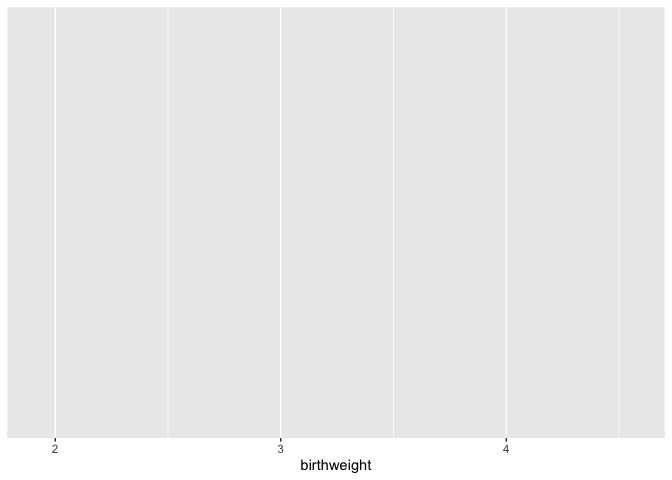<!-- -->

Alone, this produces an empty plot. The `ggplot()` function by itself creates the blank canvas upon which the plot will be drawn. The plot elements are added to this canvas in layers called "geoms."

## The geom

There are over 30 geoms in the ggplot2 library, each of which accepts a particular set of aesthetic mappings. The geoms inherit the mapping specified in the original `ggplot()` function call, and additional layer-specific aesthetics may be specified within the geom. Let's start with one of the simplest geoms, the histogram.

The `geom_histogram()` function requires, at a minimum, that a value be provided for x.


``` r
ggplot(data = experiment, mapping = aes(x = birthweight)) +
  geom_histogram()
```

```
## `stat_bin()` using `bins = 30`. Pick better value `binwidth`.
```

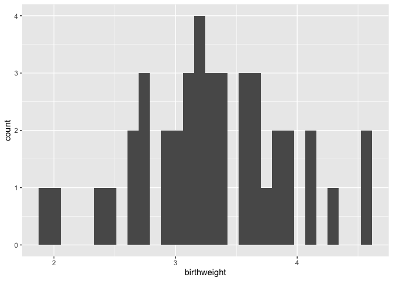<!-- -->

Setting the "binwidth" parameter within the `geom_histogram()` call changes the appearance of the plot and eliminates the message.


``` r
ggplot(data = experiment, mapping = aes(x = birthweight)) +
  geom_histogram(binwidth = 1)
```

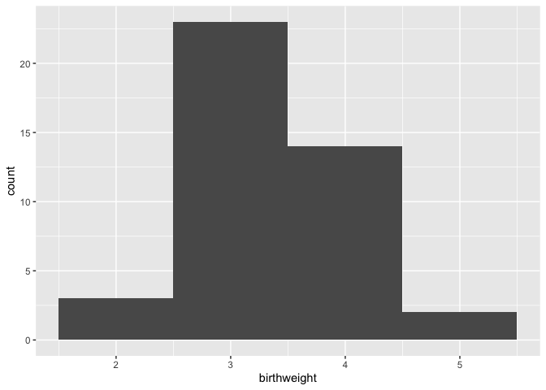<!-- -->

``` r
ggplot(data = experiment, mapping = aes(x = birthweight)) +
  geom_histogram(binwidth = 0.25)
```

<!-- -->

## Adding color (and fill) to geoms

The color (for lines and points) and fill (for areas, like bars) of a geom can add another layer of information to the plot.


``` r
ggplot(data = experiment, mapping = aes(x = birthweight, fill = location)) +
  geom_histogram(binwidth = 0.25) +
  scale_fill_manual(values = locations.palette) 
```

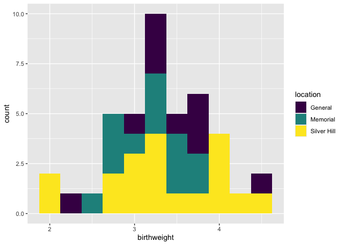<!-- -->

Here the total height of the bar is equal to the number of births at each weight, and the fill denotes the hospital at which the birth occurred.


``` r
ggplot(data = experiment, mapping = aes(x = birthweight, fill = location)) +
  geom_histogram(binwidth = 0.25, position = position_dodge()) +
  scale_fill_manual(values = locations.palette)
```

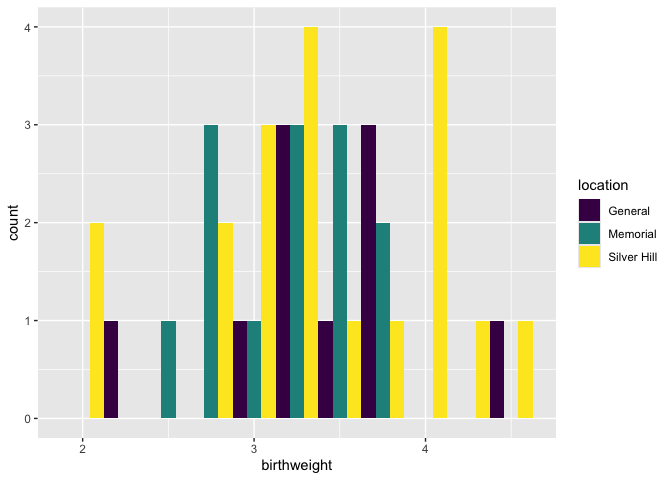<!-- -->

To un-stack the bars, use "position_dodge."

## Creating faceted plots

Sometimes, it may be more clear graphically to create multiple sub-plots or "facets" based on categorical values in the data. The `facet_wrap()` and `facet_grid()` functions allow the user to break the data down into multiple plots by one or two categorical variables, respectively.


``` r
ggplot(data = experiment, mapping = aes(x = birthweight, fill = location)) +
  geom_histogram(binwidth = 0.25) +
  scale_fill_manual(values = locations.palette) +
  facet_wrap(~year, nrow = 2)
```

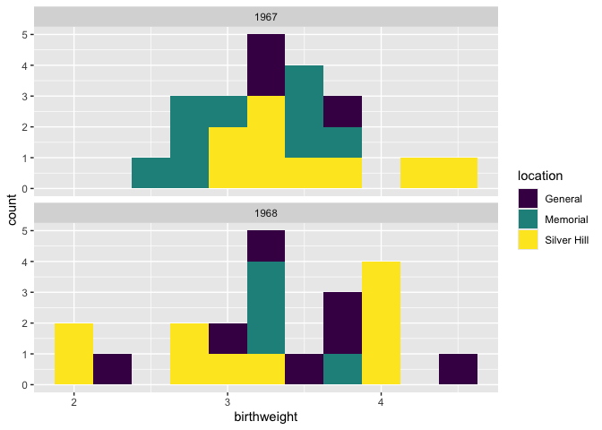<!-- -->

## Add and modify labels

Often, the aesthetic names (column names) are uninformative, or unattractive. This may not make much difference when making exploratory figures, but in a report or publication, it is important to have a greater degree of control over the plot title, axis labels, and so on. The `labs()` function offers the option to set the following labels:

- **any aesthetic that has been set**: in this case, x and fill 
- **title**: main title of the plot
- **subtitle**: displayed below the title
- **caption**: displayed at the bottom right of the plot by default
- **tag**: label that appears at the top left of the plot by default (e.g. 1A)
- **alt**, **alt_insight**: alt text for the plot (used by screen readers)


``` r
ggplot(data = experiment, mapping = aes(x = birthweight, fill = location)) +
  geom_histogram(binwidth = 0.25) +
  scale_fill_manual(values = locations.palette) +
  facet_wrap(~year, nrow = 2) +
  labs(x = "birth weight (kg)",
       fill = "Hospital",
       tag = "fig. 1",
       caption = "Birth weights by year, color-coded by delivery location.",
       alt = "Pair of histograms displaying the distribution of birth weights of infants born at General Hospital, Memorial Hospital, and Silver Hill Medical Center in 1967 and 1968.")
```

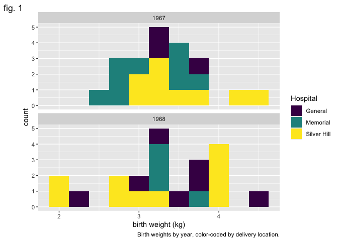<!-- -->

## Making global changes to the plot's appearance using themes

The "theme" of a ggplot object controls the graphical elements that are not mapped onto the data. This includes things like the font size and alignment of axis labels and the color of the plot background. There are a number of pre-set themes offering a range of plot styles.

In addition, the `theme()` function offers access to these graphical elements independently. Using it, you can change the angle of the text on the x axis, the placement of the legend, and many other things. Here, we will use it to remove the legend title.


``` r
ggplot(data = experiment, mapping = aes(x = birthweight, fill = location)) +
  geom_histogram(binwidth = 0.25) +
  scale_fill_manual(values = locations.palette) +
  facet_grid(location~year) +
  labs(x = "weight (kg)", y = "births") +
  theme_bw() +
  theme(legend.title = element_blank())
```

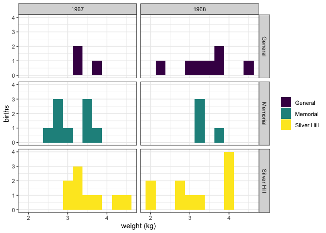<!-- -->

An interesting alternative to `geom_histogram()` is `geom_density()`.

``` r
ggplot(data = experiment, mapping = aes(x = birthweight, fill = smoker)) +
  geom_density(alpha = 0.5) +
  scale_fill_manual(values = smoking.palette) +
  labs(x = "birth weight (kg)", fill = "Maternal smoking in pregnancy") +
  theme_bw()
```

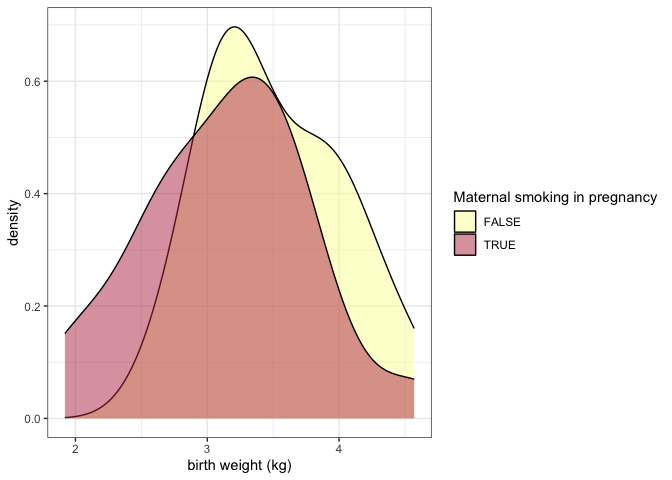<!-- -->

The alpha channel of a color determines its opacity. In this case, we have placed `alpha = 0.5` outside of the `aes()` function call, because the opacity is not being mapped to any characteristic of the data.

The examples above use color in a discrete fashion. In the scatter plot below, the color of each point represents a birth weight (continuous variable).


``` r
experiment %>%
  filter(smoker == TRUE) %>%
  ggplot(mapping = aes(x = maternal.cigarettes,
                       y = weeks.gestation,
                       color = birthweight)) +
  geom_point()  +
  labs(x = "Maternal cigarettes / day", y = "Gestational age at birth (weeks)", color = "Birth weight (kg)") +
  scale_color_viridis(option = "inferno", begin = 0.4) +
  theme_bw()
```

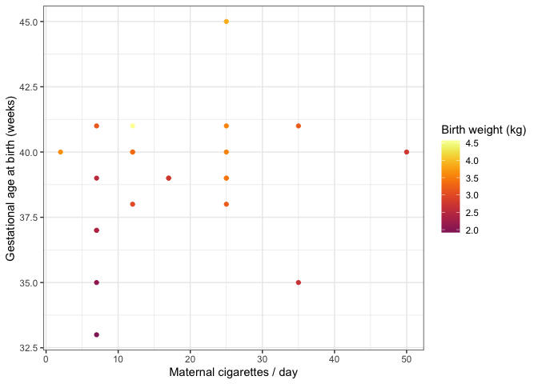<!-- -->

Notice that it is not necessary to specify a color palette; viridis has a built-in function for interacting with ggplot objects.

## Change the labels for categorical values

All of the elements of the plot, not just the height of bars and position of points, convey information. The labels on a categorical axis should be meaningful.


``` r
experiment %>%
  ggplot(mapping = aes(x = smoker, y = birthweight, fill = smoker)) +
  geom_boxplot() +
  scale_fill_manual(values = smoking.palette) +
  theme_bw()
```

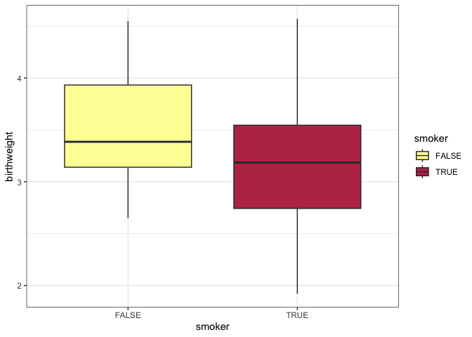<!-- -->

The bar chart above displays the values "TRUE" and "FALSE" on the x-axis. This is fine for an exploratory plot, but in a report or publication, it might be more informative to replace them with "smoker" and "non-smoker." The `scale_x_discrete()` function allows us to do just that.


``` r
experiment %>%
  ggplot(mapping = aes(x = smoker, y = birthweight, fill = smoker)) +
  geom_boxplot() +
  scale_fill_manual(values = smoking.palette) +
  scale_x_discrete(labels = c("non-smoker", "smoker")) +
  guides(fill = "none") +
  labs(y = "birth weight (kg)", x = "maternal cigarette use in pregnancy") +
  theme_bw()
```

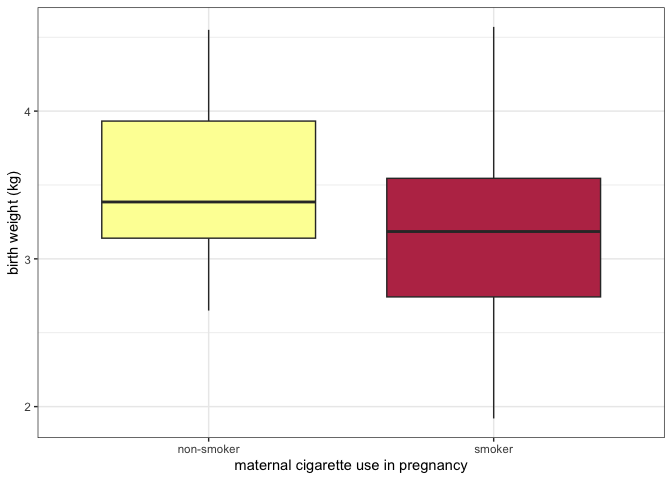<!-- -->

## Change the direction of axes to improve readability

If the category names are very long, it may be necessary to change the direction of the axis labels.


``` r
experiment %>%
  ggplot(mapping = aes(x = smoker, y = birthweight, fill = smoker)) +
  geom_boxplot() +
  scale_fill_manual(values = smoking.palette) +
  scale_x_discrete(labels = c("non-smoking in pregnancy", "cigarette smoking in pregnancy")) +
  guides(fill = "none") +
  labs(y = "birth weight (kg)") +
  theme_bw() +
  theme(axis.title.x = element_blank(),
        axis.text.x = element_text(angle = 90, vjust = 0.5, hjust = 1))
```

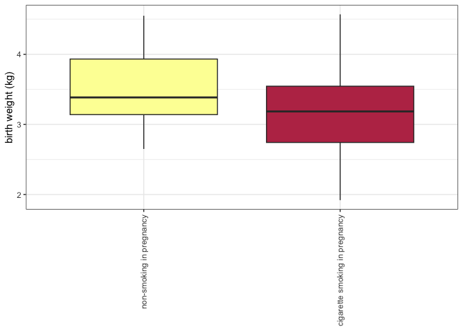<!-- -->

Or even the direction of the axes themselves.


``` r
experiment %>%
  ggplot(mapping = aes(x = smoker, y = birthweight, fill = smoker)) +
  geom_boxplot() +
  scale_fill_manual(values = smoking.palette) +
  scale_x_discrete(labels = c("non-smoking in pregnancy", "cigarette smoking in pregnancy")) +
  guides(fill = "none") +
  labs(y = "birth weight (kg)") +
  coord_flip() +
  theme_bw() +
  theme(axis.title.y = element_blank())
```

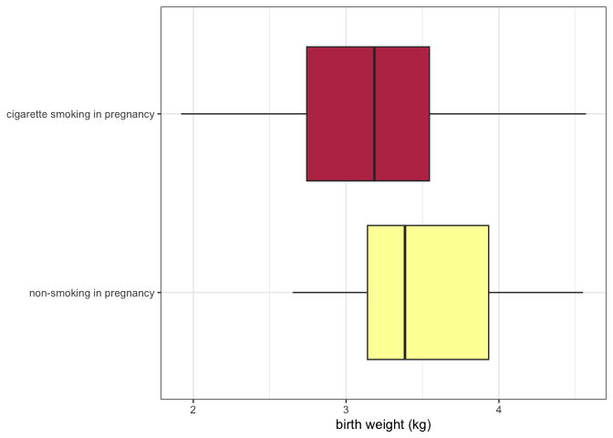<!-- -->

## The pivot_longer() function revisited

In the previous section on Tidyverse, `pivot_longer()` was only briefly discussed. This is because the easiest way to explain *why* it is useful is to demonstrate.


``` r
experiment %>%
  pivot_longer(cols = c(22:25),
               names_to = "gene.id",
               values_to = "expression") %>%
  ggplot(mapping = aes(x = smoker, y = expression, fill = smoker)) +
  geom_violin() +
  scale_fill_manual(values = smoking.palette) +
  scale_x_discrete(labels = c("non-smoker", "smoker")) +
  facet_wrap(~ gene.id, nrow = 2) +
  guides(fill = "none") +
  labs(x = "Maternal tobacco use in pregnancy", y = "miRNA expression") +
  theme_bw()
```

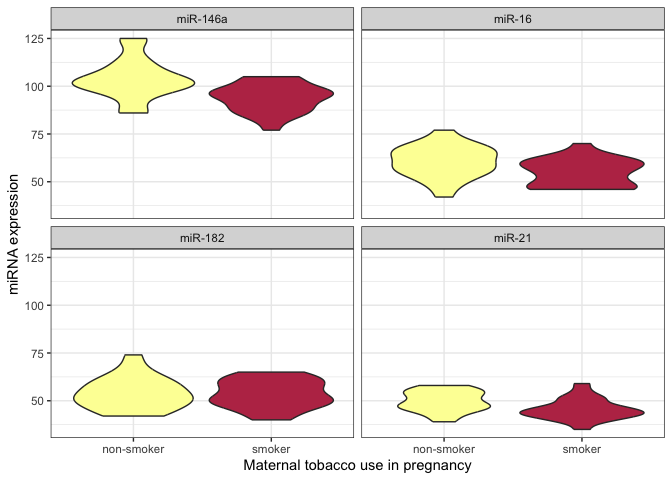<!-- -->

After pivoting the miRNA data into a single column called expression, that data is available for ggplot to map that onto an aesthetic property.

## Use shape and line type to convey meaning

Color is not the only aesthetic available for mapping to the data. Shape and line type are also good candidates for displaying categorical (or discrete) values.


``` r
experiment %>%
  pivot_longer(cols = c(22:25),
               names_to = "gene.id",
               values_to = "expression") %>%
  ggplot(mapping = aes(x = maternal.cigarettes, y = expression, color = location, shape = low.birthweight)) +
  geom_point() +
  scale_color_manual(values = locations.palette) +
  scale_shape_manual(values = c(16, 17), labels = c("< 2.72 kg", ">= 2.72 kg")) +
  facet_wrap(~ gene.id, nrow = 2) +
  labs(x = "Maternal cigarettes / day", y = "miRNA expression") +
  theme_bw() +
  theme(legend.title = element_blank())
```

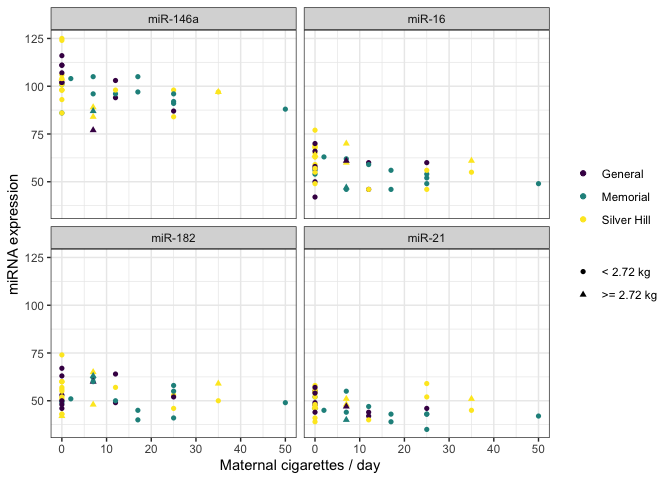<!-- -->

There are 25 shapes available for plotting. You can see them all [here](http://www.sthda.com/english/wiki/ggplot2-point-shapes).


``` r
experiment %>%
  ggplot(mapping = aes(x = weeks.gestation, y = birthweight, linetype = smoker)) +
  geom_quantile(quantiles = c(0.25, 0.5, 0.75), color = "black") +
  labs(x = "gestational age at birth", y = "birth weight (kg)", linetype = "geriatric preganancy") +
  theme_bw()
```

```
## Smoothing formula not specified. Using: y ~ x
## Smoothing formula not specified. Using: y ~ x
```

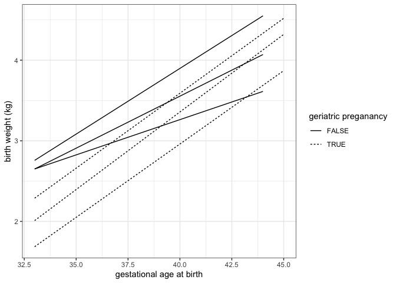<!-- -->

## Focus in on one portion of the plot

We can zoom in to the the lower left hand corner of the plot using `coord_cartesian()`.


``` r
experiment %>%
  ggplot(mapping = aes(x = weeks.gestation, y = birthweight, linetype = smoker)) +
  geom_quantile(quantiles = c(0.25, 0.5, 0.75), color = "black") +
  labs(x = "gestational age at birth", y = "birth weight (kg)", linetype = "geriatric preganancy") +
  coord_cartesian(xlim = c(33, 35), ylim = c(1.5, 3.5)) +
  theme_bw()
```

```
## Smoothing formula not specified. Using: y ~ x
## Smoothing formula not specified. Using: y ~ x
```

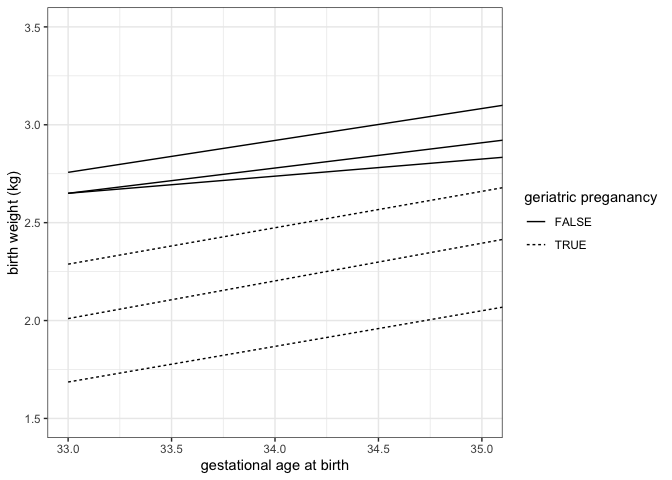<!-- -->

## Layer multiple geoms

It is not necessary to make a single geom convey all of the information a plot must communicate. Instead, ggplot2 offers users the ability to layer geoms together. As long as they use the same axes, geoms may share a plot.


``` r
ggplot(experiment, mapping = aes(x = weeks.gestation,
                                 y = birthweight,
                                 color = smoker)) +
  geom_point() +
  geom_smooth(alpha = 0.2) +
  labs(x = "Gestational age at birth (weeks)",
       y = "Birth weight (kg)",
       color = "Maternal tobacco use",
       caption = "Birthweight increases with gestational age for infants born to both\nsmokers and non-smokers.") +
  scale_color_manual(values = smoking.palette) +
  theme_bw() +
  theme(plot.caption = element_text(hjust = 0))
```

```
## `geom_smooth()` using method = 'loess' and formula = 'y ~ x'
```

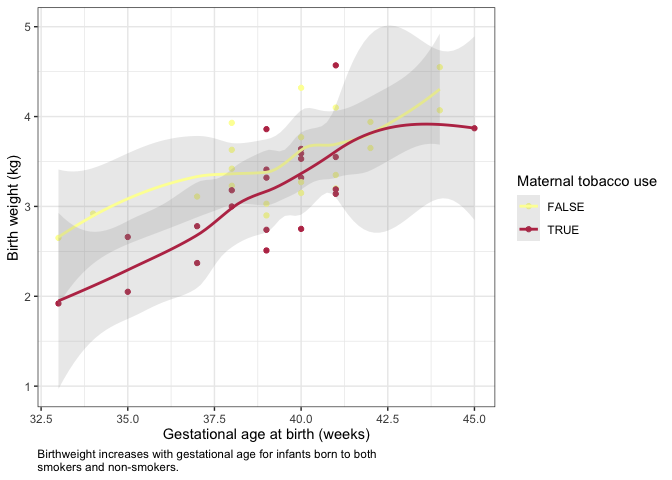<!-- -->

``` r
experiment %>%
  group_by(year, smoker) %>%
  summarise(mean.birthweight = mean(birthweight),
            sd.birthweight = sd(birthweight)) %>%
  ggplot(mapping = aes(x = as.factor(year), y = mean.birthweight, fill = smoker)) +
  geom_col(position = position_dodge2(preserve = "single")) +
  geom_errorbar(mapping = aes(ymin = mean.birthweight - sd.birthweight,
                              ymax = mean.birthweight + sd.birthweight),
                position = position_dodge2(preserve = "single")) +
  scale_fill_manual(values = smoking.palette) +
  labs(x = "birth year", y = "birth weight (kg)", fill = "maternal smoking") +
  theme_bw()
```

```
## `summarise()` has grouped output by 'year'. You can override using the
## `.groups` argument.
```

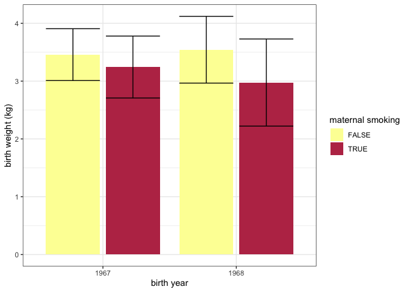<!-- -->

## ggplot2 cheat sheet

For more information on ggplot2 check out this [quick reference guide](https://www.rstudio.com/resources/cheatsheets/), and the [free online book](https://ggplot2-book.org/).

## Exercise 5

Create a visualization that provides an answer to one of the following questions:

- Are preterm babies more likely to have low birth weight?
- What is the ratio of maternal cigarettes to paternal cigarettes for births at each of the hospitals?
- Do taller mothers have taller partners? Do they have longer babies?

# Troubleshooting

Even advanced users of R run into problems often. Here are some of the most common errors that can often be resolved quickly:

- file is not in the right place, or is incorrectly named
- improperly formatted files
- missing values
- spelling errors
- incorrectly named parameters

For more complex errors, the help documentation of a function is a good place to start. Additionally, the online community of R users is extremely active and helpful. If you've got a question, it's extremely likely it's been asked and answered many times already!

