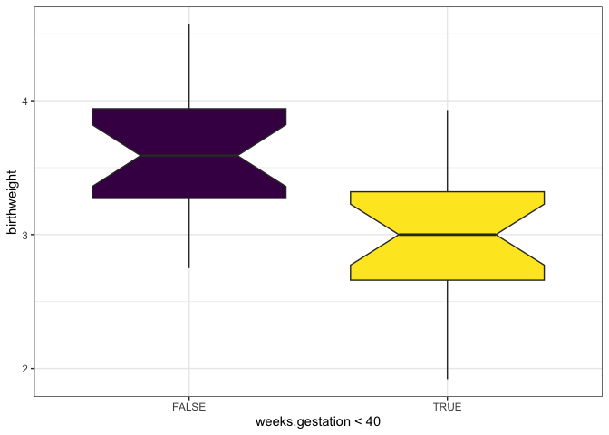
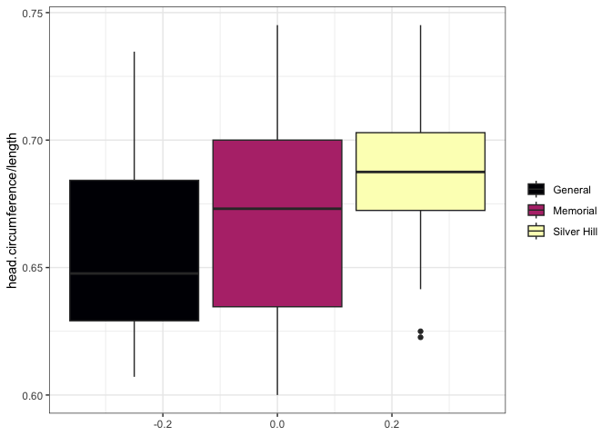
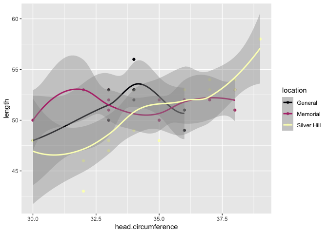
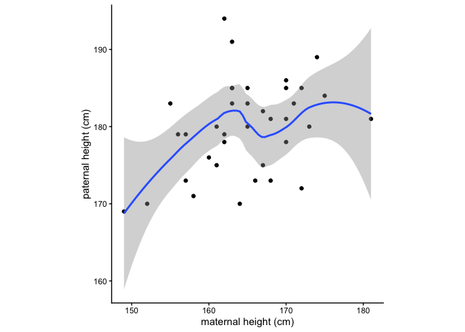
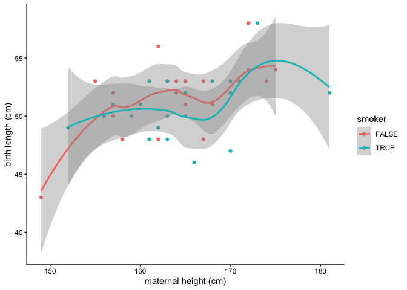

``` r
birthweight <- read.csv("birthweight.csv")
```

# Exercise 1

Use the `min()`, `max()`, and `mean()` functions on subsets of the data frame to answer one or more of the following questions. Work together. Often there will be more than one way to arrive at the answer.

- What is the range of paternal ages in the data set?


``` r
summary(birthweight$paternal.age, na.rm = TRUE)
```

```
##    Min. 1st Qu.  Median    Mean 3rd Qu.    Max.    NA's 
##   19.00   23.00   28.00   28.76   31.75   46.00       4
```

What is the mean maternal age?

``` r
mean(birthweight$maternal.age)
```

```
## [1] 25.54762
```

What is the age of the mother with the highest maternal.cigarettes value?

``` r
birthweight$maternal.age[birthweight$maternal.cigarettes == max(birthweight$maternal.cigarettes)]
```

```
## [1] 37
```

TRUE or FALSE: The mean pre-pregnant weight is lower among women who gave birth to low birth weight children.

``` r
mean(birthweight$maternal.prepregnant.weight[birthweight$low.birthweight == 1]) < mean(birthweight$maternal.prepregnant.weight[birthweight$low.birthweight == 0])
```

```
## [1] TRUE
```

# Exercise 2

Convert "low.birthweight" from numeric to logical.

``` r
birthweight$low.birthweight <- as.logical(birthweight$low.birthweight)
```

Convert "smoker" from character to logical.

``` r
birthweight$smoker <- birthweight$smoker == "yes"
```

# Exercise 3

Are preterm babies more likely to have low birth weight?

``` r
tapply(birthweight$birthweight, birthweight$weeks.gestation < 40, mean)
```

```
##    FALSE     TRUE 
## 3.643810 2.981905
```

``` r
chisq.test(birthweight$low.birthweight, birthweight$weeks.gestation < 40)
```

```
## Warning in chisq.test(birthweight$low.birthweight, birthweight$weeks.gestation
## < : Chi-squared approximation may be incorrect
```

```
## 
## 	Pearson's Chi-squared test with Yates' continuity correction
## 
## data:  birthweight$low.birthweight and birthweight$weeks.gestation < 40
## X-squared = 4.8611, df = 1, p-value = 0.02747
```

What is the ratio of head circumference to length for births at each of the hospitals?


``` r
tapply(birthweight$head.circumference / birthweight$length, birthweight$location, mean)
```

```
##     General    Memorial Silver Hill 
##   0.6584533   0.6697763   0.6865171
```

# Exercise 4

Mean birth weight by smoking status (base R).

``` r
tapply(birthweight$birthweight, birthweight$smoker, mean)
```

```
##    FALSE     TRUE 
## 3.509500 3.134091
```
Mean birth weight by combination of smoking status and low birth weight status (base R).

``` r
tapply(birthweight$birthweight, paste0("smoker:", birthweight$smoker, ", low:", birthweight$low.birthweight), mean)
```

```
## smoker:FALSE, low:FALSE  smoker:FALSE, low:TRUE  smoker:TRUE, low:FALSE 
##                3.554737                2.650000                3.378824 
##   smoker:TRUE, low:TRUE 
##                2.302000
```

Mean birth weight by pre-term or full-term status (tidyverse).

``` r
library(tidyr)
library(dplyr)
```

```
## 
## Attaching package: 'dplyr'
```

```
## The following objects are masked from 'package:stats':
## 
##     filter, lag
```

```
## The following objects are masked from 'package:base':
## 
##     intersect, setdiff, setequal, union
```

``` r
library(magrittr)
```

```
## 
## Attaching package: 'magrittr'
```

```
## The following object is masked from 'package:tidyr':
## 
##     extract
```

``` r
birthweight %>%
  mutate(full.term = weeks.gestation >= 40) %>%
  group_by(full.term) %>%
  summarise(mean.birthweight = mean(birthweight),
            sd.birthweight = sd(birthweight))
```

```
## # A tibble: 2 × 3
##   full.term mean.birthweight sd.birthweight
##   <lgl>                <dbl>          <dbl>
## 1 FALSE                 2.98          0.530
## 2 TRUE                  3.64          0.487
```

Ratio of head circumference to length at each hospital (tidyverse).

``` r
birthweight %>%
  mutate(head.length.ratio = head.circumference / length) %>%
  group_by(location) %>%
  summarise(mean(head.length.ratio))
```

```
## # A tibble: 3 × 2
##   location    `mean(head.length.ratio)`
##   <chr>                           <dbl>
## 1 General                         0.658
## 2 Memorial                        0.670
## 3 Silver Hill                     0.687
```

# Exercise 5

Are preterm babies more likely to have low birth weight?

``` r
library(ggplot2)

ggplot(data = birthweight, mapping = aes(x = weeks.gestation < 40, y = birthweight, fill = weeks.gestation < 40)) +
  geom_boxplot(notch = TRUE) +
  scale_fill_viridis_d() +
  guides(fill = "none") +
  theme_bw()
```

<!-- -->

What is the ratio of head circumference to length for births at each of the hospitals?
Box plot version:

``` r
ggplot(data = birthweight, mapping = aes(y = head.circumference / length, fill = location)) +
  geom_boxplot() +
  scale_fill_viridis_d(option = "magma") +
  theme_bw() +
  theme(legend.title = element_blank())
```

<!-- -->

Scatter plot version:

``` r
ggplot(data = birthweight, mapping = aes(x = head.circumference, y = length, colour = location)) +
  geom_point() +
  geom_smooth() +
  scale_color_viridis_d(option = "magma")
```

```
## `geom_smooth()` using method = 'loess' and formula = 'y ~ x'
```

```
## Warning in simpleLoess(y, x, w, span, degree = degree, parametric = parametric,
## : pseudoinverse used at 29.97
```

```
## Warning in simpleLoess(y, x, w, span, degree = degree, parametric = parametric,
## : neighborhood radius 4.03
```

```
## Warning in simpleLoess(y, x, w, span, degree = degree, parametric = parametric,
## : reciprocal condition number 0
```

```
## Warning in simpleLoess(y, x, w, span, degree = degree, parametric = parametric,
## : There are other near singularities as well. 4.1209
```

```
## Warning in predLoess(object$y, object$x, newx = if (is.null(newdata)) object$x
## else if (is.data.frame(newdata))
## as.matrix(model.frame(delete.response(terms(object)), : pseudoinverse used at
## 29.97
```

```
## Warning in predLoess(object$y, object$x, newx = if (is.null(newdata)) object$x
## else if (is.data.frame(newdata))
## as.matrix(model.frame(delete.response(terms(object)), : neighborhood radius
## 4.03
```

```
## Warning in predLoess(object$y, object$x, newx = if (is.null(newdata)) object$x
## else if (is.data.frame(newdata))
## as.matrix(model.frame(delete.response(terms(object)), : reciprocal condition
## number 0
```

```
## Warning in predLoess(object$y, object$x, newx = if (is.null(newdata)) object$x
## else if (is.data.frame(newdata))
## as.matrix(model.frame(delete.response(terms(object)), : There are other near
## singularities as well. 4.1209
```

```
## Warning in simpleLoess(y, x, w, span, degree = degree, parametric = parametric,
## : pseudoinverse used at 35
```

```
## Warning in simpleLoess(y, x, w, span, degree = degree, parametric = parametric,
## : neighborhood radius 2
```

```
## Warning in simpleLoess(y, x, w, span, degree = degree, parametric = parametric,
## : reciprocal condition number 1.3072e-17
```

```
## Warning in predLoess(object$y, object$x, newx = if (is.null(newdata)) object$x
## else if (is.data.frame(newdata))
## as.matrix(model.frame(delete.response(terms(object)), : pseudoinverse used at
## 35
```

```
## Warning in predLoess(object$y, object$x, newx = if (is.null(newdata)) object$x
## else if (is.data.frame(newdata))
## as.matrix(model.frame(delete.response(terms(object)), : neighborhood radius 2
```

```
## Warning in predLoess(object$y, object$x, newx = if (is.null(newdata)) object$x
## else if (is.data.frame(newdata))
## as.matrix(model.frame(delete.response(terms(object)), : reciprocal condition
## number 1.3072e-17
```

<!-- -->

What is the relationship between maternal and paternal height?

``` r
ggplot(data = birthweight, mapping = aes(x = maternal.height, y = paternal.height)) +
  geom_point() +
  geom_smooth() +
  coord_equal() +
  labs(x = "maternal height (cm)", y = "paternal height (cm)") +
  theme_classic()
```

```
## `geom_smooth()` using method = 'loess' and formula = 'y ~ x'
```

```
## Warning: Removed 5 rows containing non-finite outside the scale range
## (`stat_smooth()`).
```

```
## Warning: Removed 5 rows containing missing values or values outside the scale range
## (`geom_point()`).
```

<!-- -->

What is the relationship between maternal height and length at birth?

``` r
ggplot(data = birthweight, mapping = aes(x = maternal.height, y = length, color = smoker)) +
  geom_point() +
  geom_smooth() +
  labs(x = "maternal height (cm)", y = "birth length (cm)") +
  theme_classic()
```

```
## `geom_smooth()` using method = 'loess' and formula = 'y ~ x'
```

<!-- -->

